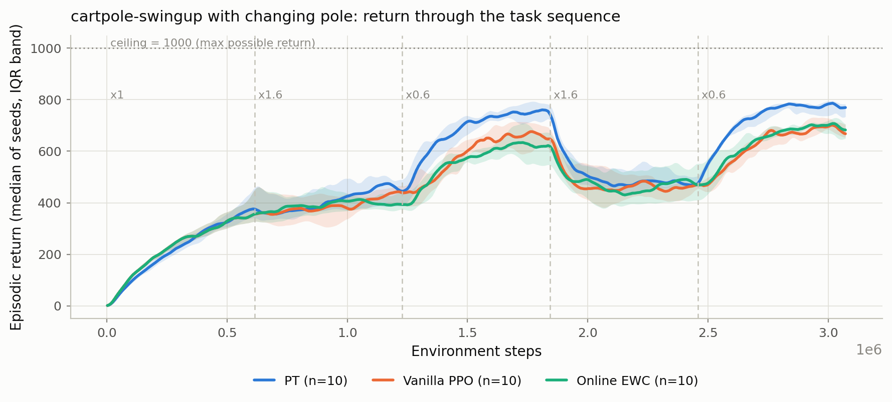
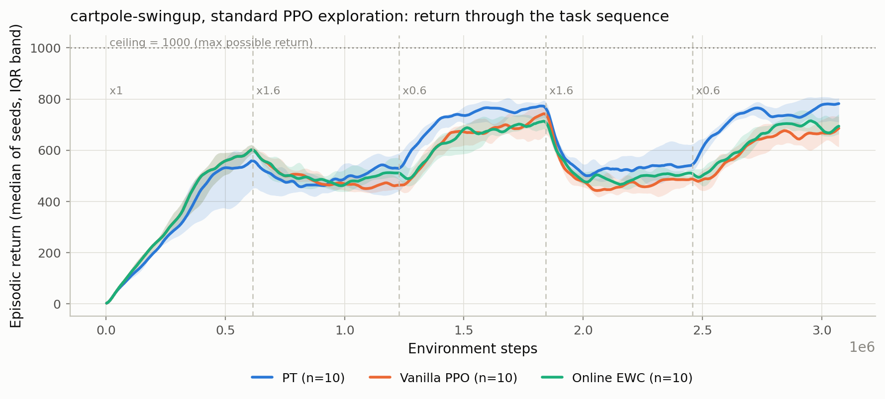
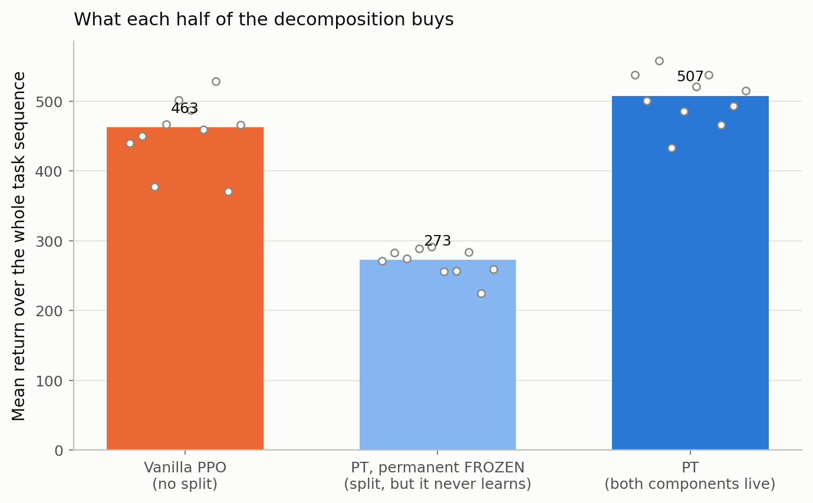
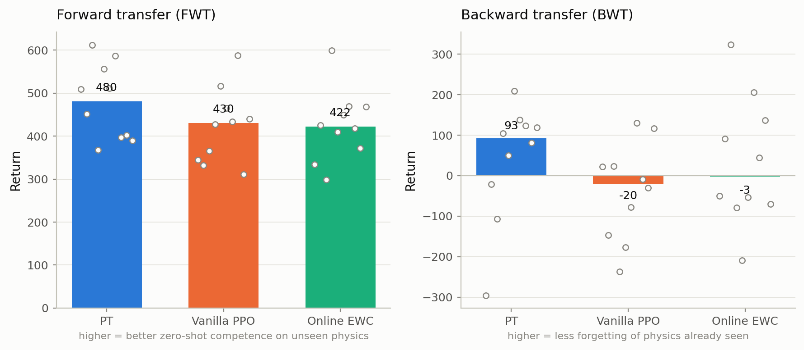
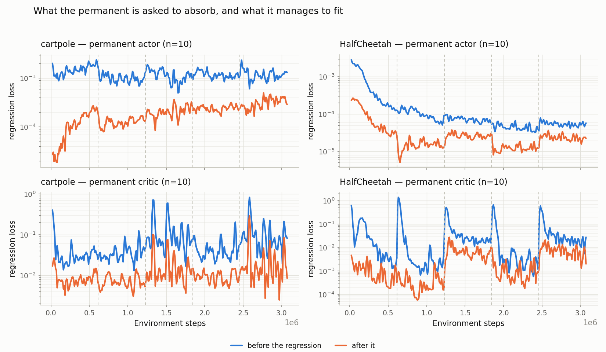
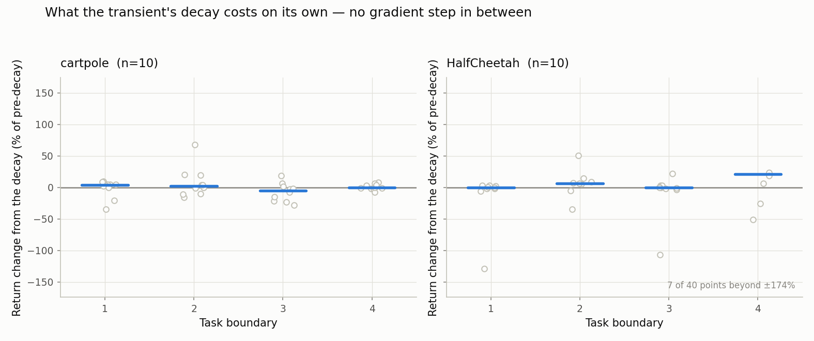

# cartpole-swingup — complete results

Second environment, built and run 2026-08-18 → 2026-08-20. **95 runs, all finished, none failed.**

**Headline: `pt` beats both baselines here, significantly, under two independent exploration
settings — and this is the reverse of every HalfCheetah result in `HALFCHEETAH_RESULTS.md`.**

---

## 1. Why this environment exists

Every earlier result in the project (~154 runs) is HalfCheetah. So none of them can separate *"this
is a property of the PT method"* from *"this is a property of HalfCheetah"* — the largest single
threat to the thesis's conclusions, and one no further HalfCheetah run could address.

cartpole-swingup is the opposite of HalfCheetah on every axis that matters: **1 actuator vs 6,
5 observations vs 17, stabilising at a point vs producing a gait.** And decisively, its **maximum
possible return is exactly 1000** — dm_control's reward is in [0,1] per step over exactly 1000 steps
with no early termination — so every number below is also reported as a percentage of optimal. This
project has repeatedly been damaged by not knowing its own ceiling; here that cannot happen.

## 2. Setup

- dm_control cartpole-swingup via shimmy (`envs/cartpole_swingup.py`), 3.07M steps, 5 tasks,
  boundary every 614,400 steps, **10 seeds** per arm.
- At each boundary the **pole changes** — length and mass, multipliers `[1.0, 1.6, 0.6, 1.6, 0.6]`.
  Reward is fixed. The sequence **cycles**: tasks 1/3 and 2/4 are the same pole, so retention and
  backward transfer are well defined.
- Physics change by **recompiling the MJCF**, so MuJoCo's own compiler recomputes mass, inertia and
  COM consistently. Patching `geom_size` alone would leave the inertia describing the old pole.
  State is snapshotted and restored across the rebuild, so a boundary changes the physics and hands
  no arm a free episode reset.
- `dm_control` is **pinned to 1.0.43**: 1.0.44 needs mujoco ≥ 3.11 and would have upgraded the
  physics engine underneath all 154 existing HalfCheetah runs.

### Pre-flight, asserted on realised values before any sweep

- **Parameter parity 0.9996x** (9,215 vs 9,219). This mattered: `pt`'s shipped HalfCheetah widths
  land at **0.931x** at obs 5 / act 1, so a shared overlay would have run the whole study with `pt`
  7% down on capacity and nothing in any config saying so. Re-derived to `[55,55]` permanent +
  `[30,30]` transient. Hence three per-arm overlays and deliberately no shared one.
- **PPO-trainable split 0.2475x** — PPO's gradient reaches only the transient (`mu_P` is detached),
  so `pt` trains 2,282 parameters against vanilla's 9,219. Both numbers belong in the write-up.
- **σ identical across arms**, physics confirmed to differ per task and to repeat on revisits,
  EWC's penalty non-zero, `pt`'s `actor_absorbed_frac` 0.96–0.99.

## 3. The gate — is there any room to measure a difference?

Stationary vanilla (`disable_task_switch`, nominal pole, 3 seeds). Run *before* the sweep, to refuse
it if every arm would sit near the top — failure mode #4, which this project has already hit once.

| stationary vanilla | whole-run | % of 1000 | final 20% | % of 1000 |
|---|---:|---:|---:|---:|
| σ frozen at 0.37 | 463 | 46% | 562 | 56% |

**Passed.** But read the denominator carefully — there are two. The *task's* ceiling is 1000. The
*achievable-by-PPO* ceiling is much lower: an independent reference (Mohammadzadeh et al., DART,
RLJ 2026) reports CleanRL PPO reaching ~620 on this exact environment. So 562 is ~91% of what PPO
realistically gets, not 56% of what's reachable. What makes the gate pass is that the continual arms
have real room *below* 562, since two of the five tasks use a harder 1.6x pole.

That external number is also the only independent check that our port is correct — a new environment
wired into an existing loop is exactly where a silent defect hides.

## 4. Main result — `pt` wins



| arm | whole-run | % of 1000 | final 20% | % of 1000 |
|---|---:|---:|---:|---:|
| vanilla | 463 | 46% | 619 | 62% |
| Online EWC | 456 | 46% | 631 | 63% |
| **PT** | **507** | **51%** | **720** | **72%** |

Exact two-sided Mann–Whitney, full enumeration (10v10 floor = 1.083e-5):

| comparison | whole-run Δ | p | final-20% Δ | p |
|---|---:|---:|---:|---:|
| PT − vanilla | +45 | **0.029** | +101 | **0.0011** |
| PT − EWC | +51 | **0.043** | +90 | **0.0003** |
| EWC − vanilla | −6 | 1.000 | +11 | 0.315 |

PT leads on both measures and clearly on the final phase. **EWC and vanilla are indistinguishable** —
on HalfCheetah, EWC led everything. The effect is concentrated in the later phases: whole-run
p-values are much weaker than final-phase ones.

The curve also shows the benchmark doing its job — the 1.6x-pole phases sit near 450–500 and the
0.6x phases reach 700+, so the physics change moves return by a wide margin rather than cosmetically.

## 5. It also holds under STANDARD PPO

Section 4 freezes σ at 0.37 — a value inherited from HalfCheetah, never swept here, and not what
standard PPO does. So the whole study was re-run with **CleanRL's setting: `log_std` trainable from
σ = 1.0**, 3 arms x 10 seeds, nothing else changed.



| arm | whole-run | % of 1000 | final 20% | % of 1000 |
|---|---:|---:|---:|---:|
| vanilla | 520 | 52% | 606 | 61% |
| Online EWC | 532 | 53% | 628 | 63% |
| **PT** | **563** | **56%** | **724** | **72%** |

| comparison | whole-run Δ | p | final-20% Δ | p |
|---|---:|---:|---:|---:|
| PT − vanilla | +44 | **0.019** | +118 | **0.0001** |
| PT − EWC | +32 | **0.036** | +95 | **0.0003** |
| EWC − vanilla | +12 | 0.166 | +22 | 0.218 |

**The result replicates, slightly stronger.** So it is not an artefact of a hand-picked setting.

**σ is matched across arms — the check that makes this usable.** On HalfCheetah the learned-σ study
was confounded because `pt` collapsed fastest (0.054 vs 0.072 and 0.094). Here:

| arm | σ at the four boundaries | σ at end |
|---|---|---:|
| vanilla | 0.441 · 0.477 · 0.293 · 0.341 | 0.296 |
| Online EWC | 0.441 · 0.445 · 0.300 · 0.427 | 0.313 |
| PT | 0.386 · 0.394 · 0.318 · 0.385 | 0.294 |

No pair differs significantly at the end (p = 0.74–0.80). **σ also does not collapse** — it settles
at 0.29–0.31 rather than running to zero. The pathology we froze σ to avoid **does not exist on this
environment**; that it settles near the 0.37 we guessed is a fortunate vindication, not a reason to
keep a non-standard setting.

EWC logs no σ (see §10), so its values are recovered from entropy — exact for a 1-D diagonal
Gaussian, validated against the other two arms' direct logs to within 0.005.

## 6. Ablation — which half of the decomposition does the work



`lr_perm = 0`: the split still exists, the transient still decays, the KL anchor still runs, but the
permanent never learns. 10 seeds.

| arm | whole-run | % of 1000 | final 20% | % of 1000 |
|---|---:|---:|---:|---:|
| vanilla (no split) | 463 | 46% | 619 | 62% |
| PT, permanent frozen | 273 | 27% | 372 | 37% |
| PT (both live) | 507 | 51% | 720 | 72% |

| comparison | whole-run Δ | p | final-20% Δ | p |
|---|---:|---:|---:|---:|
| vanilla − PT frozen | +190 | **1.1e-5** | +248 | **1.1e-5** |
| PT − PT frozen | +235 | **1.1e-5** | +349 | **1.1e-5** |

Both at the exact 10v10 floor because the groups are **completely disjoint** — vanilla's worst seed
370 against the frozen arm's best 291; PT's worst final 654 against the frozen arm's best 424.

**The split on its own is a liability; all of the benefit comes from the permanent actually
learning.** Adding the decomposition with a dead permanent costs 190 points against plain PPO;
letting it learn adds 235 back and finishes 45 ahead. So PT's win is not "two networks beat one" —
it is specifically the slow component acquiring something, which is what the method claims.

This also explains why the **net** win is modest: a large cost and a larger benefit nearly cancel.

## 7. Transfer and boundary behaviour



Frozen σ:

| arm | FWT | BWT | boundary drop | final return |
|---|---:|---:|---:|---:|
| vanilla | 430 | −20 | 10% | 619 |
| Online EWC | 422 | −3 | 11% | 631 |
| PT | 480 | +93 | 13% | 720 |
| *PT, permanent frozen* | *178* | ***+103*** | *19%* | *372* |

**None of the differences among the three live arms is significant** (PT−vanilla: FWT p = 0.218,
BWT p = 0.143, drop p = 0.190). Spreads are wide and overlapping. Direction only.

**The frozen row is here as a warning label.** It has the *best* backward transfer of any arm and
*half* PT's return. That is failure mode #5 live on this benchmark: retention metrics improve when
an agent simply learns less, so a BWT column read alone would crown the worst arm. On HalfCheetah
this confound measured corr(peak return, BWT) = **−0.745**. Against that backdrop, PT having the top
return *and* the best BWT among live arms means its BWT is not the lazy kind.

**Under standard PPO the boundary metric flips in PT's favour** — PT drops **14%** against 18% for
both baselines, p = 0.019 vs vanilla and 0.023 vs EWC. That is the method's own claim, and the
opposite of HalfCheetah finding 4 where PT dropped far more than EWC.

## 8. The KL anchor does almost nothing here — a failed prediction

`pt` regularises its policy with a KL pull toward the permanent instead of an entropy bonus. Because
KL between two Gaussians of equal σ grows like (Δμ)²/2σ², `kl_prior_coef` and σ are arguably the
same knob seen from two directions — which would have explained PT's *interior optimum in σ* on
HalfCheetah, the most interesting open question in `HALFCHEETAH_RESULTS.md`.

**Pre-registered prediction:** hold σ at 0.37, vary `kl_prior_coef`; return should peak at the
shipped 0.01 and fall off at both ends. 10 seeds per setting.

| kl_prior_coef | whole-run | % of 1000 | final 20% | % of 1000 |
|---|---:|---:|---:|---:|
| 0 (no anchor) | 508 | 51% | 687 | 69% |
| 0.01 (shipped) | 507 | 51% | 720 | 72% |
| 0.1 (10x) | 525 | 53% | 732 | 73% |
| *vanilla, for reference* | *463* | *46%* | *619* | *62%* |

**The prediction failed.** No pair differs significantly (closest: 0 vs 0.1, p = 0.063). There is no
interior optimum; the trend runs weakly *upward*, the opposite shape.

**And `pt` still beats vanilla with the anchor off entirely** — +45 whole-run (p = 0.0068), +67
final (p = 0.0029). The anchor is not what makes the method work here, and the σ-band explanation it
was meant to supply does not survive. One of `pt`'s moving parts is doing very little on this task.

## 9. Why it works here and not on HalfCheetah

The best available explanation, reached largely by **elimination**.

### Tasks share far more structure here — measured

From the transfer matrices: what fraction of its competence does a task-0-only policy keep on the
*other* tasks (baseline-corrected, row 0 only so training budget is identical across cells)?

| benchmark | carry-over | difficulty-normalised |
|---|---:|---:|
| **cartpole** | **0.78** | **0.56** |
| HalfCheetah (2 drift targets) | 0.44 | 0.23 |
| HalfCheetah (4 drift targets, "hard") | — | 0.02 |

Disjoint groups, p = 1.083e-5; the difficulty-normalised version gives p = 7.3e-4. Ordering the
benchmarks by carry-over and reading off PT's advantage over vanilla gives a monotone ladder:
carry 0.02 → PT −194%; carry 0.23 → −42%; carry 0.56 → **+10%**.

⚠️ **Confounded by σ.** The HalfCheetah arms above use learned σ. At *matched* frozen σ the
HalfCheetah gap is only −4%, so the honest σ-matched comparison is −4% at carry 0.23 versus +10% at
carry 0.56 — same direction, far smaller than the raw ladder implies.

### Independent corroboration from the consolidation loss



Four panels = 2 environments × 2 networks (top: permanent actor; bottom: permanent critic; left:
cartpole; right: HalfCheetah). Blue = regression loss *before* each consolidation (how much the
transient piled up); orange = *after* (what the permanent could not fit).

**HalfCheetah's critic loss explodes ~100x at every boundary and decays across the phase;
cartpole's barely reacts.** Same mechanism, same code, very different disruption — the carry-over
result in a different currency.

### What has been ruled out

| suspect | verdict | evidence |
|---|---|---|
| The permanent never learns | **no** | `actor_absorbed_frac` ≈ 0.95 on both |
| The permanent can't fit its target | **no** | 67–90% loss reduction on both (§9 figure) |
| The decay throws away what's needed | **no** | ≈ 0 effect on both (below) |
| The KL anchor is mis-tuned | **no** | §8 — inert |
| Capacity / trainable budget | **no** | allocation test null at 1.68x (HalfCheetah) |



The decay probe is the cleanest instrument available: evaluate, shrink the transient's output layer,
evaluate again, **with no gradient step in between**. For a split critic it is provably zero-effect,
so it isolates the split *actor*. Median effect: **−0.07%** on cartpole, **+1.55%** on HalfCheetah —
zero on both, and slightly *helpful* on HalfCheetah if anything.

**So `pt` is not broken on HalfCheetah.** The machinery runs correctly there. What survives is that
the permanent fits its target fine — the target is simply worth less when tasks share little. That
is arrived at by elimination, not measured directly, and the write-up should say so.

## 10. Mechanism checks and defects found

- PT `actor_absorbed_frac` median **0.953**, min 0.751 — far above the 0.01 inert floor.
- PT-frozen `actor_absorbed_frac` median and max **exactly 0.000** — the control really was off,
  asserted on realised behaviour rather than the config key.
- `diag/actor_perm_trans_corr` median **+0.099** — not near −1, so the components are not cancelling.

Three defects found and fixed during this work:

1. **`drift/multiplier` logged a fiction.** Under `schedule: step` it fell through to the clock
   formula and logged a 1.0 → 2.25 ramp while the physics cycled `[1.0, 1.6, 0.6, …]`. Affects
   every Phase 2a run's diagnostic; no result invalidated.
2. **`pt` dropped `log_std_min`**, and **`ewc` logged no σ at all.** Same root cause: any agent that
   overrides `update()` returns its own metrics dict and silently discards what `PPOBase` added.
   `HALFCHEETAH_RESULTS.md` records the original "sigma logged by pt only" bug as fixed in `PPOBase` —
   that was never true for the two arms that override the method. Harmless here (1 action dimension,
   so min = mean) but a real blind spot at HalfCheetah's six.
3. **`boundary/mean_drop` is unusable on this benchmark** — it reports an *absolute* drop over a
   10,240-step window against a 614,400-step phase, on a 0.99 EMA, so it returns ~1% while the curve
   shows ~250-point collapses. The drop column in §7 is recomputed from the return curves over half
   a phase; see `scripts/report_cartpole.py`.

## 11. What this does and does not establish

**Established.** `pt` beats vanilla PPO and online EWC on cartpole-swingup, under both a controlled
and the standard exploration setting, at 10 seeds, with σ verified matched. The advantage comes
specifically from the permanent learning, not from having a split. The benchmark is not saturated,
the ceiling is known, and the port is externally corroborated.

**Not established.** *Why* PT fails on HalfCheetah. The shared-structure account fits every
observation and predicts the ordering, but it was reached by eliminating alternatives rather than by
a positive causal test — and the cleanest causal design (varying task similarity) confounds
similarity with difficulty, so it has not been run.

**Other limits.** One non-stationarity type (physics), one task-multiplier setting, one phase
length. `rho` and `k` were tuned against the discarded Phase 1 reward-flip benchmark and have never
been checked here. Whole-run p-values are much weaker than final-phase ones.

## 12. Regenerating everything

```bash
cd "e:/update-single task + videos"

# numbers
python -m src_continuous_control.scripts.report_cartpole                                    # frozen sigma
python -m src_continuous_control.scripts.report_cartpole src_continuous_control/results/cartpole_learned

# figures
python -m src_continuous_control.plots.make_phase2_figures --seeds 0 1 2 3 4 5 6 7 8 9 \
    --results-dir src_continuous_control/results/cartpole \
    --frozen-dir src_continuous_control/results/cartpole/ablation_frozen \
    --ceiling 1000 --env-label "cartpole-swingup with changing pole" \
    --out-dir src_continuous_control/plots/figures_cartpole
python -m src_continuous_control.plots.plot_consolidation_loss
python -m src_continuous_control.plots.plot_decay_gain
```

Directory → experiment map: `results/MANIFEST.md`. Every number here comes from
`scripts/report_cartpole.py`, which imports the canonical significance test from
`report_tables.py` so the two reports cannot drift onto different statistics.
