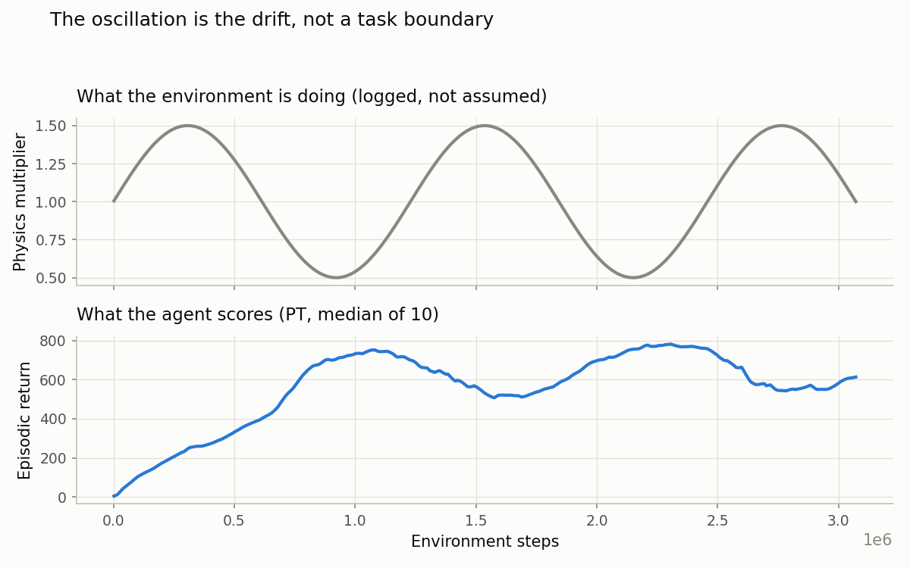
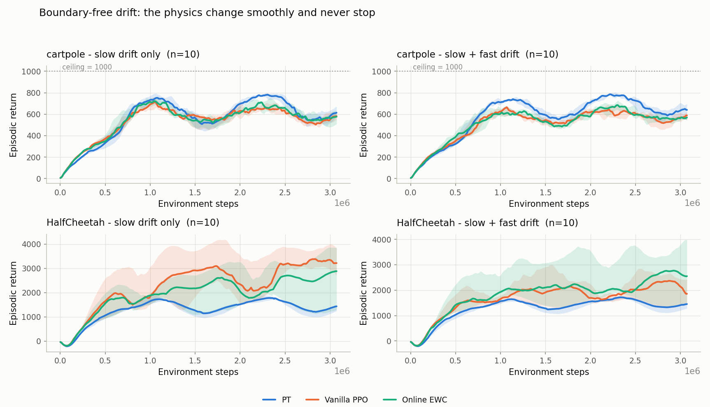

# Boundary-free drift results

Phase 2b, run 2026-08-21/22. **160 runs, all completed, none failed.**

Every earlier study in this project changed the physics at discrete moments and told the agent when
they happened. This one does not. The physics change **smoothly and continuously, forever**, with no
task boundaries, no task index and no reset signal. That is the setting the thesis proposal
specifies.

**Result: on cartpole, when the physics also wobble quickly, `pt` beats vanilla PPO and online EWC.
On HalfCheetah it loses, as it does under boundaries.**

---

## 1. The two worlds

Everything about the agents is identical in both. The only difference is how the physics move.

**World A — slow drift only.** One slow wave, like a tide. It rises to its peak by step 300,000,
bottoms out at 920,000, rises again — about 2.5 full swings across the run. At any given moment the
physics are barely moving.

What that wave actually does:

- **cartpole** — the pole grows and shrinks. At the peak it is 1.5 m long and 0.15 kg; at the
  trough, 0.5 m and 0.05 kg. A long heavy pole is slow and hard to swing up; a short light one is
  quick and easy.
- **HalfCheetah** — the joints stiffen and loosen while the ground grips and turns slippery, both
  together. At the peak the six actuated joints have damping `[9, 6.75, 4.5, 6.75, 4.5, 2.25]` and
  ground friction 0.6; at the trough, damping `[3, 2.25, 1.5, 2.25, 1.5, 0.75]` and friction 0.2.
  So the cheetah alternates between stiff limbs on grippy ground and loose limbs on slippery
  ground. Its whole running gait has to change.

**World B — slow + fast drift.** The same slow tide, plus a fast ripple on top. The ripple completes
a full cycle every ~30,000 steps — roughly 100 times across the run, against the tide's 2.5. So the
pole (or the joints and the ground) is drifting slowly *and* wobbling quickly at the same time.

The tide is slightly smaller in World B so the two worlds cover a comparable total range: the
multiplier spans 0.5-1.5 in World A and 0.4-1.6 in World B.

Formally, the physics are multiplied every step by

    World A:  m(t) = 1 + 0.5 * sin(2*pi*t / 1,228,800)
    World B:  m(t) = 1 + 0.4 * sin(2*pi*t / 1,228,800) + 0.2 * sin(2*pi*t / 30,720)

**Why two worlds.** `pt` carries a slow network and a fast one. If the world only changes slowly,
the fast network has nothing to do — an ordinary single network tracks slow change perfectly well.
World B gives the fast network an actual job.

This was written down in the codebase before these runs, in the drift wrapper's own docstring
(`envs/drift_half_cheetah.py`, lines 30-35): with one slow component "a permanent/transient split
has nothing to do and PT necessarily ties the baseline". That is a prediction made in advance by
this project, not independent evidence — it is the same hypothesis §6 tests, stated earlier. It is
worth recording that the prediction pre-dates the result, and worth nothing more than that.

### What the multiplier scales is different in each environment

It has to be — a cartpole has no gait and no meaningful ground contact, and HalfCheetah has no pole.

- **cartpole**: pole length and pole mass.
- **HalfCheetah**: joint damping and ground friction.

What is held identical across the two is the *form* of the change: one multiplier scaling two
physical parameters, the same wave shape, the same amplitudes, the same periods. The reward function
never changes in either.

(HalfCheetah deliberately leaves `mass` alone. Under continuous drift it would fire MuJoCo's
`mj_setConst` inertia refresh on every single step. The archived Phase 1 drift study used the same
two parameters for the same reason.)

## 2. The four agents

`vanilla` (one network), `pt` (slow + fast networks), and online EWC at two penalty strengths.
10 seeds each, 3.07M steps, standard PPO exploration.

**Online EWC could not run here without a change, and that is worth stating.** It normally
strengthens its protection *at a task boundary*. There are none here, so it never protects anything:
the penalty stays at zero and the agent becomes plain vanilla PPO. That is measured, not argued — in
the archived Phase 1 drift runs, the EWC and vanilla results are **bit-identical on all five seeds**
(largest difference 0.000000).

So EWC was given a timer: consolidate every 10 updates, which is exactly `pt`'s own cadence. Both
methods now update on the same schedule, so a difference between them is about the mechanism rather
than about who gets more chances. Verified live: EWC's penalty is non-zero on 1490 of 1500 updates,
and it is no longer identical to vanilla.

**Why two EWC strengths.** EWC's protection accumulates each time it consolidates. Going from 4
consolidations to 150 makes the accumulated total ~5.4x larger, so the strength dial `ewc_lambda`
now bites ~5.4x harder than in the setting it was tuned for. Both values are run and **both are
reported**: 0.0088 as originally tuned, and 0.0018 which cancels the 5.4x. Reporting only the better
one would be choosing the baseline's result after seeing it.

## 3. These runs used no task boundaries

The return curves rise and fall on a regular interval, which looks like the boundary experiments.
It is not. It is the drift itself — the world genuinely gets harder and easier, smoothly.



Evidence from the logs:

- The physics multiplier takes **299 distinct values**, moving in steps of ~0.005. In the boundary
  benchmark it takes **three** (0.6, 1.0, 1.6).
- `boundary/mean_drop`, `boundary/return_drop`, `transfer/bwt` and `transfer/fwt` are **absent from
  every drift run**. They are only written when boundaries are switched on, and they are present in
  the boundary runs.
- Correlation between the physics multiplier and the return, after initial learning: **−0.75 on
  cartpole, −0.76 on HalfCheetah.** A longer pole, or more damping and friction, scores lower.

## 4. Returns



Median across 10 seeds of each seed's mean return over the whole run; the final-20% figure is in
brackets. Best arm in each row is bold.

| environment | world | vanilla | PT | EWC (0.0088) | EWC (0.0018) |
|---|---|---:|---:|---:|---:|
| cartpole | slow drift only | 530 (549) | **556 (600)** | 542 (575) | 525 (565) |
| cartpole | slow + fast drift | 504 (567) | **570 (630)** | 521 (577) | 519 (554) |
| HalfCheetah | slow drift only | **2288 (3284)** | 1275 (1382) | 1882 (2643) | 1357 (1416) |
| HalfCheetah | slow + fast drift | 1731 (2224) | 1252 (1427) | 1810 (2518) | **2194 (3002)** |

## 5. Is `pt` ahead of each baseline?

Each cell is `pt`'s score minus that baseline's score. Positive means `pt` is ahead. Two numbers per
cell: whole-run, then final-20%. Exact two-sided Mann-Whitney.

| environment | world | vs vanilla | vs EWC 0.0088 | vs EWC 0.0018 |
|---|---|---|---|---|
| cartpole | slow drift only | +26 (p=0.166) · +51 (p=0.166) | +14 (p=0.529) · +25 (p=0.631) | +32 (p=0.089) · +35 (p=0.190) |
| **cartpole** | **slow + fast drift** | **+66 (p=0.0001)** · **+63 (p=0.023)** | **+49 (p=0.0011)** · **+54 (p=0.043)** | **+51 (p=0.012)** · **+77 (p=0.023)** |
| HalfCheetah | slow drift only | −1014 (p=0.036) · −1902 (p=0.075) | −607 (p=0.218) · −1261 (p=0.280) | −83 (p=0.315) · −34 (p=0.529) |
| HalfCheetah | slow + fast drift | −479 (p=0.019) · −798 (p=0.105) | −558 (p=0.015) · −1091 (p=0.043) | −943 (p=0.0015) · −1575 (p=0.0007) |

**On cartpole with slow + fast drift, `pt` beats all three baselines on both measures — six
comparisons, every one significant.** This is the first result in the project where `pt` beats an
online EWC that is actually working.

With slow drift only, `pt` leads on every comparison but nothing reaches significance.

On HalfCheetah `pt` loses to vanilla in both worlds, and to both EWC settings once the fast
component is added.

## 6. Did the fast wobble cause it?

The theory says it should: the fast network only has something to do when the world contains
something fast. `pt` is significant only in World B, which fits — and the prediction was on record
in the codebase before the runs (see §1).

Testing it directly means asking **how much bigger `pt`'s lead got when the fast wobble was added.**
Worked example, cartpole against vanilla:

- World A: `pt` 556, vanilla 530 — `pt` leads by **26**
- World B: `pt` 570, vanilla 504 — `pt` leads by **66**
- The lead grew by **66 − 26 = +40**

That subtraction is the **change** column below. The two columns before it show the gap itself, so
you can see where `pt` actually stands — the change alone is misleading without them.

| environment | baseline | metric | gap in World A | gap in World B | change | p |
|---|---|---|---:|---:|---:|---:|
| cartpole | vanilla | whole-run | +26 | +66 | +40 | 0.167 |
| cartpole | vanilla | final 20% | +51 | +63 | +12 | 0.795 |
| cartpole | EWC | whole-run | +14 | +49 | +35 | 0.155 |
| cartpole | EWC | final 20% | +25 | +54 | +29 | 0.459 |
| HalfCheetah | vanilla | whole-run | **−1014** | **−479** | +535 | 0.146 |
| HalfCheetah | vanilla | final 20% | **−1902** | **−798** | +1104 | 0.095 |
| HalfCheetah | EWC | whole-run | **−607** | **−558** | +49 | 0.923 |
| HalfCheetah | EWC | final 20% | **−1261** | **−1091** | +170 | 0.871 |

⚠️ **A positive change does not mean `pt` won.** On HalfCheetah every gap is negative in both worlds —
`pt` is behind the baseline whichever way the physics move. The positive change there means the gap
got *smaller*, i.e. `pt` lost by less. It is still losing. Only the four cartpole rows have `pt`
ahead at all.

So the honest reading is: all eight moved in the direction the theory predicts, but **none is
statistically significant** (p = 0.095 at best). The eight also overlap heavily — two measures x two
baselines computed from the same runs, so there are really only two independent cases here, not
eight. The pattern fits the theory and does not demonstrate it.

## 7. Limitations

1. `pt`'s win is significant in one of two worlds, on one of two environments.
2. The World A vs World B contrast points the right way in all eight comparisons but is
   statistically unsupported.
3. One drift speed only (period 1,228,800). The proposal lists varying the drift rate as a
   condition; that was not done.
4. `rho` and `k` were tuned on the Phase 1 reward-switch benchmark and never re-tuned for this one.
   EWC's strength is reported at two values; `pt`'s knobs are at their inherited defaults.

## 8. Note on run time

cartpole slow+fast runs took ~4.0 h against ~1.0 h for slow-only, while HalfCheetah's two worlds
took the same (~39 min). The cartpole environment changes physics by **rebuilding the MuJoCo model**,
which it does whenever the multiplier moves past 0.005 — under fast drift, roughly every 15 steps.
HalfCheetah writes numbers into model arrays and needs no rebuild.

It is a cost, not a confound: all four arms share the same environment, so it cannot favour one of
them. The 0.005 quantisation is 0.6% of the drift range.

## 9. Regenerating

```bash
cd "e:/update-single task + videos"
python -m src_continuous_control.plots.plot_drift
```

Data: `results/drift_{slow,dual}_{cartpole,halfcheetah}[_ewclo]/`, 10 seeds each. The directory
names use `slow` and `dual`; those are World A (slow drift only) and World B (slow + fast drift).
