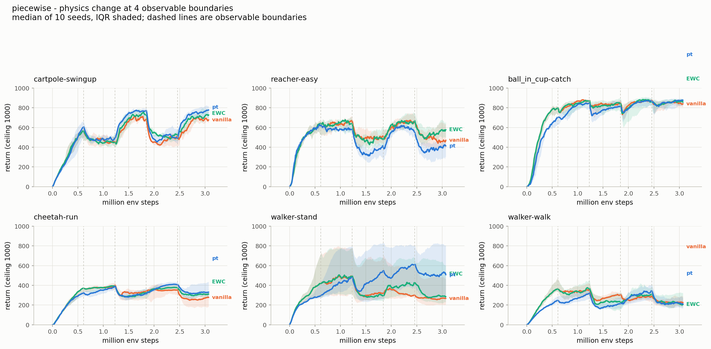
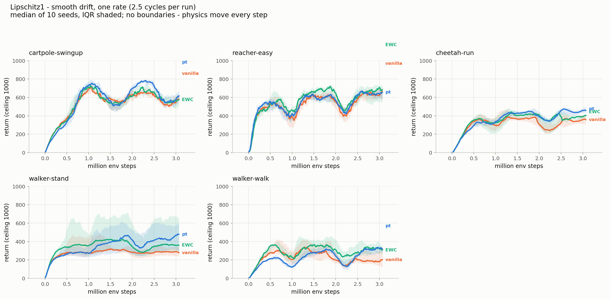
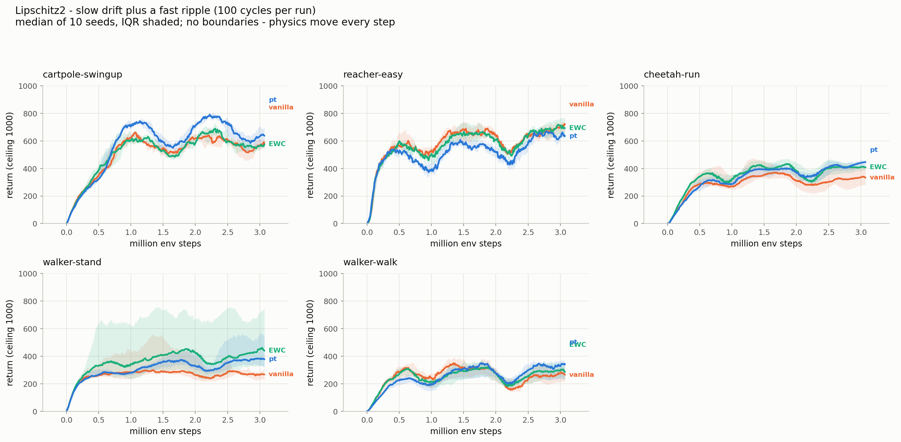
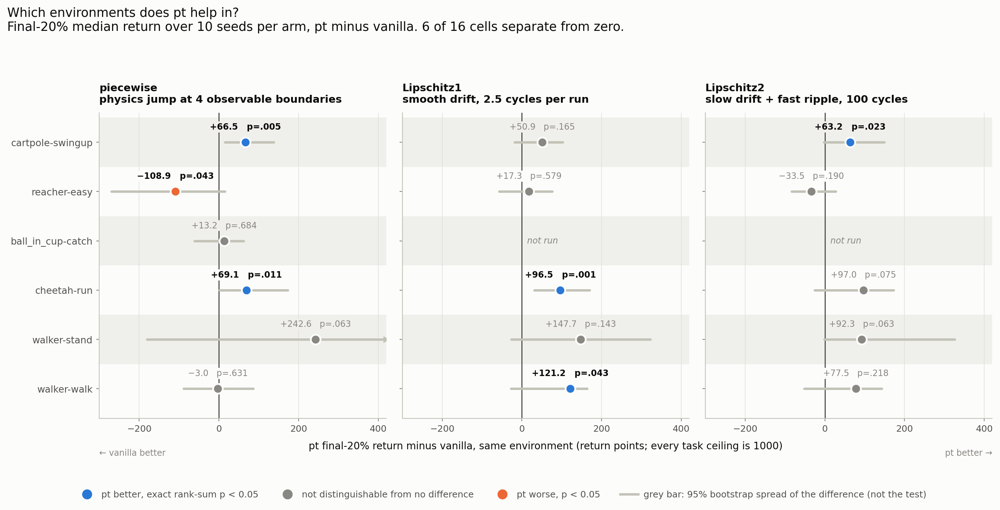
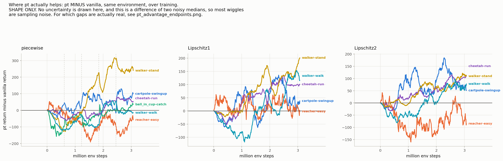
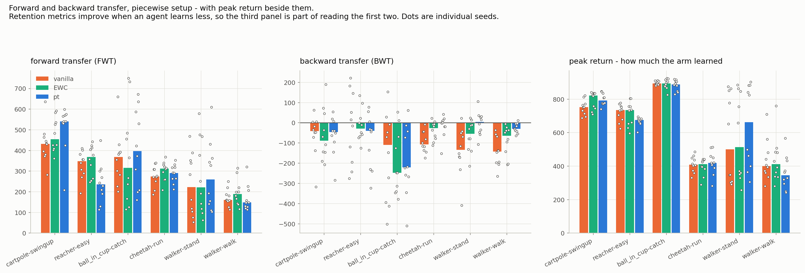

# Environment specifications and continuity types — reference table

**This document contains no interpretation.** It is the raw material: what each environment
physically is, what we change in it, how each continuity type changes it over time, and what the
three agents actually scored. The question of *why* `pt` behaves as it does is left open on
purpose.

Every number here is read from the live models or from the run data, not from memory.

---

## 1. What each environment is

*What the agent controls and what it can see. Environments are ordered by observation dimension
throughout this document and in every figure, so a row means the same thing everywhere.*

| environment | actuators : DoF | observations | control timestep | physics substeps | gravity acts on the task? | body contacts the ground? |
|---|---|---:|---|---:|---|---|
| cartpole-swingup | 1 : 2 | 5 | 0.01 s | 1 | yes | no |
| reacher-easy | 2 : 2 | 6 | 0.02 s | 1 | **no** | **no** |
| ball_in_cup-catch | 2 : 4 | 8 | 0.02 s | **10** | yes | no |
| cheetah-run | 6 : 9 | 17 | 0.01 s | 1 | yes | yes |
| walker-stand | 6 : 9 | 24 | 0.025 s | **10** | yes | yes |
| walker-walk | 6 : 9 | 24 | 0.025 s | **10** | yes | yes |

**Underactuated wherever actuators < DoF** — every environment except reacher, which has one motor
per joint.

**Gravity is −9.81 m/s² in all six models, and all six have a floor geom**; the two right-hand
columns say whether either acts on the task. All of reacher's joints rotate about **z** while
gravity points along **−z**, so the arm turns in a plane perpendicular to it and gravity exerts no
torque on it — a top-down arm, where nothing falls. cartpole and ball_in_cup have gravity acting
(the pole falls, the ball swings) but never touch their floor.

### What each environment asks for

*The same six, described by what the task requires rather than by what hardware it has. Two
environments with the same entries here are the same kind of problem, whatever their motor count.*

| environment | what must be held or produced | a state, or a motion | goal redrawn each episode? | start state |
|---|---|---|---|---|
| cartpole-swingup | pole upright **and** cart near centre, at low speed | a **state** | no | always pole-down, ±0.01 noise |
| reacher-easy | fingertip inside the target disc | a **state** | **yes** — angle uniform, radius 0.05–0.20 | joints randomised |
| ball_in_cup-catch | ball inside the cup | a **state** | no | ball uniform in x ∈ [−0.2, 0.2], z ∈ [0.2, 0.5] |
| cheetah-run | forward speed, target 10 m/s | a **motion** | no | joints uniform over range, then 200 settling steps |
| walker-stand | torso upright at height 1.2 | a **state** | no | joints randomised |
| walker-walk | upright **and** forward speed 1 | a **state × a motion** | no | joints randomised |

**reacher-easy is the only environment whose goal moves between episodes.** Everywhere else the
thing to be achieved is identical for all 3.07M steps and only the physics changes; in reacher the
target is re-drawn on every one of the ~3000 episodes, on top of the physics change.

**Only cartpole has an effectively fixed start.** The other five randomise the initial pose, so they
already carry episode-to-episode variation that has nothing to do with the task schedule.

### What the actuators drive, and what the observation contains

- **cartpole** — cart along a rail. `position` (3) = cart position + pole angle as cos/sin;
  `velocity` (2) = cart and pole rates
- **reacher** — shoulder, wrist. `position` (2) = joint angles; `to_target` (2) = **vector from
  fingertip to goal**; `velocity` (2)
- **ball_in_cup** — cup in x and z. `position` (4) = cup x,z and ball x,z; `velocity` (4)
- **cheetah** — back and front thigh/shin/foot. `position` (8) = root height/pitch + 6 joint angles
  (root x excluded); `velocity` (9)
- **walker** — hip/knee/ankle ×2. `orientations` (14) = cos/sin of 7 body angles; `height` (1);
  `velocity` (9)

**Only reacher's observation contains the goal.** Every other environment's goal is implicit in the
reward and fixed for the whole run.

---

## 2. The reward functions, exactly

*What each environment pays for. The last column is the measured evidence behind the dense/binary
call: the number of distinct per-step reward values over 400 steps driven by uniform-random actions
from reset, seed 0. Re-running that procedure reproduces these counts exactly.*

| environment | reward | dense or binary | distinct reward values in 400 random steps |
|---|---|---|---:|
| cartpole-swingup | `upright × centered × small_control × small_velocity`, four smooth factors | **dense, shaped** | 400 of 400 |
| reacher-easy | `tolerance(fingertip_to_target_dist, (0, radii))`, **no margin** | **binary 0/1** | 1 |
| ball_in_cup-catch | `physics.in_target()` | **binary 0/1** | 2 |
| cheetah-run | `tolerance(speed, (10, inf), margin=10, linear)` | **dense, shaped** | 90 |
| walker-stand | `(3·standing + upright) / 4`, height target 1.2 with margin 0.6 | **dense, shaped** | 400 of 400 |
| walker-walk | `stand_reward × (5·move_reward + 1) / 6`, speed target 1 | **dense, shaped** | 400 of 400 |

All rewards are in [0,1] per step over exactly 1000 steps, so **the ceiling is 1000 everywhere** and
returns are directly comparable across environments.

Notes that may matter:

- **walker-walk's reward is multiplicative**: it must stand *and* move. Standing alone caps it at
  1/6 of the per-step maximum. walker-stand is the same standing term with the speed factor removed.
- **cheetah's speed target is 10 m/s**, and the linear sigmoid means partial credit scales linearly
  from 0 at rest. Nothing rewards posture — a cheetah on its back that moves fast still scores.
- **reacher-easy's target radius is 0.05** (the "big" target); the fingertip radius adds to it.

---

## 3. What we change, and what it physically alters

*The one physics quantity each environment's tasks scale, and what moving it does to the body.
Section 4 gives the schedule that moves it and the absolute spans that result.*

| environment | what we scale | nominal (×1.0) | what this physically changes |
|---|---|---|---|
| cartpole-swingup | pole length + pole mass | 1.0 m, 0.10 kg | pendulum inertia and natural period; the torque needed to swing up |
| reacher-easy | arm segment length + mass | 0.12 m, 0.042 kg | **the arm's reach** — i.e. which targets are attainable at all — plus inertia |
| ball_in_cup-catch | ball mass | 0.065 kg | the momentum imparted by a cup swing; string tension dynamics |
| cheetah-run | joint damping + ground friction | 6.0 (bthigh), 1.0 | joint stiffness/resistance and available traction |
| walker-stand / walker-walk | limb mass + ground friction | 4.06 kg (thigh), 0.7 | mass distribution (**torso is left unchanged**) and available traction |

**The parameter is not the same across environments.** This is a stated limitation of the design:
each environment differs from the others both in *what it is* and in *what was changed in it*. The
walker pair is the exception — identical body, identical parameter, only the goal differs, which is
why they share one row here.

Points worth noticing when reasoning about this:

- **reacher's change is qualitative, not just quantitative.** Targets are drawn at radius 0.05–0.20
  from the origin. A 0.6× arm reaches ~0.115 m; a 1.6× arm reaches ~0.307 m. **Some targets become
  physically unreachable at the short setting**, so the achievable ceiling itself moves.
- **cartpole's reward includes `small_velocity`**, scored against a fixed 5 rad/s margin. A longer
  pole rotates more slowly, so pole length weakly couples to the reward as well as to the dynamics.
- **walker changes mass *distribution*** (limbs move, torso does not), not overall scale.
- **cheetah changes damping, not mass** — `cheetah.xml` has `<compiler settotalmass="14"/>`, so any
  mass change would be silently renormalised away.

---

## 4. The three continuity types

*How the multiplier from section 3 moves over a run. The three setups are the columns here,
compared attribute by attribute; the second table below turns them back into rows per environment.*

| | piecewise | Lipschitz1 | Lipschitz2 |
|---|---|---|---|
| **form** | step function of task index | one sine | slow sine + fast sine |
| **multiplier** | `[1.0, 1.6, 0.6, 1.6, 0.6]` | `1 + 0.5·sin(2πt/1,228,800)` | `1 + 0.4·sin(2πt/1,228,800) + 0.2·sin(2πt/30,720)` |
| **range** | 0.6 – 1.6 (span 1.0) | 0.5 – 1.5 (span 1.0) | **0.4 – 1.6 (span 1.2)** |
| **change per step** | 0 within a task | 2.6 × 10⁻⁶ | **43.0 × 10⁻⁶** (~17×) |
| **change at a boundary** | up to 1.0, instantaneous | — | — |
| **cycles per 3.07M run** | 5 tasks, 4 boundaries | 2.5 slow | 2.5 slow + **100 fast** |
| **boundaries observable?** | **yes** | no | no |
| **tasks revisit?** | yes (1↔3, 2↔4) | yes (cyclic) | yes (cyclic) |
| **transfer matrix (FWT/BWT)** | **available** | undefined | undefined |

### What that multiplier is worth in absolute units

*The schedule above is identical across environments, so what differs per environment is the
physical quantity it multiplies. Read a row as: this environment has the features of section 1,
and the variation applied to it looks like this.*

| environment | quantity scaled | piecewise: the 5 task values | Lipschitz1 span | Lipschitz2 span |
|---|---|---|---|---|
| cartpole-swingup | pole length (m), mass follows | 1.0, 1.6, 0.6, 1.6, 0.6 | 0.5 – 1.5 | 0.4 – 1.6 |
| reacher-easy | arm segment length (m) | 0.120, 0.192, 0.072, 0.192, 0.072 | 0.060 – 0.180 | 0.048 – 0.192 |
| ball_in_cup-catch | ball mass (kg) | 0.065, 0.104, 0.039, 0.104, 0.039 | *not run* | *not run* |
| cheetah-run | joint damping (bthigh) | 6.0, 9.6, 3.6, 9.6, 3.6 | 3.0 – 9.0 | 2.4 – 9.6 |
| walker-stand / walker-walk | thigh mass (kg) | 4.06, 6.50, 2.44, 6.50, 2.44 | 2.03 – 6.09 | 1.62 – 6.50 |

Where section 3 lists two quantities, both are scaled by the same multiplier; the column above
names the one whose absolute values are quoted. cheetah's ground friction moves 0.6 – 1.6 alongside
its damping, and the walkers' 0.42 – 1.12 alongside their limb mass.

**The one case where the span changes what is achievable at all is reacher**: at ×0.6 the arm
reaches ~0.115 m while targets are drawn out to 0.20 m, so some episodes become impossible
(section 3). In the other four the span changes how the body responds, not what the task is.

**Lipschitz2 carries 20% more total range than Lipschitz1** (1.2 vs 1.0). The slow amplitude was
reduced from 0.5 to 0.4 to partly compensate, but the two are not range-matched. Any Lipschitz1 →
Lipschitz2 comparison therefore differs in *two* ways: a fast component was added, **and** the total
excursion grew.

**The design intent, as recorded before the runs:** `pt` carries a slow network and a fast one.
Lipschitz1 gives the fast network nothing to do that one ordinary network could not handle;
Lipschitz2's ripple (100 cycles per run) is what gives it a job.

---

## 5. What the three agents do, and on what timescale

*Sections 1–4 describe the world. This describes what is put into it. Every value is read from the
live configs.*

| | vanilla PPO | online EWC | `pt` |
|---|---|---|---|
| networks | 1 actor, 1 critic | 1 actor, 1 critic, plus a Fisher-weighted anchor | **2 actors** (permanent + transient), **2 critics** |
| changed every PPO update | everything | everything, pulled toward the anchor | **transient only** — the permanent is detached from the PPO gradient |
| changed rarely | — | the Fisher/anchor, decayed by γ = 0.95 | the **permanent**, at consolidation |
| the knobs | lr 3e-4 | λ = 0.0088, γ = 0.95 | **k = 10 updates**, **ρ = 0.5** |
| what it treats as slow-moving | nothing | the weights that solved earlier tasks | the permanent component of the policy and value |

At each consolidation the permanent absorbs ρ = 0.5 of the transient and the transient's output
layer is scaled by 1 − ρ. The transient starts at the **zero function**; the permanent gets the
ordinary initialisation.

**The timescales, all in one unit.** One PPO update = `n_steps` 256 × 8 envs = **2048 env steps**,
so a 3.07M-step run is **1500 updates**. Against that:

- a piecewise task lasts **300 updates**; there are 4 boundaries per run
- the Lipschitz1 slow cycle is **600 updates**; 2.5 per run
- the Lipschitz2 fast ripple is **15 updates**; 100 per run
- `pt` consolidates every **10 updates** — 150 times per run, 30 times per piecewise task

So the permanent is written to about **1.5 times per fast ripple**, **60 times per slow cycle**, and
**30 times per piecewise task**.

---

## 6. What actually happened — final-20% median return, 10 seeds

*Every cell of the design, grouped by environment so the three setups sit together. **Bold marks
p < 0.05 and nothing else** — it never marks the best arm in a row.*

**Definitions, so the numbers are unambiguous.** *Final-20%* is the mean of the last fifth of one
run's logged returns; each cell reports the **median** of those values across 10 seeds. `p` is the
exact two-sided rank-sum test on the 10 vs 10 per-seed values, the project's standing convention.
Differences are medians of the arms, not medians of per-seed differences. The ceiling is 1000 in
every cell. **Figure 7.2 uses this same definition**, so the differences it draws are exactly the
`pt` vs vanilla column below.

| environment | setting | vanilla | EWC | `pt` | `pt` vs vanilla | `pt` vs EWC |
|---|---|---:|---:|---:|---:|---:|
| cartpole-swingup | piecewise | 636.7 | 671.3 | 703.2 | **+66.5 (p = .005)** | +32.0 (p = .190) |
| cartpole-swingup | Lipschitz1 | 548.7 | 574.8 | 599.7 | +50.9 (p = .165) | +24.9 (p = .631) |
| cartpole-swingup | Lipschitz2 | 567.2 | 576.7 | 630.3 | **+63.2 (p = .023)** | **+53.6 (p = .043)** |
| reacher-easy | piecewise | 501.2 | 540.3 | 392.3 | **−108.9 (p = .043)** | **−147.9 (p = .023)** |
| reacher-easy | Lipschitz1 | 622.0 | 666.8 | 639.4 | +17.3 (p = .579) | −27.4 (p = .912) |
| reacher-easy | Lipschitz2 | 673.4 | 679.0 | 639.8 | −33.5 (p = .190) | −39.2 (p = .089) |
| ball_in_cup-catch | piecewise | 838.8 | 846.1 | 852.1 | +13.2 (p = .684) | +5.9 (p = .853) |
| cheetah-run | piecewise | 265.2 | 318.3 | 334.3 | **+69.1 (p = .011)** | +16.0 (p = .393) |
| cheetah-run | Lipschitz1 | 357.4 | 381.1 | 454.0 | **+96.5 (p = .001)** | **+72.9 (p = .003)** |
| cheetah-run | Lipschitz2 | 327.8 | 412.4 | 424.8 | +97.0 (p = .075) | +12.4 (p = .684) |
| walker-stand | piecewise | 269.7 | 312.0 | 512.3 | +242.6 (p = .063) | +200.4 (p = .436) |
| walker-stand | Lipschitz1 | 284.7 | 358.3 | 432.4 | +147.7 (p = .143) | +74.1 (p = .796) |
| walker-stand | Lipschitz2 | 275.5 | 417.5 | 367.8 | +92.3 (p = .063) | −49.8 (p = .912) |
| walker-walk | piecewise | 232.7 | 229.2 | 229.7 | −3.0 (p = .631) | +0.5 (p = .739) |
| walker-walk | Lipschitz1 | 189.3 | 302.8 | 310.5 | **+121.2 (p = .043)** | +7.7 (p = .796) |
| walker-walk | Lipschitz2 | 251.4 | 288.9 | 328.9 | +77.5 (p = .218) | +40.0 (p = .631) |

**ball_in_cup-catch was run under piecewise only**, so the design has 16 cells, not 18.

**Do not compare a piecewise row against the Lipschitz rows below it.** The Lipschitz1 and
Lipschitz2 cells were run on the **same machine**, so every contrast between them is same-hardware
and testable. The piecewise study came from a different machine, and a 3.07M-step PPO run is
chaotic enough that a bit-level difference changes the draw. Reading down an environment's three
rows is qualitative only — it is not a pooled test. Section 8 has the full provenance.

**No multiplicity correction is applied.** Six of the 16 `pt` vs vanilla tests are below .05. Under
Holm at α = 0.05 only cheetah-run Lipschitz1 survives; under Benjamini–Hochberg, that plus cartpole
piecewise.

### Where in the run the difference appears

*`pt` minus vanilla, median over 10 seeds, split into five equal windows of 614,400 steps. For
piecewise those windows are exactly the five tasks and the multiplier is named; for the drift
setups they are fifths of the run, since there are no tasks.*

| environment | setting | window 1 | window 2 | window 3 | window 4 | window 5 |
|---|---|---:|---:|---:|---:|---:|
| | *piecewise multiplier* | *×1.0* | *×1.6* | *×0.6* | *×1.6* | *×0.6* |
| cartpole-swingup | piecewise | −6.4 | +18.5 | +67.6 | +45.3 | +66.7 |
| cartpole-swingup | Lipschitz1 | −39.9 | +49.1 | −5.2 | +88.1 | +51.0 |
| cartpole-swingup | Lipschitz2 | −15.4 | +95.9 | +67.5 | +115.6 | +63.2 |
| reacher-easy | piecewise | +3.2 | −69.7 | −130.7 | −59.8 | −109.1 |
| reacher-easy | Lipschitz1 | +43.7 | +20.0 | +3.9 | +18.3 | +17.4 |
| reacher-easy | Lipschitz2 | −18.7 | −129.9 | −88.6 | −78.9 | −33.5 |
| ball_in_cup-catch | piecewise | −92.4 | −42.5 | −60.0 | −1.8 | +13.0 |
| cheetah-run | piecewise | −16.0 | −32.2 | −30.3 | +24.0 | +68.9 |
| cheetah-run | Lipschitz1 | −18.5 | +2.6 | +64.4 | +93.9 | +96.5 |
| cheetah-run | Lipschitz2 | −15.4 | +32.7 | +46.1 | +70.3 | +96.9 |
| walker-stand | piecewise | −66.2 | −50.0 | +105.1 | +219.6 | +242.8 |
| walker-stand | Lipschitz1 | −10.5 | +9.2 | +83.2 | +122.1 | +147.6 |
| walker-stand | Lipschitz2 | −0.7 | +3.7 | +70.1 | +60.2 | +92.1 |
| walker-walk | piecewise | −65.2 | −87.8 | −90.8 | +17.6 | −3.0 |
| walker-walk | Lipschitz1 | −38.2 | −91.8 | −7.6 | +35.7 | +121.1 |
| walker-walk | Lipschitz2 | −39.8 | −52.4 | −0.4 | +31.9 | +77.6 |

By count:

- `pt` is behind vanilla in window 1 in **14 of the 16 cells**, and ahead in window 5 in **13 of 16**.
- **reacher-easy piecewise is the one cell whose gap does not close.** Its deficit is deepest in the
  two **×0.6** tasks (−130.7, −109.1) and shallower in the two ×1.6 tasks (−69.7, −59.8); ×0.6 is
  the short-arm setting of section 4.
- **walker-walk turns latest.** It is still negative in window 3 under all three setups, and under
  piecewise it does not finish positive.

### The Lipschitz1 → Lipschitz2 contrast

The pre-registered prediction is that `pt`'s gap over vanilla should **grow** when the fast
component is added. Taking the two `pt` vs vanilla gaps above and testing the interaction:

cartpole-swingup **+12.2** (p = .795) · reacher-easy **−50.9** (p = .257) · walker-stand **−55.5**
(p = .702) · walker-walk **−43.7** (p = .457) · cheetah-run **+0.5** (p = .995)

All five: nothing significant, and the signs disagree — two positive, three negative.

---

## 7. Figures

All in `plots/figures_setups/`, each with the CSV behind it. Median of 10 seeds throughout.

### 7.1 All three arms, one panel per environment

Read one panel at a time: does `pt` beat the baselines here, and where in the run. IQR shaded.
Dashed vertical lines on the piecewise figure are the four observable boundaries; the drift
figures have none, because the physics move every step.

### 7.2 Where `pt` actually helps

`pt`'s final-20% return minus vanilla's, in the same environment. A **within-environment
difference** cancels that environment's difficulty, reward scale and attainable maximum, leaving
only what the method changed — which is what makes these comparable to each other.

**How to read it.** One panel per non-stationarity setup, one row per environment, so setup is
carried by *position* and there is no colour legend to hold in your head. Each row is one cell of
the design:

- the **dot** is the median difference, the same number as section 6's `pt` vs vanilla column;
- the **grey bar** is the 95% bootstrap spread of that difference — spread only, *not* the test;
- the **dot's colour and the printed p** are the verdict, from the project's standard exact
  rank-sum test: blue = `pt` better, orange = `pt` worse, grey = not distinguishable from zero.

Colour and the printed number say the same thing, so nothing is carried by colour alone, and the
figure never has to be read against section 6's table.

**The grey bar and the verdict can disagree, and that is not an error.** The rank-sum test asks
whether `pt`'s ten seeds systematically outrank vanilla's — ordering only, magnitude ignored. The
bootstrap interval asks how precisely the median difference is *located*. `pt` can beat vanilla on
nearly every seed by wildly varying amounts, which gives a clean rank-sum and a wide interval:
reacher piecewise is p = 0.043 with an interval spanning −271 to +15.

**Only 6 of 16 cells separate from zero**, and one of those is `pt` being *worse*: `pt` is ahead on
cartpole-swingup (piecewise, Lipschitz2) and cheetah-run (piecewise, Lipschitz1) and walker-walk
(Lipschitz1), and behind on reacher-easy (piecewise). They are the bold rows of section 6.
Everything else — including walker-stand's headline +242.6 under piecewise — has a spread wide
enough that it cannot be separated from no difference at 10 seeds.

**This figure does not show EWC, and several of those wins do not survive it.** walker-walk
Lipschitz1 is +121.2 over vanilla but +7.7 over EWC. Section 6 carries both columns; read them
together.

### 7.2a The same thing over training — shape only

The same difference plotted across training rather than at the endpoint. **No uncertainty is drawn
here and it should not be read for significance** — it is a difference of two noisy medians, so
most of the wiggle is sampling noise. It is included because it shows *when* during a run a gap
opens or closes, which the endpoint figure cannot.

### 7.3 Forward and backward transfer — piecewise only

FWT and BWT are indexed by task number, so they exist only where there are tasks. The drift
setups have none and no transfer matrix was computed for them.

**Peak return is the third panel, not an afterthought.** Every retention-flavoured metric improves
when an agent simply learns less; on HalfCheetah a frozen-permanent arm scored BWT ~ 0 with a peak
return of exactly 0.0. Reading the first two panels without the third is how the worst arm gets
crowned. Dots are individual seeds.

### 7.4 One thing the tables in section 6 cannot show

- **The drift curves oscillate with the schedule.** 2.5 slow cycles are visible across each run as
  returns rise and fall with the multiplier. A final-20% median collapses that entirely, and where
  the run happens to stop within the cycle affects the number.

---

## 8. Provenance

- piecewise: 180 runs, one rented box (48-core), 2026-08-26
- Lipschitz1: 150 runs run **three times** — twice on EPYC boxes (bit-identical across both, all 150
  runs and all 47 scalar series) and once on the Ryzen box used for Lipschitz2
- Lipschitz2: 120 runs on the Ryzen box + cheetah-run from an EPYC box
- All arms: 10 seeds, 3.07M steps, learned σ from 1.0, parameter parity within 0.4% per environment.
- `actor_absorbed_frac` — how much of the transient the permanent took up at each consolidation,
  measured over all 160 `pt` runs. Per cell, the median over seeds of each run's median runs from
  **0.824** (walker-walk, Lipschitz1) to **0.948** (reacher-easy, Lipschitz1), with the middle of
  the 16 cells near 0.88. The lowest single consolidation anywhere is 0.335 (cartpole,
  Lipschitz1). Below 0.01 the permanent would be inert; it is not inert in any cell.
