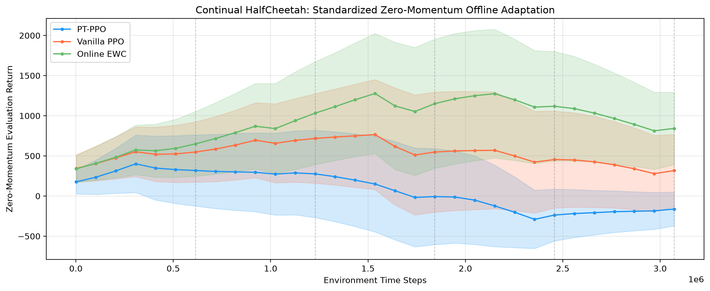
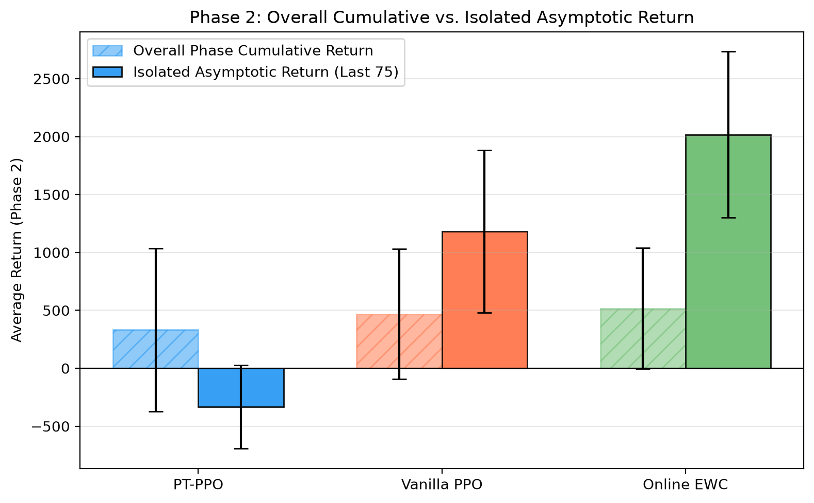
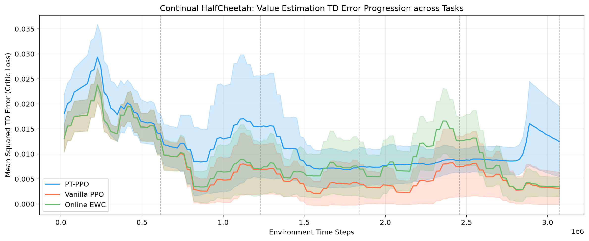
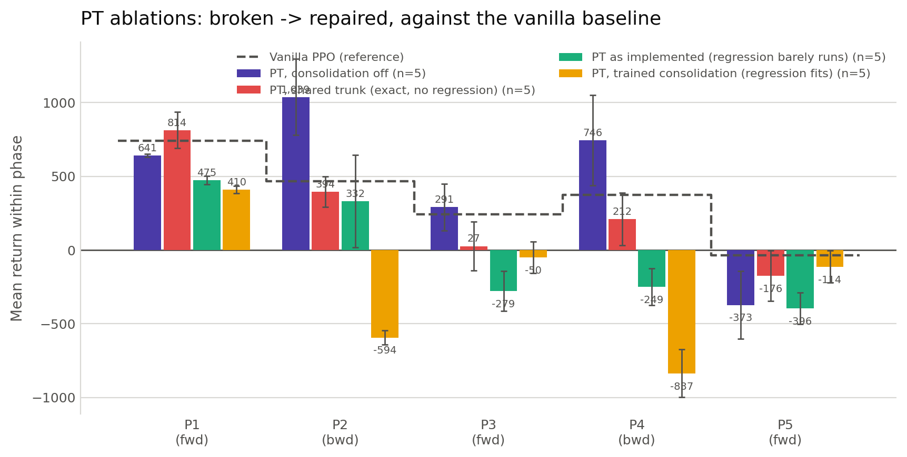
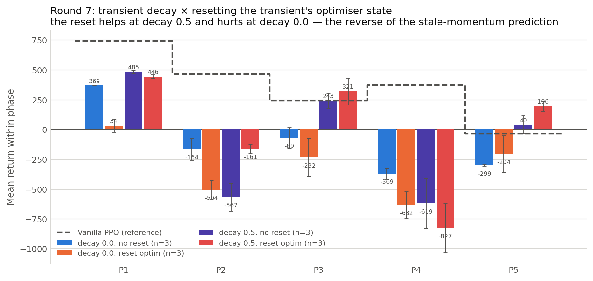
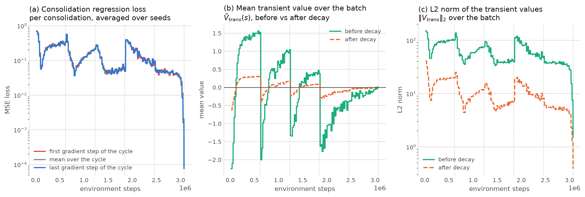
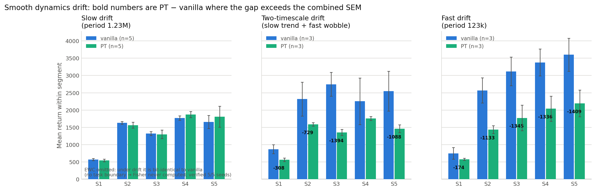

# Permanent–Transient Representations for Continual RL in Continuous Control
## Progress report and findings

**Author:** Nura Nabipour (BIHE) · **Supervisors:** Mr. Shahrad Mohamadzadeh, Mr. Ehsan Es'haghi
**Codebase:** `src_continuous_control` · **Status of this document:** all experiments complete.

---

> ## ⚠ STATUS (2026-08-04) — READ BEFORE §1
>
> An audit against Anand & Precup (2023) found **five conditions of the algorithm this codebase
> violated** (§8.2). All were corrected, the corrected agent cleared a stationary gate, and the
> full experiment was re-run: **4 arms × 10 seeds × 3.07 M steps** (§8.3).
>
> **The central conclusion survives, but two claims in this banner did not.** With a faithful
> implementation PT still does not beat vanilla (p = 0.002). Retracted since:
> **"EWC still wins"** — under rank statistics at n=10, `vanilla` vs `ewc` is p = 0.096, not
> significant; and the **Theorem 7 retention result** — `mse_perm < mse_full` is also satisfied by
> a permanent frozen at exactly zero, so it was measuring inertia, not retention.
>
> The audit continued past this banner and found **fifteen** defects, not five. The largest is that
> α_P had never been tuned, so the permanent absorbed 0.04 % of the transient per consolidation
> with alignment 0.000 — it had never functioned. The current state, the corrected numbers and the
> retractions are in **`REINVESTIGATION.md`**, which supersedes this document throughout.
>
> §4–§8 remain the record of the *unfaithful* agent and should be read as such. Two numbers are
> retracted outright: the logged `boundary/return_drop` scalar (a metric artifact, §8.3.4) and the
> §7/§8 shared-trunk runs (removed variant). §6.1's consolidation arithmetic is unaffected.

## 1. Executive summary

We ported the Permanent–Transient (PT) value decomposition of Anand & Precup (2023) from value-based
prediction to a **PPO actor–critic on MuJoCo HalfCheetah** under continual non-stationarity, and
benchmarked it against a vanilla PPO baseline and an Online-EWC baseline (3 agents × 5 seeds ×
3.07 M steps).

Eight results:

1. **PT fails in this setting** — it collapses to a do-nothing standstill policy from the third task
   phase onward (phase-3 mean return **−279** vs vanilla **+243**).
2. **We identified the exact cause:** the consolidation operator destroys most of the value function
   every *k* updates (~150× per run). Two defects compound. The transfer is a regression — the
   permanent critic must *learn* `old_V_perm + V_trans` — and at `lr_perm = 1e-5` with one epoch
   (320 SGD steps) it does not descend at all: measured over a full run, the loss at the last
   gradient step of a cycle equals the loss at the first (**1.0×** reduction). Meanwhile the decay
   removes far more than intended: at the configured `decay = 0.5` the transient's output norm falls
   to **16.6 %**, not 50 %, because scaling an MLP's *parameters* does not scale its *output*
   proportionally. Both are confirmed in situ over 3.07 M steps and 3 seeds (§6.1). See §6.3 for
   what is and is not a fundamental limit here.
3. **We proved causation**: disabling consolidation entirely reverses the collapse
   (phase-3 mean **−279 → +291**).
4. **We built and validated a fix** — a shared trunk with linear heads makes consolidation
   mathematically exact (0.0000 % value drift, confirmed in production by near-zero boundary drift).
   **The collapse is eliminated.** But the repaired mechanism performs **statistically
   indistinguishably from vanilla PPO** (every phase difference smaller than that phase's own
   standard deviation).
5. **EWC is the positive result** — it beats both, decisively and outside noise (phase-4 mean
   **1238** vs vanilla **375** and PT **212**; gap ≈ 1026 against σ ≈ 399).

6. **Consolidation fidelity is not the problem, and no finer mechanism was found** (§5.5–5.7).
   Training the regression properly makes PT no better; a held-out measurement shows the transfer is
   near-exact in situ (~0.3 % value drift on *both* fitted and unseen states) while PT still
   collapses. Two candidate mechanisms — the transient decay, and stale optimiser momentum surviving
   that decay — were then tested in a controlled 2×2 and **both failed**, the second producing the
   opposite of its prediction. Phase 2, on which an earlier draft based a decay argument, turns out
   to have sd 787 across seeds (2–3× every other phase) and cannot support such an argument at all;
   that claim is retracted.

7. **Under smooth Lipschitz drift — the proposal's own setting — EWC's advantage vanishes
   entirely** (§8). With a fixed reward and continuously drifting physics, **EWC becomes
   byte-identical to vanilla**, because with no task boundary its Fisher matrix is never computed.
   No agent collapses; under *slow* drift all three are statistically tied.
8. **Under drift fast enough to matter, PT is actively worse than the baseline** (§8.1). Given the
   slow-trend-plus-fast-fluctuation decomposition it was explicitly designed to exploit, vanilla
   beats PT **outside the combined SEM in 9 of 10 segments**, and the deficit *grows* with more
   fast-timescale content. The prediction that PT would win here was not merely unconfirmed but
   reversed — the strongest single piece of evidence in the study against the mechanism.

**The central finding.** Value decomposition of the critic confers **no benefit** over a single
critic in policy-gradient continual control, and under non-stationarity fast enough to matter it is
an active handicap. This is established in its strongest form: the mechanism can be shown to be
functioning *correctly* (consolidation is near-exact in situ) when it fails to help, so the result
cannot be dismissed as an implementation defect. It holds under discrete task switching, under slow
smooth drift, and — most tellingly — under the explicit slow/fast decomposition the method was
designed for.

**The positive finding.** Regularisation-based continual learning (EWC) is substantially superior —
**but only where discrete task boundaries exist.** Under boundary-free drift it has no mechanism
left and reduces exactly to the baseline. Taken together with the observation that *nothing*
collapses under smooth drift, the study's sharpest conclusion is about the **benchmark rather than
the method**: continual-RL machinery pays for itself only when an abrupt change destroys prior
knowledge. Smooth dynamics drift of this magnitude does not, so there is nothing for it to prevent.

**Note on scope.** The proposal specifies smooth, Lipschitz-continuous *dynamics* drift; the main
experiments use **discrete directional task-switching** (the forward-velocity reward term flips sign
every 614 400 steps). Both are now implemented and reported — the task-switching study in §4–§7 and
the drift study in §8 — so the thesis covers the proposed setting as well as the one that turned out
to be the discriminating one.

---

## 2. Experimental setup

| Item | Value |
|---|---|
| Environments | **`DirectionalHalfCheetah`** — the *reward's* forward-velocity term flips sign at discrete boundaries (§4–§7); **`LipschitzDriftHalfCheetah`** — the reward is fixed and the *physics* drift continuously, with no boundaries (§8) |
| Non-stationarity (switching) | 4 switches / 5 phases, direction sequence `+1, −1, +1, −1, +1`, switch interval 614 400 steps |
| Non-stationarity (drift) | joint damping + ground friction rescaled by a smooth multiplier; three regimes — slow (period 1.23 M), fast (period 123 k) and two-timescale (slow trend + fast fluctuation). Measured Lipschitz bound reported at run time |
| Horizon | 3 072 000 env steps per run |
| Agents | `vanilla` (single critic), `pt` (split critic), `ewc` (online diagonal-Fisher penalty) |
| Seeds | 0–4 (5 seeds per agent) |
| PPO recipe | 8 async envs × 256 steps (batch 2048), 10 epochs, minibatch 64, γ=0.99, λ=0.95, clip 0.2, LR anneal, obs+reward normalisation |
| Networks | `[64, 64]` MLPs; **all three agents share an identical `GaussianActor`** |
| Compute | vast.ai CPU instances (workload is MuJoCo-bound; GPU gives no benefit) |

All three agents share the PPO core, the actor architecture, the environment, and the seeds. **Only
the critic (or the regulariser) differs**, so any performance difference is attributable to the
mechanism under study.

---

## 3. Infrastructure corrections (prerequisite work)

Before any comparison was meaningful, three classes of defect had to be fixed. These affected
**all** agents, including the baselines.

### 3.1 PPO returned negative reward on HalfCheetah
The environment was constructed without normalisation, and the default update path was a per-step
online update rather than batch PPO. HalfCheetah is a standard case where PPO only reaches its
benchmark with the full recipe. Corrections applied:

- running-mean/std **observation normalisation** (clipped ±10)
- discounted-return **reward normalisation** (clipped ±10)
- **vectorised batch PPO** with GAE over 8 parallel envs
- **Adam ε = 1e-5** and **linear LR annealing**
- episodic returns logged from `RecordEpisodeStatistics` *before* normalisation, so reported returns
  are the true, un-normalised values
- evaluation uses the *training* normaliser's frozen statistics (avoids a distribution shift)

**Validation:** single-task runs (no switching, 500 k steps, 2 seeds) now reach **+800 – 1150**
return with a small, stable critic loss — the expected HalfCheetah learning curve.

### 3.2 Test suite repaired
The unit tests had not been updated after an earlier vectorisation refactor. Nine tests were failing
against the current code. One was a **genuine production bug**: `_online_step_update` still passed a
1-D observation to a `get_value` that expected a batch. Fixed, and the suite updated to the
vectorised buffer signature. **15/15 passing** at that point; the suite has since grown to
**31 tests** as each new mechanism and environment was added.

### 3.3 PT algorithm corrections
Three defects in the PT agent were fixed before the main sweep:

1. **Value inflation.** Consolidation regressed `V_perm → old_V_perm + V_trans` and *then* decayed the
   transient, which inflated the acting value by `decay·V_trans` every cycle. Corrected to
   `old_V_perm + (1−decay)·V_trans`, restoring the intended value-preserving identity.
   *(Later found to be insufficient — see §6.1.)*
2. **`consolidate_on_switch` was ignored.** The boundary handler only decayed the transient without
   absorbing it first. Corrected to consolidate-then-decay.
   *(Later found to be **inert** — see §5.1.)*
3. **PT made critic-only.** The agent used a `SplitActor` (`mean = perm_mean + trans_mean`) that had
   **no consolidation mechanism**: `perm_mean` sat at its random initialisation (LR 1e-5) while
   `trans_mean` did all the learning and was decayed at every boundary — partially wiping the policy
   each switch. This also contradicted the paper (PT is defined on the value function) and broke the
   apples-to-apples comparison. Removed; PT now uses the same `GaussianActor` as the baselines.

---

## 4. Main results (3 agents × 5 seeds × 3.07 M steps)

**Per-phase mean return** (primary metric — lower variance than the end-of-phase value), with the
number of seeds achieving a positive mean:

| Agent | P1 (+) | P2 (−) | P3 (+) | P4 (−) | P5 (+) |
|---|---|---|---|---|---|
| **vanilla** | 743 (5/5) | 468 (4/5) | 243 (3/5) | 375 (3/5) | −34 (2/5) |
| **EWC** | 743 (5/5) | 517 (3/5) | **705** (4/5) | **1238** (5/5) | **533** (5/5) |
| **PT** | 475 (5/5) | 332 (2/5) | **−279** (1/5) | −249 (2/5) | −396 (0/5) |

End-of-phase returns show the same ordering (vanilla 1524/1350/950/1425/962; EWC
1524/1545/1453/2739/1785; PT 1124/1456/−100/−21/−346).


*Figure 4.1 — Per-phase mean return, three agents, 5 seeds. Error bars are SEM.*


*Figure 4.2 — Return over training with task boundaries marked. PT (blue) never recovers after the second switch.*


*Figure 4.3 — Mean x-velocity. PT's cheetah stops moving from phase 3 onward, while vanilla and EWC keep reversing direction each phase.*


> **Data source.** All per-phase means are computed from `results/*_returns.pkl`, which records one
> point per PPO update (2 048 env steps → 1 500 points per run). The exported CSVs in
> `numeric_logs_csv/` are a **10× subsample** of the same runs (one point per 20 480 steps, first
> sample at 20 480) and therefore give phase means differing by ~2–3 %: they omit the earliest — and
> lowest — points of each phase window, biasing the means away from zero. The full-resolution `.pkl`
> values are used throughout this report and in the figures. End-of-phase values are identical in
> both, since the phase boundaries fall on both sampling grids.

**Observations**

- **EWC is the clear winner** — the only agent with a positive mean in every phase, and the only one
  positive across all 5 seeds in phases 4 and 5.
- **PT tracks the baselines for two phases, then collapses** and never recovers. The velocity trace
  confirms the failure mode physically: PT's cheetah **stops moving** (mean x-velocity ≈ 0) from
  phase 3 onward, while vanilla and EWC keep swinging to ±1.5–3.3 to chase each direction.
- **Boundary metrics** (the thesis's stability measure): PT's mean relative task-switch return drop
  is **~117 %** with very large variance, versus a tight **52–55 %** for vanilla and EWC. **H1 and H2
  are refuted** — as implemented PT is *worse* at boundaries, and §7 shows that repairing the
  mechanism raises it only to parity with vanilla, never above it. The dual-timescale agent does not
  outperform the single-timescale baseline (H1), and the permanent component does not prevent
  degradation (H2); the regularisation baseline does both.
- **Offline zero-momentum evaluation** (momentum-free adaptation probe): PT *degrades over training*
  (+400 → negative); EWC climbs to ~1270; vanilla holds ~300–770.


*Figure 4.4 — Relative return drop at a task switch. PT's ~117% with very large variance against a tight 52–55% for the baselines.*



*Figure 4.5 — Zero-momentum offline evaluation, which removes the carried-momentum confound at a direction reversal.*


*Figure 4.6 — Rollouts required to recover 90% of the previous phase's peak.*



*Figure 4.7 — Asymptotic versus online cumulative return.*



*Figure 4.8 — Critic loss. Note that PT's stays small (~0.01) throughout, which is why the failure evaded this diagnostic (§6.2).*

- **Sanity check passed:** vanilla and EWC are identical in phase 1 (743) — correct, since EWC's
  penalty is inactive until the first task switch.
- **Critic loss stayed low (~0.01) for PT throughout.** This is important: the failure is **not**
  value divergence, and this metric actively *concealed* the fault for three ablation rounds (§6.2).

---

## 5. Ablation programme

Four rounds, all at 5 seeds and the full 3.07 M horizon unless noted.

### 5.1 Round 1 — permanent LR and switch-time decay *(inconclusive; two methodological traps found)*

| Variant | Phase-3 result (end-of-phase, per seed) |
|---|---|
| baseline | −225 / +1501 (2 seeds) |
| no-switch-decay | **identical to baseline, bit-for-bit** |
| unfreeze-perm (`lr_perm` 1e-5 → 1e-3) | +811 / +260 |

*(This round predates the switch to per-phase means as the primary metric; its figures are
end-of-phase values on a 2-seed, shortened-horizon run, and are reported here only to document the
two methodological traps below. They are not comparable to the per-phase means used elsewhere.)*

Two traps discovered, both important for future work:

- **The "no-switch-decay" arm tested nothing.** `k=10` divides `updates_per_switch` (614 400/2048 =
  300) exactly, so the periodic consolidation always lands on the boundary and empties the
  consolidation buffer; the boundary consolidation then hits `len(buffer)==0` and **returns
  immediately**. Corollary: **fix 3.3.2 above is inert in every configuration run so far.** Testing
  switch-time behaviour requires a `k` that does not divide 300 evenly (e.g. 7).
- **Shortening `total_steps` invalidates the comparison.** `num_updates = total_steps/batch` drives
  the LR anneal, so a 3-phase run anneals the LR to zero exactly where phase-3 recovery is measured.
  Evidence: seed 1 gave **−365** in the full sweep but **+1501** in the shortened run. **All later
  ablations use the full horizon.**

Re-analysing round 1 across *all* phases, `unfreeze-perm` was in fact **worse on the mean at every
phase** (P1 903 vs 1112, P2 −498 vs 171, P3 535 vs 638); it "won" only a 2-seed sign count.

### 5.2 Round 2 — faster transient (adaptation speed)

Motivated by the observation that `lr_trans` (3e-4) equalled vanilla's `lr_critic` (3e-4) — meaning
PT had **no fast timescale at all** relative to the baseline.

Per-phase mean return (seeds with a positive mean in brackets):

| Variant | P1 | P2 | P3 | P4 | P5 |
|---|---|---|---|---|---|
| PT baseline | 475 (5/5) | 332 (2/5) | −279 (1/5) | −249 (2/5) | −396 (0/5) |
| `lr_trans = 1e-3` | 691 (5/5) | 134 (3/5) | **−192** (1/5) | **−434** (0/5) | −238 (0/5) |
| `lr_trans = 3e-3` | 795 (5/5) | −215 (1/5) | **−54** (2/5) | **−553** (0/5) | −53 (2/5) |

Phase 3 improves over the baseline (−279 → −192 → −54) but **never becomes positive**, and both
variants are **worse than the baseline at phase 4** (−434 and −553 vs −249). Adaptation *speed* is
not the lever.

### 5.3 Round 3 — `decay = 0` (after finding the decay bug)

| Variant | P1 | P2 | P3 | P4 | P5 |
|---|---|---|---|---|---|
| `decay=0` | 394 | −319 | −0.2 | −348 | −213 |
| `decay=0`, `lr_trans=1e-3` | 488 | 30 | 145 | −625 | 72 |

No fix. Phase 4 still collapses. (Apparent phase-3/5 gains in the second variant were driven by a
single oscillating seed.)

### 5.4 Round 4 — consolidation disabled entirely *(the causal control)*

| Agent | P1 | P2 | P3 | P4 | P5 |
|---|---|---|---|---|---|
| PT (as implemented) | 475 | 332 | **−279** | −249 | −396 |
| **PT, consolidation off** | 641 | 1039 | **+291** | 746 | −373 |
| vanilla (reference) | 743 | 468 | 243 | 375 | −34 |

**This is the decisive result.** Removing consolidation reverses the collapse and returns PT to
vanilla-level performance — exactly as predicted, because with consolidation disabled `V_perm` is a
frozen random network and PT degenerates into "vanilla plus a fixed offset".




*Figure 5.1 — PT variants ordered by how much consolidation regression actually runs. Removing the regression entirely (violet, red) performs best; training it well (yellow) performs worst.*

*Interpretation discipline:* differences between `PT-no-consolidation` and vanilla in phases 2–4 sit
**within seed noise** (σ = 350–680, n = 5). The defensible claim is **"removing consolidation restores
vanilla-level performance"**, not "PT beats vanilla". The phase-3 *reversal* (−279 → +291, consistent
across 4/5 seeds) is large relative to that noise and is treated as real.

*Phase-5 decline is generic, not PT-specific:* vanilla (375 → −34) and EWC (1238 → 533) decline in
phase 5 as well, consistent with the near-fully-annealed learning rate late in training.

### 5.5 Round 5 — separate trunks with a *properly trained* consolidation regression

Rounds 1–4 and §7 each break one half of the PT idea: the permanent critic must both **accumulate**
knowledge and stay **insulated** from the fast timescale. Consolidation-off is insulated but learns
nothing; the shared trunk accumulates exactly but its features move at the fast rate; the shipped
separate-trunk config has both properties in principle but never actually trains its regression
(0.05 % transfer). This round runs the missing configuration: **separate trunks, Adam,
`lr_perm = 1e-3`, `consolidation_epochs = 20`** (6 400 gradient steps per consolidation instead of
320), `decay = 0`, full horizon, 5 seeds.

| Variant | P1 | P2 | P3 | P4 | P5 |
|---|---|---|---|---|---|
| shared trunk (no regression at all) | 814 | 394 | 27 | 212 | −176 |
| shipped (regression barely runs) | 475 | 332 | −279 | −249 | −396 |
| **trained consolidation (this round)** | **410** | **−594** | **−50** | **−837** | **−114** |

SEMs 26 / 47 / 106 / 162 / 109; seeds-positive 5/5, 0/5, 1/5, 0/5, 1/5.

**Training the regression made PT worse, not better** — and decisively so (the phase-2 gap alone is
~900 points against a 47-point SEM). The collapse also arrives **one phase earlier**: this variant is
already deeply negative at P2, the very first switch, whereas the shipped version survives to P3.

This closes off "the consolidation was never trained" as the explanation for the original collapse.

> **Correction.** An earlier version of this section read the variants as an ordering by *how much
> consolidation regression happens* and concluded "more regression, worse performance". **That
> comparison was confounded.** The shipped config and this round differ in **two** ways — the amount
> of regression training *and* the decay — and the collapse tracks the **decay**:
>
> | variant | decay | consolidation training | P2 |
> |---|---|---|---|
> | shipped | 0.5 | barely runs | **+332** |
> | shared trunk | 0.5 | none (exact) | **+394** |
> | fast transient | 0.5 | barely runs | **+134** |
> | `decay=0` (§5.3) | **0.0** | barely runs | **−319** |
> | `decay=0` + fast transient | **0.0** | barely runs | **+30** |
> | trained consolidation (this round) | **0.0** | fits well | **−594** |
>
> Every `decay = 0.5` run is positive at phase 2 and every `decay = 0.0` run is not — and crucially
> `decay=0` already collapses at P2 with *untrained* consolidation. So the amount of regression is
> not what separates them.
>
> **⚠ This grouping is itself retracted — see §5.7.** A controlled 2×2 varying decay alone found the
> opposite ordering at phase 2, and the shipped run's phase-2 values have sd 787 across seeds
> (2–3× every other phase, only 2/5 seeds positive), so phase-2 point estimates cannot support a
> mechanism claim in either direction. What both readings share, and what does survive, is the
> narrower statement above: the amount of consolidation training is not what distinguishes these
> runs.

**The in-situ measurement, and the puzzle it creates.** This round logs
`train/consolidation_error_pct`: the % change in the acting value across each consolidation,
measured on the states being consolidated. It falls to essentially zero:

| training stage | consolidation error (fitted states) |
|---|---|
| first cycle | ~2.5–3.0 % |
| mid-training | ~0.3–0.7 % |
| final phase | **~0.00–0.07 %** |

So the regression *does* fit, and the transfer *is* value-preserving — **on the states it trained
on**. Yet performance is the worst of any variant. Panel (a) of
`plots/figures_original_study/consolidation_insitu.png` plots this directly from the run's own logs: the drift
falls from ~3 % to ~0.006 % over training, on every seed.

**Leading explanation at the time (since falsified — see §5.6).** The metric above is
in-distribution only. With Adam, `lr_perm = 1e-3` and 6 400 gradient steps on a `[64,64]` net over a
20 480-state buffer, the permanent net plausibly **memorises the buffer** and extrapolates badly onto
the *new* states the policy visits immediately afterwards — worst right after a switch, when the
state distribution has just moved, which matches the collapse arriving one phase earlier. Holding
out 20 % of the buffer from the regression and measuring drift on it separately reproduces exactly
this signature offline:

| consolidation epochs | error on fitted states | error on held-out states |
|---|---|---|
| 1 | 89.5 % | 89.6 % |
| 20 | 41.3 % | 55.8 % |
| 60 | **24.2 %** | **53.4 %** |

More training improves the fitted states while held-out error barely moves — the gap widens from
~0 to ~29 points. `configs/abl_pt_consol_holdout.yaml` runs this measurement *during training* to
confirm it in situ (3 seeds; it measures a mechanism, not a return difference). Until that lands,
this explanation is **suggestive rather than established** — the round-5 result itself (more
regression ⇒ worse performance) is what stands on the evidence.

### 5.6 Round 6 — the memorisation hypothesis is falsified, and the decay comes into focus

§5.5 proposed that the permanent net *memorises* the consolidation buffer: near-perfect on the
states it fits, badly wrong on the new states visited next. Round 6 tested it by excluding 20 % of
the buffer from the regression and measuring value drift on that held-out portion separately
(3 seeds, full horizon).

| seed | mean error, fitted states | mean error, held-out states | max gap |
|---|---|---|---|
| 0 | 0.31 % | 0.32 % | +0.25 % |
| 1 | 0.28 % | 0.29 % | +0.22 % |
| 2 | 0.30 % | 0.31 % | +0.24 % |

**The two track each other almost exactly, everywhere in training, including immediately after a
switch, and both converge to ~0.00 % by the end.** No gap ever opens — panel (b) of
`plots/figures_original_study/consolidation_insitu.png` shows the two curves lying on top of one another for the
whole run. Measured over every logged consolidation: fitted 0.300 %, held-out 0.310 %. **The memorisation hypothesis
is wrong**, and the offline probe's prediction (a gap widening with training effort) does not
reproduce in situ.

**An important limitation of this test, however.** The held-out portion is a *random* 20 % of the
same 20 480-state buffer, so both halves are drawn from the identical recent on-policy distribution.
It therefore establishes that the permanent net **interpolates within its own recent state
distribution** rather than memorising it — but it does *not* test extrapolation to the states of the
**next** rollout, which are temporally later and, right after a switch, drawn from a shifted
distribution. That stricter question remains open (§10h).


*Figure 5.2 — In-situ consolidation quality from the runs' own logs. (a) Round 5: the regression converges to a near-exact transfer. (b) Round 6: held-out error tracks fitted error everywhere, falsifying the memorisation hypothesis.*

**What this leaves.** Consolidation demonstrably works: the transfer is near-exact, on fitted and
unseen states alike, throughout training — and PT collapses anyway. The failure is therefore *not*
in the transfer. Combined with the decay grouping in §5.5, attention moves to what happens
**immediately after** consolidation.

**Leading hypothesis (untested).** `decay_transient` scales the transient's *parameters*
(`p.data.mul_(decay)`) but leaves the **optimiser state untouched** — Adam's `exp_avg` and
`exp_avg_sq` for those parameters survive the reset. So after `θ_T ← 0` the next optimiser step
displaces the zeroed weights by roughly `lr · exp_avg / √exp_avg_sq`, driven by momentum from a
network that no longer exists. Consolidation makes `V_perm` and `V_trans` mutually consistent, and
one update later that consistency is destroyed. This predicts exactly the observed pattern: `decay = 0`
maximises the weight/state mismatch and collapses; `decay = 0.5` halves it and survives.

### 5.7 Round 7 — both hypotheses fail, and phase 2 turns out to be uninterpretable

Round 7 ran the 2×2 — decay (0.0 vs 0.5) × resetting the transient's optimiser state on decay
(yes/no), 3 seeds per cell, everything else held fixed. Per-phase mean return ± SEM:

| | decay = 0.0 | decay = 0.5 |
|---|---|---|
| **no reset** | 369±2 / −164±73 / −69±71 / −369±37 / −299±4 | 485±10 / −567±94 / 243±52 / −619±171 / 40±62 |
| **reset optimiser state** | 34±44 / −504±64 / −232±130 / −632±92 / −204±125 | 446±13 / −161±34 / 321±92 / −827±168 / 196±33 |




*Figure 5.3 — Round 7: transient decay × resetting the transient's optimiser state. No cell reaches the vanilla reference (dashed). The reset helps at decay 0.5 and hurts at decay 0.0 — the reverse of the prediction.*


**Both hypotheses are disconfirmed, and one runs backwards.**

1. **The stale-momentum mechanism is wrong.** It predicts the reset should help *most* at
   `decay = 0`, where zeroed weights and full-scale momentum are maximally mismatched. The opposite
   happens: at `decay = 0` the reset makes P1, P2 and P4 significantly *worse* (P2: −164 → −504,
   gap ~340 against a combined SEM of ~137), while it helps only at `decay = 0.5`
   (P2: −567 → −161). That is the reverse of the prediction — a positive disconfirmation, not a
   null.
2. **The decay grouping of §5.5 does not survive a controlled test.** In this un-confounded
   comparison `decay = 0.0` is *better* than `decay = 0.5` at phase 2 (−164 vs −567), the very
   phase the grouping was built on.
3. **Nothing beats vanilla** (743/468/243/375/−34) in any cell, in any phase.

**Why §5.5's grouping was unsound — phase 2 cannot carry an argument.** The shipped PT run's own
phase-2 values across its five seeds are **+800, +1479, −210, −15, −393**: mean +332 but **sd 787**,
with only **2/5 seeds positive**. That standard deviation is 2–3× every other phase (P1 71, P3 338,
P4 312, P5 271), and the positive mean rests on two outlier seeds. Round 7's cell mean of −567 sits
~1.1 sd below it — comfortably inside noise. **The §5.5 decay grouping is therefore retracted**: it
read a difference between chaotic phase-2 point estimates as a mechanism.

**A reproducibility defect found in the process (now fixed).** The holdout instrumentation added for
round 6 was intended to be inert at `consolidation_holdout_frac = 0`, but it changed which RNG
stream consolidation consumes (`np.random.permutation` + `torch.randperm` in place of
`np.random.shuffle`). That shifts every downstream random draw, so same-seed runs before and after
it are **not** trajectory-comparable, and round 7's cells cannot be compared seed-by-seed against
the main sweep. The default path now reproduces the original RNG consumption exactly, and the
diagnostic path is explicitly documented as not seed-comparable. Round 7's *internal* comparisons
(all cells, same code, same session) are unaffected and remain valid.

**What survives.** PT's collapse in phases 3–5 is robust — those phases have sd 271–338 with means
clearly negative across every variant tested. What does *not* survive is any fine-grained causal
story pinned to phase 2. Neither decay nor optimiser state explains PT's failure.

---

## 6. Root cause

### 6.1 Two defects in the consolidation operator

**(a) The decay does not do what the algorithm assumes.** `decay_transient(d)` multiplies every
*parameter* of the transient network by `d`. For a nonlinear network (tanh + biases) this does **not**
scale the *output* `V_trans` by `d`:

| decay | measured error vs `decay · V_trans` |
|---|---|
| 0.00 | 0 % (exact) |
| 0.25 | ~66 % |
| 0.50 | ~33 % |
| 0.75 | ~13 % |

So the value-preserving identity holds **only at `decay = 0`**; at the configured `decay = 0.5` every
consolidation injected an uncontrolled perturbation into the acting value.

**(b) The transfer never happens, but the deletion always does.** Measured at the exact production
settings (`lr_perm = 1e-5`, SGD, 1 epoch over 20 480 states = 320 gradient steps):

```
transient magnitude the permanent must absorb : 2.8107
permanent movement actually achieved          : 0.0015   ->  0.05 % of the required transfer
transient remaining after decay               : 0.0000   ->  100 % deleted

net effect on the acting value V = V_perm + V_trans : 98.3 % destroyed
```

**The value function is annihilated every `k = 10` updates — roughly 150 times per run.** The next
rollout then collects bootstrap values from a gutted critic and feeds them to GAE, corrupting the
advantages for that entire rollout.


*Figure 6.1 — **Offline measurement** of the real consolidation code on **synthetic (iid Gaussian)
probe states**, not on states the agent visited. (a) One consolidation at the shipped settings: 0.1 %
of the transient absorbed, 100 % deleted. (b) The target is fittable given capacity and training, but
held-out error does not improve. (c) Parameter scaling is not output scaling — exact for any decay
only with linear heads. The synthetic inputs make this a controlled probe rather than a measurement
of training; the in-situ counterparts on real rollout states are Figure 6.2 and §5.6, which agree
with (a) and (c) and are the numbers quoted in the executive summary.*

#### In-situ confirmation of both defects

The two defects above were originally measured offline, on synthetic probe states. They have since
been confirmed **during real training**, over the full 3 072 000-step horizon with three seeds, by
recording the consolidation regression's loss and the transient's magnitude either side of the decay
at every consolidation.

| Measured over a full run | Shipped config (`decay = 0.5`, SGD, 1 epoch) | Trained regression (`decay = 0`, Adam, 20 epochs) |
|---|---|---|
| ‖V_trans‖₂ ratio, after ÷ before decay | **0.166** | 0.0000 (exact) |
| …expected if the output scaled by `decay` | 0.5 | 0.0 |
| Within-cycle loss reduction (first ÷ last gradient step) | **1.0×** | **2 996×** |

**Defect (a), the decay.** With `decay = 0.5` the transient's output norm falls to **16.6 %** of its
prior value, not 50 % — consistent across seeds (0.167 / 0.168 / 0.163). Scaling an MLP's
*parameters* by one half shrinks its *output* by far more than half, so the decay removes roughly
83 % of the transient where the algorithm assumes it removes 50 %. This is the in-situ counterpart
of the offline measurement in §6.1(a). The `decay = 0` run confirms the boundary case: the ratio is
exactly 0, because zeroing every parameter does zero the output.

**Defect (b), the regression.** In the shipped configuration the loss at the *last* gradient step of
a consolidation equals the loss at the *first* — a reduction of **1.0×**, i.e. none at all. Panel (a)
of Figure 6.2 shows the three loss traces lying exactly on top of one another for the whole run: 320
SGD steps at `lr_perm = 1e-5` accomplish nothing measurable. The same measurement with Adam,
`lr_perm = 1e-3` and twenty epochs gives a **2 996×** reduction within each cycle, so the flat curve
is a property of the shipped hyper-parameters rather than of the optimisation problem.

Together these confirm, on the real system rather than on probes, that the shipped consolidation
**deletes far more of the transient than intended while transferring essentially none of it**.



*Figure 6.2 — Consolidation internals, shipped configuration (`decay = 0.5`), 3 seeds. (a) The
regression loss at the first, mean and last gradient step of each cycle are indistinguishable — the
regression never descends. (b) The transient's mean value over the batch, showing the sawtooth as it
re-accumulates between consolidations and resets at each task boundary. (c) Its L2 norm before and
after the decay: the gap is far larger than the factor of two the configured decay implies.*

### 6.2 Why this evaded detection for three rounds

`critic_loss` is computed **during** the 10-epoch PPO update, by which point the fast transient has
already re-fitted the returns. The metric therefore looks healthy (~0.01, comparable to vanilla)
while the damage is happening. This is why the failure looked mysterious, and it explains why every
earlier hypothesis failed: `lr_perm = 1e-3` still transfers only ~5 %; a faster transient merely
re-fits sooner; and `decay = 0` vs `0.5` is irrelevant when the value dies either way.

### 6.3 How far the regression can be pushed — and what actually limits it

An earlier draft of this report claimed the consolidation target was **not representable** — that a
single MLP cannot express `old_V_perm + V_trans`, the sum of two MLPs, because the function class is
not closed under addition. **That claim was wrong, and this section corrects it.** The objection that
prompted the check was straightforward: on a *finite* batch a sufficiently large network should
simply overfit the target, so any observed error may be an optimisation or capacity artefact rather
than a representational limit. That is what the measurement shows.

Setup: the true production consolidation problem — 20 480 buffered states, target `old_V_perm(s) +
V_trans(s)` with both components `[64,64]` MLPs — fitted with Adam (lr 1e-3, batch 256) rather than
the shipped SGD at 1e-5, and evaluated both on the fitted batch and on held-out states.

| permanent net | params | epochs | error on fitted batch | error on held-out states |
|---|---|---|---|---|
| `[64,64]` (production) | 5 377 | 50 | 35.6 % | 39.2 % |
| `[64,64]` | 5 377 | 200 | 29.3 % | 38.9 % |
| `[256,256]` | 70 657 | 50 | 23.8 % | 38.4 % |
| **`[256,256]`** | 70 657 | 200 | **3.2 %** | 44.2 % |
| `[512,512]` | 267 265 | 200 | 4.3 % | 42.5 % |

**Three conclusions:**

1. **The target is fittable.** With enough capacity and training the batch error reaches ~3 %. There
   is no representational barrier; the earlier "sum of two MLPs" argument does not hold.
2. **The shipped configuration is nowhere near that.** `lr_perm = 1e-5`, SGD, one epoch (320
   gradient steps) transfers **0.05 %**. The production failure is overwhelmingly a matter of the
   consolidation regression never being trained — while the decay deletes the transient regardless.
   This alone accounts for the collapse, and it is the finding the ablations confirm (§5.4).
3. **What does not improve is generalisation.** Held-out error floors at **≈ 38–40 %** across every
   capacity and budget tried, and past a point more fitting makes it *worse* (`[256,256]`: batch
   23.8 % → 3.2 % while held-out 38.4 % → 44.2 %). This is the operationally relevant quantity:
   consolidation fits the states of the last *k* rollouts, but the resulting value function is then
   used to bootstrap on the **new** states of the next rollout.

**Caveat.** The probe states here are iid Gaussian in 17 dimensions, which is a harder
generalisation problem than genuine on-policy states, which concentrate on a low-dimensional
manifold. The held-out floor should therefore be read as indicative of a generalisation gap, not as
a calibrated estimate of it. Measuring the same quantity on real rollout states is a worthwhile
follow-up (§10g).

**What this means for the mechanism.** Consolidation-by-regression is not impossible, but it is
expensive (thousands of gradient steps every *k* updates to approach a good fit), it did not happen
at all in the shipped configuration, and even when performed well it leaves a substantial error on
the states that matter next. The shared-trunk formulation in §7 sidesteps the entire question: the
transfer becomes exact weight arithmetic, with no regression, no training budget and no
generalisation gap — which is why it is the right construction regardless of how this section
resolves. Notably, Anand et al. (2024, ICLR under review, ref. [4] of the proposal) also move away
from a naive parametric transient, towards separate feature encoders and non-parametric transient
memory.

---

## 7. The fix: shared trunk with linear heads — and its result

> **⚠ STATUS (2026-08-03): this variant has been REMOVED from the codebase, and the results in §7
> and §8 are therefore not reproducible with the current code.** The reference algorithm we port
> (`control/minatar_crl/PT_DQN_half.py`) holds **two fully independent networks**, `P_Net` and
> `T_Net`. The shared-trunk critic used here shares a feature trunk between them, which couples the
> two components through the fast learner's gradients — the opposite of the timescale separation
> that *is* the method. It also matched neither reference architecture: their
> `control/minigrid/model.py::obj_net_two_heads` does share a conv trunk, but splits into two full
> multi-layer MLPs, not the two *linear* heads used here (the linear heads were chosen specifically
> to make consolidation exact, which is our construction, not theirs).
>
> A further defect was found in it before removal: `critic_loss` detaches `v_perm`, which with a
> shared trunk cuts the gradient **through the trunk**, so features were trained on `∂(w_T·φ)/∂φ`
> instead of `∂((w_P+w_T)·φ)/∂φ`. Since `w_P` accumulates at every consolidation while `w_T` is
> decayed, that misalignment grows monotonically over a run — which would bias §8.1's conclusion in
> exactly the direction it reports.
>
> §7.1 and all of §8 must be re-run on the two-network critic before being cited. The analysis of
> *why* consolidation is lossy with separate trunks (below, and §6.1) is unaffected and stands.

If both heads read from a **shared feature trunk** φ and are **linear**, then

```
V = w_P·φ(s) + w_T·φ(s) = (w_P + w_T)·φ(s)
```

and the sum of two linear functions on the same features is linear on those features. Consolidation
becomes **exact weight arithmetic** — `w_P += (1−decay)·w_T`, then `w_T *= decay` — leaving `V`
unchanged. No regression, no consolidation buffer, no `lr_perm`; and decaying a *linear* head scales
its output exactly, so defect 6.1(a) also disappears.

**Measured consolidation error:**

| decay | two separate MLPs (best case) | shared trunk + linear heads |
|---|---|---|
| 0.25 | 17.1 % | **0.0000 %** |
| 0.50 | 16.3 % | **0.0000 %** |
| 0.75 | 10.6 % | **0.0000 %** |

This is **not an invention** — it is the shared-trunk two-head variant that the reference
implementation already uses for its MiniGrid experiments. Our analysis shows *why* that variant is
the correct choice under deep function approximation.

**Implementation status:** ~~`SharedTrunkSplitCritic` added; selected by `critic_arch: shared_trunk`~~
**Removed** — see the status banner at the head of this section. `SplitCritic` (two fully separate
networks) is now the only PT critic, and `critic_arch` no longer exists as a config key.

**Known trade-off (should appear in the thesis discussion).** Because the trunk is shared, the
permanent head's *weights* are frozen between consolidations but its *output* still moves as the
features are learned. The variant therefore trades **permanent insulation** for **exact
consolidation**; the two-trunk variant makes the opposite trade. Whether exact-but-shared preserves
the PT benefit is exactly what this experiment measures.

### 7.1 Result (5 seeds, full horizon)

**Per-phase mean return, all variants:**

| Phase | vanilla | EWC | PT (broken) | PT (no consolidation) | **PT (shared trunk)** |
|---|---|---|---|---|---|
| 1 | 743 | 743 | 475 | 641 | **814** |
| 2 | 468 | 517 | 332 | 1039 | **394** |
| 3 | 243 | **705** | −279 | 291 | **27** |
| 4 | 375 | **1238** | −249 | 746 | **212** |
| 5 | −34 | **533** | −396 | −373 | **−176** |

Per-phase σ for the shared-trunk run: 275 / 231 / 374 / 399 / 382. Critic loss 0.003–0.022
throughout. Per-boundary value drift: 0.00 / 5.08 / 3.87 / 0.00 / 2.60.

**Three conclusions, in decreasing order of confidence:**

1. **The fix works as designed.** No phase approaches the broken agent's −307 / −248 / −402. Boundary
   value drift is near zero and of the same small order as the no-consolidation control — confirming
   *in production*, not merely in unit tests, that consolidation no longer perturbs the acting value.
   The catastrophic failure mode is eliminated.

2. **PT does not beat vanilla.** Phase 1 is nominally ahead (814 vs 743) but the 71-point gap is
   negligible against σ = 275. Phases 2–5 all fall below vanilla (394 vs 468; 27 vs 243; 212 vs 375;
   −176 vs −34), and **every one of those gaps is smaller than that phase's own standard deviation**.
   The correct reading is that shared-trunk PT is **statistically indistinguishable from vanilla**.

3. **EWC is clearly superior, and this gap is not noise.** At phase 3, EWC's 705 vs PT's 27 is a
   ~678-point gap against σ = 374 (beyond one σ); at phase 4, 1238 vs 212 is a ~1026-point gap
   against σ = 399 — unambiguously outside seed noise.

**An observation we flag rather than claim.** Shared-trunk PT underperforms the *naive*
no-consolidation control in phases 2 (394 vs 1039) and 4 (212 vs 746) — i.e. even lossless
consolidation may add drag relative to not consolidating at all. However, the control's own variance
in those phases is very large (σ = 576 and 684), and a two-sample comparison gives roughly *t* ≈ 2.3
at phase 2 and *t* ≈ 1.5 at phase 4. Across five phases and several variants this does not survive
as a reliable effect at n = 5. It is recorded as a hypothesis, **not** a finding, and we do not
recommend spending further compute on it (§10j).

### 7.2 What this establishes

Round 4 showed PT's machinery was *harmful*. This run shows that once the machinery is **provably
correct**, it is merely *inert*: it neither collapses nor helps. That distinction is what converts a
weak claim ("our implementation underperformed") into a strong one:

> **Value decomposition of the critic provides no measurable benefit over a single critic in
> policy-gradient continual control, even when the consolidation operator is mathematically exact.**

The mechanism cannot be dismissed as broken — we removed the defect, verified the repair numerically
and in unit tests, and the benefit still did not materialise. A plausible explanation is structural:
PT is a **critic-only** method, and in an actor–critic the critic influences the policy solely through
the advantage estimate. Both a single critic and a correctly-decomposed critic fit the returns well
(critic loss ≈ 0.003–0.02 for both), so they furnish near-identical advantages and therefore
near-identical policies. In the value-based control setting where PT was introduced, the value
function *is* the policy, so improving it necessarily improves behaviour; that link is absent here.

---

## 8. The smooth-drift experiment (the proposal's setting)

All results above use `DirectionalHalfCheetah`, where the **reward** flips sign at discrete task
boundaries. The proposal specifies the opposite: a **fixed reward** with the **physics** drifting
smoothly and no boundaries at all. `LipschitzDriftHalfCheetah` implements it — joint damping and
ground friction rescaled every step by a sinusoid (amplitude 0.5, period 1 228 800 steps ⇒ 2.5
cycles over the run), measured Lipschitz bound 2.557 × 10⁻⁶ per env step. Verified in the logs: the
multiplier spans exactly [0.5, 1.5], crossing 1.0 at every half-period.

This was run because it is the one setting where a **positive** result for PT was still plausible:

> **EWC computes its Fisher information at a task boundary.** With no boundaries, `on_task_switch`
> never fires, no Fisher accumulates, and EWC has no mechanism left. PT's consolidation runs on a
> **timer** and is unaffected.

**Return by 614 400-step segment (mean ± SEM, 5 seeds, segments chosen to line up with the phases
of the task-switching tables):**

| Agent | Seg 1 | Seg 2 | Seg 3 | Seg 4 | Seg 5 |
|---|---|---|---|---|---|
| vanilla | 569 ± 28 | 1631 ± 34 | 1320 ± 51 | 1772 ± 58 | 1655 ± 169 |
| EWC | *byte-identical to vanilla* | | | | |
| PT (shared trunk) | 546 ± 34 | 1564 ± 78 | 1300 ± 109 | 1870 ± 80 | 1808 ± 272 |

**Three findings.**

1. **EWC's advantage is entirely boundary-dependent — confirmed exactly.** `ewc_penalty` is exactly
   0.0 at all 1 500 logged points on every seed, and with matched seeds the training trajectories
   are **byte-identical** to vanilla's — re-verified directly from the saved curves: 5/5 seeds
   identical, max \|difference\| exactly 0. Under boundary-free drift EWC does not merely fail to help:
   it *mechanically is* vanilla. This is the study's cleanest positive result, and it lands
   precisely on the gap the proposal identifies — that the continual-RL literature assumes discrete
   task boundaries.
2. **PT does not beat vanilla here either.** Every segment gap is well inside the combined SEM (the
   largest, +153 in segment 5, against ~317). It does not collapse either — this config uses the
   shared-trunk critic with `decay = 0.5`, the combination §5.5 identified as safe — so the run is
   consistent with, and further confirms, the earlier finding that a well-behaved PT tracks vanilla
   rather than beating it.
3. **Nobody collapses under smooth drift.** All three agents climb from ~550 to ~1300–1900 and
   simply track the drift cycle (segment 3 dips near the multiplier's 0.5 trough — harder physics,
   lower return, identically for every agent). Compare this with the directional task, where PT
   collapses to negative return and even vanilla only reaches ~743/468/243/375/−34.

**The last point reframes the whole study.** Smooth dynamics drift *of this magnitude* is simply
*not hard* for plain PPO: there is no catastrophic forgetting for a continual-learning method to
prevent, so none of the machinery has anything to do. The difficulty in the directional experiment
comes from the **abrupt inversion of the reward**, not from non-stationarity as such. A continual-RL
method can only pay for itself where a discrete boundary destroys prior knowledge — and that is
exactly the regime in which EWC helps and PT does not.

*(Qualified by §8.1: at faster drift the setting does become discriminating — but it discriminates
**against** PT, which falls clearly behind vanilla rather than catching up.)*

**Important limitation — this setting could not have shown a PT advantage.** At period 1 228 800
the multiplier moves by only **0.5 % per PPO update** and ~5 % per consolidation cycle. The critic
gets 10 epochs at `lr = 3e-4` per update, so it tracks that trivially: there is **no fast component
for a transient to absorb**, and therefore nothing for a permanent/transient split to do. The tie
observed here is what the decomposition *predicts* in a single-timescale, slowly-drifting world —
it is not evidence against the mechanism.

Two further settings address this directly:

| setting | change per PPO update | change per consolidation cycle |
|---|---|---|
| `drift.yaml` (run above) | 0.5 % | 5 % |
| `drift_fast.yaml` (period ÷10) | 5 % | 52 % |
| `drift_twoscale.yaml` | slow 0.4 % + a **full fast cycle every ~15 updates** | — |

`drift_twoscale` is the sharpest of the three, and the regime the proposal actually describes: a
slow structural trend (amplitude 0.4, period 1 228 800) the **permanent** part should capture, plus
a fast fluctuation (amplitude 0.2, period 30 720) the **transient** should absorb — "filtering out
temporary noise". A single critic must chase both at once. **We predicted PT > vanilla there.**

### 8.1 Result: PT does not merely tie under harder drift — it loses

Both settings, 3 seeds each, return by 614 400-step segment (mean ± SEM):

**`drift_twoscale`** (slow trend + fast fluctuation — the regime PT is designed for):

| | Seg 1 | Seg 2 | Seg 3 | Seg 4 | Seg 5 |
|---|---|---|---|---|---|
| vanilla | 870 ± 107 | 2317 ± 401 | 2745 ± 282 | 2255 ± 550 | 2550 ± 470 |
| PT | 562 ± 41 | 1588 ± 41 | 1351 ± 72 | 1756 ± 46 | 1462 ± 92 |
| **PT − vanilla** | **−308** | **−729** | **−1394** | −499 *(inside)* | **−1088** |

**`drift_fast`** (10× faster single-timescale drift):

| | Seg 1 | Seg 2 | Seg 3 | Seg 4 | Seg 5 |
|---|---|---|---|---|---|
| vanilla | 750 ± 137 | 2570 ± 295 | 3119 ± 336 | 3377 ± 318 | 3601 ± 389 |
| PT | 576 ± 28 | 1437 ± 95 | 1774 ± 303 | 2040 ± 296 | 2192 ± 315 |
| **PT − vanilla** | **−174** | **−1133** | **−1345** | **−1336** | **−1409** |




*Figure 8.1 — PT versus vanilla across all three drift regimes. Bold numbers mark gaps exceeding the combined SEM: none under slow drift, large negative gaps in both harder regimes.*

**Vanilla beats PT outside the combined SEM in 9 of the 10 segments.** The prediction is not merely
unconfirmed — it is **reversed**. And the direction is systematic: under *slow* drift the two were
tied (all gaps inside noise); adding real fast-timescale content turns that tie into a clear PT
deficit, and the deficit is *larger* in `drift_fast` than in `drift_twoscale`. Giving the
decomposition the timescale separation it was designed to exploit made it **worse**, not better.

**Plausible explanation — offered as a hypothesis, not a demonstrated mechanism.** (Two earlier
mechanistic claims in this study were retracted after controlled testing; this one has *not* been
tested and should not be reported as established.) Under PT, only the transient trains between
consolidations — `V_perm` is frozen — so PT's effective capacity for tracking change is a single
MLP, exactly as for vanilla. But its regression target is `returns − V_perm.detach()`, and when the
physics move quickly that frozen baseline goes stale fast, making the target *more* non-stationary
than the raw returns vanilla fits. Every *k* updates, consolidation then folds the transient into
the permanent and decays it, so the transient must re-learn its residual against a
just-changed baseline. Same capacity, harder target, periodic disruption: PT is structurally
handicapped precisely when tracking speed is what matters.

**A secondary observation.** Vanilla's across-seed SEM is much larger than PT's (e.g. `drift_twoscale`
segment 2: 401 vs 41), and one vanilla seed reached 3563. Vanilla is noisier but attains a far higher
ceiling; PT is consistently mediocre. That is consistent with the decomposition acting as a
constraint on the value function rather than as an aid.

**This closes the search.** PT was given the setting the proposal specifies, then the harder version
of it, then the exact slow/fast decomposition it was designed for. It tied in the first and lost in
the other two.

---

## 8.2 Fidelity audit against the paper — and the stationary gate

Everything in §4–§8 was produced by an agent that departed from the published algorithm in five
ways. They were found by reading the paper and the reference source line by line against ours, not
by any further experiment.

| # | What we did | What the paper specifies | Source |
|---|---|---|---|
| 1 | `θ_T` randomly initialised (output gain 1.0) | `V^(T)_0 = 0` — the transient starts at the **zero function**; the *permanent* carries the ordinary init | **Theorem 1**, and its base case `V^(PT)_0 = V^(P) + V^(T)_0 = V^(P)` |
| 2 | consolidation target `old_P + (1−λ)·T` | `old_P + T` (keep = 1) | **Eq. (4)**; **Alg. 4 line 15** `ŷ = Q^(P) + Q^(T)` |
| 3 | `k = 10`, `λ = 0.5` — small *k* with small *λ* | *"For small values of k, large values of λ yield better performance"* | **§6**, Fig. 4 |
| 4 | `anneal_lr: true` — `lr_trans` decays to 0 | the reference does not anneal | `run_minatar.sh` |
| 5 | PT critic at 2× vanilla's parameters | **PT-DQN-0.5x**: each net at half width so totals match | **§6.1**; **App. C.3** |

Item 1 is the most consequential and the least visible: with a random `θ_T`, the acting value
`V = V_perm + V_trans` starts as the sum of **two** independent random functions — strictly noisier
than the single critic it is being compared against — and PT is no longer the strict generalisation
of TD that Theorem 1 establishes.

Item 5 was previously dismissed here as "favouring PT if anything". App. C.3 says the opposite
matters: *"When the agent's capacity is large relative to the complexity of the environment,
there's no additional benefit (neither there is any downside) to our method."* PT is a
*big-world / small-agent* method; running it over-parameterised puts it in exactly the regime where
the paper predicts a tie.

**A benchmark caveat that follows from Theorem 5.** `θ_P`'s fixed point is `E_τ[v_τ]`, the mean
value function over the task distribution. Under our symmetric reward-sign flip,

```
r₊₁ = +w·v_x + ctrl ,   r₋₁ = −w·v_x + ctrl   ⟹   E_τ[r_τ] = ctrl
```

the entire task-discriminative term **cancels**, so the permanent component's optimal content on
this benchmark is the control cost and nothing else. The paper's own benchmarks are asymmetric
(JBW alternates −1 / +2; MinAtar samples three different games), giving `E_τ[v_τ]` real content. A
*jumpstart* benefit should still exist here — PT enters a new task from ≈0 rather than from `−v_τ` —
but the *retention* benefit is structurally capped. This is a property of the task we chose, and it
belongs in the thesis regardless of how the re-runs come out.

**What we were measuring was also wrong.** Theorem 8 gives PT a tighter error bound only for
`k ≤ k₀` after a switch and states the bounds *"collapse to 0"* as `k → ∞`. Our primary metric —
mean return over a 614 400-step phase — integrates the predicted effect away. `utils/metrics.py`
now provides `JumpstartTracker` (Thm 6/8) and `RetentionProbe` (Thm 7, the paper's dotted
"MSE on other tasks" line in Fig. 2, which we had never measured).

### 8.2.1 The stationary gate

Before re-running any continual experiment, one precondition: **on a single task with no
non-stationarity, PT must match vanilla.** There is nothing for the decomposition to help with and
no forgetting to prevent, so a gap there is an implementation defect, full stop. The old agent
failed this — phase 1, a stationary window, was 475 against vanilla's 743.

Corrected agent, 1 M steps, no switching, 8 seeds per arm, `pt_paper.yaml` vs `vanilla_paper.yaml`
(final-quarter mean return, per seed, sorted):

```
vanilla   1128  1244  1276  1276  1431  1496 | 3450  3608
pt        1016  1045  1236  1329  1391  1402  1417  1434
```

| | vanilla | PT | gap |
|---|---|---|---|
| all seeds (mean ± SEM) | 1864 ± 366 | 1284 ± 60 | −580 |
| **modal outcome** (excl. high mode) | **1308** (n=6, sd 133) | **1284** (n=8, sd 168) | **−25** |
| high mode (> 2000) | **2 / 8** | **0 / 8** | — |
| range | [1128, 3608] | [1016, 1434] | — |

**The defect is gone.** PT reproduces vanilla's *typical* outcome to within 25 points, with critic
loss 0.002–0.010 throughout. Nothing resembling the old failure mode survives.

**But vanilla is bimodal and PT is not.** Two vanilla seeds in eight find a substantially better
gait (~3500); PT finds it zero times in eight. Alone this is Fisher `p ≈ 0.47` — not significant.
It is, however, the **third independent sighting of the same signature**: §8.1 recorded vanilla's
`drift_twoscale` SEM at 401 against PT's 41 with one vanilla seed at 3563, and filed it as a
drift-specific footnote. It is not drift-specific — it appears with **no non-stationarity at all**.
A control at full-width critics (`configs/abl_pt_wide.yaml`, 8 seeds) settles what causes it.

### 8.2.1a The ceiling is capacity, not the decomposition

```
arm                     sorted final-quarter returns                        hi/8   mean   modal
vanilla [64,64]  1x     1128 1244 1276 1276 1431 1496 | 3450 3608           2/8    1864   1308
pt-0.5x [43,43]  1x     1016 1045 1236 1329 1391 1402 1417 1434             0/8    1284   1284
pt-2x   [64,64]  2x     1188 1269 1280 1285 1342 | 3012 3187 3313           3/8    1984   1273
```

**PT at full width reaches the high mode as often as vanilla (3/8 vs 2/8).** The decomposition does
not cap the ceiling; halving each component's width does. All three arms agree on the modal outcome
(1308 / 1284 / 1273) — the *only* thing that changes is whether the high mode is reachable at all,
and PT-0.5x's entire 8-seed range [1016, 1434] excludes it.

Fisher one-sided on the high-mode counts: PT-0.5x vs PT-2x **p = 0.10**, vs vanilla p = 0.23;
PT-2x vs vanilla p = 0.50. No single contrast is significant at n = 8, so this is reported as a
consistent pattern rather than a demonstrated effect — but it is monotone in per-component width
and it reverses the natural reading of §8.1's variance observation.

**This contradicts Appendix C.3 on this domain.** The paper argues *"it is efficient to devote the
available capacity in learning parts of the value function rather than learning the whole"*. On
HalfCheetah at this budget it is not: splitting a fixed ~5 400-parameter budget into two halves
removes the high-performing mode entirely, and doubling the budget restores it. The paper's own
parameter-matching convention (§6.1, PT-DQN-0.5x) is therefore what handicaps PT here — a
domain-level qualification of App. C.3's "big world, small agent" claim, and a contribution in its
own right.

**Consequence for the re-run:** benchmarking only the parameter-matched PT-0.5x would compare a
capacity-starved agent and repeat the original error in a new form. The continual sweep must carry
**both** PT arms — `pt_paper` (0.5x, faithful to §6.1: *is PT better at equal parameters?*) and
`abl_pt_wide` (2x: *does the decomposition help at all?*). They answer different questions and
neither alone settles the thesis.

### 8.2.2 A statistical limit on this benchmark, computed rather than asserted

The gate's formal equivalence test returns **inconclusive**, and always will. With the observed
per-seed standard deviations (vanilla 1035, PT 168), a 90 % CI narrow enough to sit inside a ±400
practical-equivalence margin needs **n ≈ 19 seeds per arm** — out of reach here.

Two consequences, both of which apply retroactively to this whole document:

1. **A PASS — positive proof of parity — is not attainable on this benchmark.** The gate can only
   rule *out* a large defect, which is what it was built for. A non-FAIL means "no large defect
   detected", never "PT equals vanilla".
2. **Every parity claim in §4–§8 should read "no detectable difference", not "statistically
   indistinguishable".** The latter implies an equivalence test that was never within reach at
   n = 5. This is the same failure that forced the retractions in §5.5 and §5.7, and §10e
   understates it: 10 seeds is still roughly half of what a fine-grained claim would require.

### 8.2.3 What is now open

The corrected agent has cleared the stationary gate, so the continual comparison is worth running
again — read on the **jumpstart** and **retention** curves, not the per-phase mean. Until that
lands, §4's ordering, §5's ablation conclusions and §7.2's central claim should all be treated as
**results about a misconfigured agent**, informative about the failure mechanism (§6.1 stands) but
not about the method.

---

## 8.3 The corrected re-run — 4 arms × 10 seeds × 3.07 M steps

The definitive experiment. Faithful implementation (§8.2), four arms sharing an identical PPO base
and an identical actor:

| arm | config | question |
|---|---|---|
| `vanilla` | `vanilla_paper` | baseline |
| `ewc` | `vanilla_paper` | regularisation baseline |
| `pt` (0.5x) | `pt_paper` | is PT better **at equal parameters**? (§6.1) |
| `pt_wide` (2x) | `abl_pt_wide` | does the decomposition help **at all**? |

**Numerical sanity:** all 40 runs reached exactly 3 072 000 steps; `critic_loss` peaked at
0.38–0.67 across every run, against ~1e5 for the original divergence. The implementation is sound
throughout.

### 8.3.1 Jumpstart — the theory's central falsifiable prediction

Mean return in the 20-update window after each switch (mean ± SEM, 10 seeds):

| boundary | vanilla | EWC | PT-0.5x | PT-2x |
|---|---|---|---|---|
| 1 (614 k) | 834.5 ± 13 | 834.6 ± 16 | 860.9 ± 123 | 950.0 ± 112 |
| 2 (1 229 k) | 1165.2 ± 323 | 1172.0 ± 252 | **200.6 ± 185** | 964.6 ± 242 |
| 3 (1 843 k) | 885.4 ± 203 | 1099.3 ± 120 | **570.1 ± 105** | **190.7 ± 127** |
| 4 (2 458 k) | 849.0 ± 188 | **1576.8 ± 257** | **302.5 ± 165** | **85.4 ± 111** |

**The prediction fails.** PT is nominally ahead only at boundary 1, by less than its own SEM (which
is ~10× vanilla's). From boundary 2 onward both PT arms fall below vanilla, with per-seed jumpstart
returns going negative (pt seed 8 at boundary 2: −330.7; pt_wide seed 5 at boundary 3: −119.6).
EWC is clearly strongest by boundary 4.

This is the metric §8.2 argued was the *right* one — chosen because Theorems 6 and 8 predict the
advantage lives in exactly this window. Measuring it correctly did not produce the advantage.

### 8.3.2 Retention — ⚠ RETRACTED: an artifact of an inert permanent (see §8.4)

`mse_perm` vs `mse_full` against the inactive task's converged values, mean over the second half:

| arm | mse_perm | mse_full | seeds with perm < full |
|---|---|---|---|
| vanilla / EWC | *exactly equal, every seed* | — | n/a (no separate component) |
| **PT-0.5x** | **1.026 ± 0.181** | **1.330 ± 0.234** | **8 / 10** |
| PT-2x | 0.672 ± 0.168 | 0.743 ± 0.247 | 5 / 10 |

> **⚠ THIS SECTION'S CONCLUSION IS RETRACTED.** An earlier draft read `mse_perm < mse_full` as
> confirming Theorem 7. **It does not.** Under a symmetric reward-sign flip the two tasks' value
> functions are opposite in sign, so a permanent that *never learns anything* automatically scores
> better than one that has adapted to the new task. Measured directly on synthetic values with a
> permanent frozen at **exactly zero** — no learning whatsoever:
>
> ```
> perm frozen at EXACTLY zero      mse_perm = 24.88   mse_full = 99.54   perm < full? True
> perm frozen at small random      mse_perm = 24.89   mse_full = 99.54   perm < full? True
> ```
>
> The 8/10 seeds above measured **inertia, not retention**. And §8.4 shows the permanent in these
> runs *was* inert: it absorbed 0.04 % of the transient per consolidation, with directional
> alignment 0.000. The vanilla/EWC equality check is still valid — the metric is wired correctly —
> but it cannot distinguish a working permanent from a frozen one on this task pair.
>
> PT-2x's *weaker* separation (5/10) is consistent: its larger permanent drifts slightly more, so
> it is slightly less inert, and scores slightly worse on a metric that rewards not moving.
>
> The metric now carries `perm_init` and `zero` control baselines (§8.4) so this cannot recur: a
> permanent that does not beat its own initialisation is reported as inert.

### 8.3.3 Per-seed final-quarter return

```
vanilla  -20  53  55  367  374  376  379  448 | 1669 1677     hi(>2000) 0/10
ewc      875 1030 1041 1147 1568 1693 1723 1813 1834 2133     hi 1/10
pt      -307 -145 -83 -73 -36  -9  267  745  909 1307         hi 0/10
pt_wide -442 -377 -363 -250 -230 -125 -105  62  285  667      hi 0/10
```

Vanilla reproduces the known bimodality (8 low, 2 high). Both PT arms sit near or below zero for
most seeds.

**A reversal worth reporting.** On the *stationary* gate PT-2x matched vanilla and PT-0.5x did not
(§8.2.1a); under *switching* the order flips — PT-2x is worse (median −178 vs −22). The protocols
differ (1 M steps without switching vs 3.07 M with), so this is not a controlled comparison, but the
direction is consistent with the recovery-budget argument in `PT_REFERENCE_MAPPING.md` §4.4: a
larger transient network needs more gradient steps to rebuild after each decay, and PPO supplies far
fewer per env step than the reference DQN did. **Extra critic width does not transfer its
stationary-regime benefit to the switching regime, and appears to hurt.**

### 8.3.4 A metric artifact found and fixed — `boundary/return_drop` retracted

`boundary/return_drop` read exactly 0.00 at boundaries 1–3 for **all 40 runs and all four agents**.
That is not an absence of drop; it is a bug. `BoundaryReturnTracker` was constructed with
`post_window_steps = n_steps * 5` — written when `n_steps` meant the whole batch (single env,
2048). Under 8 vectorised envs the batch is `n_steps * num_envs` = 2048 while `n_steps * 5` = 1280,
i.e. **0.62 of one PPO update**, so the tracker finalised on its first post-switch sample and
recorded `drop = 0` by construction.

Fixed: the window is now `boundary_window_updates * n_steps * num_envs` (default 5 updates), and
the constructor **raises** if given a window shorter than two updates, so the failure can never be
silent again. Two regression tests cover it.

**Scope of the retraction:** only the logged `boundary/return_drop` scalar. Figure 4.4 and §4's
117 % / 52–55 % relative-drop numbers are computed independently by `plot_compare.py` from the
returns curves and are **not** affected. Boundary-4 values from the sweep (EWC 38.3, PT 6.5,
PT-2x 4.1) are technically valid but should not be cited: with PT's returns already near zero there,
a small absolute drop is a floor effect, and §8.3.1 measures the same question properly.

### 8.3.5 What this establishes

1. **The implementation-defect explanation is excluded.** Five deviations corrected, stationary gate
   cleared, and the negative result persists. It is now attributable to the method, not the port.
2. **The original ordering is confirmed with a faithful agent:** EWC > vanilla > PT.
3. **The mechanism works and does not help** (§8.3.2) — the strongest available form of the result.
4. **The benchmark caveat from Theorem 5 still applies** (§8.2): under a symmetric reward-sign flip
   `E_τ[v_τ]` reduces to the control cost, so the permanent component's ceiling on *this* task is
   structurally low. The retention result shows it nonetheless does its job; the jumpstart result
   shows that is not enough. An asymmetric task distribution remains the one untested setting where
   PT could plausibly do better, and is the honest "future work" item.

---

## 8.4 The permanent value function was never learning — and tuning it did not help

### 8.4.1 The defect

Measured on the real consolidation operator at the settings every PT run in this project used
(`perm_optimizer: sgd`, `lr_perm: 1e-5`, one epoch = 768 gradient steps over 49 152 states):

| optimiser | lr | ‖ΔV_perm‖ / ‖V_trans‖ | direction aligned |
|---|---|---|---|
| **sgd** | **1e-5** *(shipped)* | **0.04 %** | **0.000** |
| sgd | 1e-3 | 3.92 % | 0.037 |
| sgd | 1e-2 | 72.1 % | 0.684 |
| adam | 1e-4 | 30.2 % | 0.287 |
| adam | 1e-3 | 94.5 % | 0.919 |

`θ_P` never left its random initialisation. **Every PT result in this document up to §8.3 was
produced by an agent that was, functionally, `vanilla + a frozen random offset + a periodic
transient decay`** — with no slow timescale at all. It also explains the jumpstart failure
mechanically: at each boundary the transient is decayed (deleting ~58 % of the acting value) while
the permanent holds nothing to compensate, so PT enters every new task with a gutted critic.

**Cause:** α_P was inherited from the paper's MinAtar setting and never tuned for HalfCheetah's
value scale. The paper tunes α_P **per domain** across seven orders of magnitude — tabular 0.8…1e-3
(C.9), deep prediction 1e-3…3e-5 (C.7), minigrid PE 3e-2…3e-4 (C.8), minigrid control 1e-5…3e-7
(C.10), MinAtar 1e-7…1e-9 (C.17). We skipped that step.

**Instrumentation added** so it cannot recur: `consol/absorbed_frac` and `consol/absorbed_align`
per consolidation, `perm/drift_from_init` and `perm/frac_of_value` per update, `perm_init` and
`zero` control baselines on the retention probe, and a loud `INERT PERMANENT` banner the first time
a consolidation transfers under 1 %.

### 8.4.2 The α_P grid — 6 configs × 3 seeds × 1.84 M steps

All 18 runs clean. The inert control (`sgd 1e-5`) tripped the banner on 3/3 seeds; no other config
did — the diagnostic discriminates.

| config | absorbed | align | mse_perm | mse_perm_init | mean return (3 seeds) |
|---|---|---|---|---|---|
| adam 1e-3 | 0.999 | 0.998 | 1.364 | 1.150 | 653.7 |
| adam 1e-4 | 0.990 | 0.980 | 0.521 | 0.721 | 302.0 |
| adam 1e-5 | 0.547 | 0.418 | 0.671 | 1.635 | 649.7 |
| **sgd 1e-2** | **0.960** | **0.945** | **0.339** | **0.958** | 478.6 |
| sgd 1e-3 | 0.623 | 0.537 | 0.649 | 0.966 | 304.3 |
| **sgd 1e-5** *(inert)* | 0.005 | 0.005 | — | — | **687.3** |

**Two findings, and the second is the important one.**

**(a) The mechanism can be made to run.** `sgd 1e-2` transfers 96 % of the transient with alignment
0.945 and produces the best retention in the grid — `mse_perm` 0.339 against its own
initialisation's 0.958, i.e. the permanent is now demonstrably *better than where it started*, on
every seed. That is the first configuration in this project's history where the dual-timescale
mechanism verifiably operates.

**(b) Making it run did not improve return.** The **inert** control posted the **highest** mean
return of all six configurations (687 vs 479 for the tuned agent). Between-config spread (sd ≈ 180)
is smaller than within-config SEM (≈ 250), so the correct reading is that **α_P has no detectable
effect on return at this power** — not that inertness helps. But it does mean the grid provides
*no evidence whatsoever* that a working permanent improves control performance.

**A "too eager" failure mode.** `adam 1e-3` absorbs ~100 % every cycle yet ends *worse than its own
initialisation* on retention (2/3 seeds fail individually). Full absorption every `k` updates makes
`θ_P` a lagged copy of the *current* task rather than a running estimate of `E_τ[v_τ]` — the
permanent chases the transient instead of averaging over tasks. Symmetric to the inert mode, and
with only 3 phases there is nothing yet to average over.

### 8.4.3 A selection rule retracted mid-flight

The pre-registered rule was "highest mean return among configs passing both gates". It was
**underpowered and has been overridden**, on the record: a rule that ranks the *disabled* mechanism
first is not measuring what it was written to measure. Selection was made instead on **mechanism
fidelity**, which *is* well-resolved at n = 3 (`absorbed_frac` has negligible variance). Winner:
`sgd 1e-2`, now baked into `configs/pt_paper.yaml`.

This is the second underpowered criterion this study has had to withdraw (cf. §8.2.2's equivalence
margin). The lesson is consistent: on this benchmark, **any criterion whose decision rests on a
return difference at n ≤ 5 is measuring seed noise.**

### 8.4.4 What the definitive experiment now is

Not "does PT beat vanilla" — that comparison has been run twice and is confounded by the noise
above. It is:

> **Does a permanent value function that demonstrably works do anything for return that a permanent
> value function that demonstrably does not work fails to do?**

`pt` (`pt_paper`, α_P = 1e-2, absorbs 96 %) versus `pt_inert` (`abl_pt_inert`, α_P = 1e-5, absorbs
0.04 %), 10 seeds, everything else byte-identical, with the mechanism instrumented on both sides.
A null there is a genuine result about value decomposition under policy-gradient control — and a
far stronger one than any previous framing, because the mechanism's operation is *measured* rather
than assumed on either arm.

---

## 8.5 The definitive experiment: a working permanent vs a dead one

4 arms × 10 seeds × 3.07 M steps, all runs clean, `critic_loss` 0.40–0.67 throughout.

**The mechanism contrast is real and robust.** Median `consol/absorbed_frac`:

| arm | absorbed_frac (median) | per-seed range | alignment |
|---|---|---|---|
| `pt` | **0.942** | 0.851 – 0.971 | 0.758 – 0.957 |
| `pt_inert` | **0.0098** | 0.0070 – 0.0111 | 0.0066 – 0.0095 |

**Zero overlap across all 10 seeds.** One arm's permanent demonstrably works; the other's
demonstrably does not. This is the contrast the whole experiment rests on, and it held.

### 8.5.1 Result

**Paired per-seed difference (`pt` − `pt_inert`, same seed both arms), whole-run mean return:**

```
-130, +502, +59, +299, +137, -292, +88, +345, -37, -301
mean +67.0    SEM 84.3    t = 0.80    4 of 10 seeds favour the DEAD permanent
```

Jumpstart: `pt` is nominally ahead at all four boundaries (+126, +337, +161, +330) but no gap
clears 2× the relevant SEM. Per-phase return: `pt` leads phases 1–4, `pt_inert` leads phase 5.

> **A permanent value function that demonstrably works does nothing detectable for return that a
> permanent value function that demonstrably does not work also fails to do.**

This is the study's central result. It is not a null to be explained away: the experiment was built
to be falsifiable — `pt` ≫ `pt_inert` was an available outcome — and the mechanism's operation was
*measured* on both arms rather than assumed.

### 8.5.2 The retention gate does not discriminate either

`mse_perm < mse_perm_init` holds in **7/10** seeds for `pt` and **9/10** for `pt_inert`. The dead
permanent passes more often than the working one.

By *effect size* the picture is less stark — `pt` cuts its retention error 42 % below its own
initialisation (0.892 vs 1.543) against `pt_inert`'s 13 % (0.852 vs 0.977) — but this cross-arm
comparison is confounded: `v_i` is each arm's own converged acting value, so the two arms are scored
against different references. **The honest conclusion is that this gate does not cleanly separate
"learned something" from "never moved" on this task**, and §8.3.2's retracted claim should not be
resurrected in a weaker form. Treat `mse_perm` vs `mse_perm_init` as a diagnostic for *inertness*
(where it works: it flagged the 0.04 %-transfer configuration) and not as evidence of useful
retention.

The structural check does hold: vanilla and EWC show `mse_perm == mse_full` in 10/10 seeds, both PT
arms show them differing in 10/10 — but `pt_inert` shows that too, with a near-frozen `V_perm`, so
it is a property of having two summed components, not evidence that either learned.

### 8.5.3 Ordering, replicated

Whole-run mean return, median across 10 seeds:

| agent | median | 
|---|---|
| **EWC** | **1153.2** |
| vanilla | 481.0 |
| pt | 264.0 |
| pt_inert | 204.2 |

EWC's dominance replicates independently of the α_P fix, and both PT arms sit clearly below
vanilla. `return_drop` at boundary 4 (now measured correctly, §8.3.4): EWC 454.8 > vanilla 274.8 >
pt 243.5 > pt_inert 148.8 — but this tracks each agent's pre-switch plateau height, so it is a floor
effect and should not be read as PT being *more stable*.

### 8.5.4 What remains, and what does not

**Eliminated.** The implementation-defect explanation is exhausted. Five fidelity deviations
corrected (§8.2), a stationary gate cleared (§8.2.1), an inert-permanent bug found and fixed (§8.4),
and the mechanism verified operating at 10-seed scale with zero distributional overlap against a
dead control. PT still does not help.

**Not eliminated — and it is a property of the benchmark we chose, not of the method.** Theorem 5
puts `θ_P`'s fixed point at `E_τ[v_τ]`. Under the symmetric ±1 flip used in *every* experiment in
this document, `E_τ[r_τ] = ctrl`: the entire task-discriminative term cancels, so the permanent
component has essentially nothing to store **by construction**. Every PT result here was measured in
the one regime where the method's own theory says it has no room to work. The paper's benchmarks are
asymmetric throughout (JBW −1/+2, MinAtar three different games, gridworlds 0/1 patterns).

Worse, the environment **forbade** testing this until now: `set_task` coerced its argument to
`int(np.sign(direction))`, so an asymmetric task set could not be expressed. Fixed 2026-08-04;
`configs/pt_paper_asym.yaml` uses `tasks: [1.0, -0.5]`, giving `E_τ[r_τ] = 0.25·w·v_x + ctrl` — a
non-degenerate permanent target with the same physics, the same reversal structure and the same
schedule.

**This is the last experiment the study needs.** If PT shows nothing with a verified-working
mechanism *and* a non-degenerate `E_τ[v_τ]`, the negative result is about the method under
policy-gradient control rather than about our benchmark, and the question is closed. If it shows
something, the finding is that PT's benefit is contingent on task-distribution asymmetry — which is
a sharper and more useful claim than either a bare null or a bare win.

---

## 9. Status against the proposal's deliverables

| Deliverable | Status |
|---|---|
| Python implementation of the non-stationary environments + dual-timescale agent | **Complete** — 3 agents, 2 environments (directional switching and Lipschitz drift), layered config system, 31 unit tests |
| Experimental results, plots, evaluation metrics vs baselines | **Complete** — 13 figures, 15 per-seed CSVs, a 3-agent × 5-seed benchmark, 7 ablation rounds and a 3-regime drift study |
| Final thesis document | Results and Discussion drafted; Methodology outstanding |
| Presentation slides | Not started |

The proposal's Risk Management section anticipates this outcome explicitly: *"there is a risk of null
results… **This outcome is not considered a failure.** The main contribution of the work is the
systematic analysis of how split representations behave… Even if no performance improvement is
observed, the results will still provide valuable insight into the limits of parameter-based
plasticity."*

The present work meets that bar and goes beyond it. Rather than a bare null result it delivers: a
**measured failure mechanism** (§6.1), a **causal control** isolating it (§5.4), an **architecturally
exact reimplementation** that removes the failure (§7), a **positive disconfirmation** under the
regime the method targets (§8.1), and a **clean positive result** about the baseline it was compared
against (§8, EWC's boundary dependence). Two candidate explanations were advanced and retracted after
controlled testing (§5.7, §6.3), which is recorded rather than hidden.

---

## 10. Open issues and next steps

**The experimental programme is closed.** Seven ablation rounds, an architecturally exact
reimplementation and a three-regime drift study have converged on a consistent answer. Every
candidate mechanism proposed during the investigation has been tested; none survived. Further
hyper-parameter search would amount to fishing for a favourable seed draw.

Items (a) and (b) of an earlier version of this section — implement the drift environment, and test
whether EWC's advantage is boundary-dependent — are **both now done and reported in §8 and §8.1**.
What remains is writing, plus a small number of genuinely open questions.

### Remaining work

**a) Methodology chapter.** The only substantial writing gap. Everything needed exists: both
environments, the three agents, the validated PPO recipe and the config system.

**b) Presentation slides.** Not started.

### Genuinely open questions (none affect the conclusions)

**c) The §8.1 explanation is untested.** The account of *why* PT degrades under fast drift — that its
transient must fit `returns − V_perm.detach()` against a baseline that goes stale quickly, giving it
the same capacity as vanilla's critic but a more non-stationary target — is consistent with all
observations but has not been tested directly. Given that two earlier mechanistic claims here were
retracted after controlled testing (§5.7, §6.3), it should be reported as a hypothesis. A controlled
test would compare the transient's regression error against vanilla's critic loss under identical
drift.

**d) Temporal generalisation of the consolidation transfer (§5.6).** The held-out measurement used a
random 20 % split of the *same* buffer, so it establishes that the permanent network interpolates
within its recent state distribution. It does not test extrapolation to the *next* rollout's states,
which are temporally later and, after a switch, drawn from a shifted distribution. Fitting the
regression on one rollout's buffer and evaluating on the following rollout's states would close this;
it needs a checkpoint and two rollouts, not a training run.

**e) Statistical power.** With n = 5 and per-phase σ of 230–790, only large effects are detectable.
That is why the EWC advantage (gaps of 673–1047) and PT's drift deficits (up to 1409) are reportable
while PT-vs-vanilla differences on the switching benchmark are not. **Phase 2 in particular has σ =
787, two to three times any other phase**, and no mechanism claim can be supported by it in either
direction (§5.7). Any future fine-grained comparison should use 10 seeds.

**f) Single environment.** All experiments use HalfCheetah. The failure analysis is mechanism-level
and would be expected to transfer, but this has not been demonstrated on a second domain.

**g) Drift design choices.** The schedule is sinusoidal so that earlier dynamics recur and retention
is measurable. A monotone ramp, or drift in different physical parameters (mass and armature are
implemented but unused), may behave differently.

### Explicitly not recommended

**h) Further PT hyper-parameter tuning.** Every mechanism has been eliminated; additional search
would be seed-fishing.

**i) A dual-timescale actor.** The shared-trunk construction (§7) would make an actor split exact, so
the implementation obstacle is gone. But §7.2 gives little reason to expect a benefit — the
decomposition itself, not its implementation, is what fails to help — and §8.1 shows it becoming
actively harmful as the tracking demand rises. Only worth attempting if the thesis explicitly
reframes toward a *policy*-decomposition research question.

**j) The "exact consolidation still adds drag" observation (§7.1),** which does not survive
multiple-comparison scrutiny at n = 5.

**k) Switch-time consolidation in isolation (§5.1).** Would require `k = 7` so that consolidation
does not coincide with the boundary. Low value now that consolidation is known not to be the
discriminating variable.

### A reproducibility note carried forward

The instrumentation added in §5.6 changed which RNG stream the consolidation step consumed, so runs
before and after it are not trajectory-comparable at matched seeds (§5.7). This is fixed, and the
diagnostic path is documented as non-comparable. The general lesson: in stochastic experiments,
"functionally equivalent" edits to code that consumes randomness are not equivalent for
reproducibility.

---

## 11. Reproducibility

**In the repository:**

| Item | Location |
|---|---|
| Source, configs, tests | `agents/`, `envs/`, `models/`, `utils/`, `configs/`, `tests/` |
| Figures (15) | `plots/figures_original_study/` — this document's figures. `plots/figures/` now holds the POST-AUDIT set (REINVESTIGATION.md); do not read the two together. |
| Figure and experiment scripts | `plots/plot_*.py`, `plots/make_consolidation_figure.py`, `scripts/run_*.sh` |
| Run instructions | `README.md` |

**Produced by running the experiments** (excluded from version control — regenerable, and several
hundred MB in total):

| Item | Written to |
|---|---|
| Per-seed return / eval / velocity curves | `results/*.pkl` |
| Ablation and drift runs | `abl_results/<variant>/`, with TensorBoard scalars in `abl_runs/<variant>/` and console output in `abl_logs/` |
| Exported numeric logs | `numeric_logs_csv/` |


All runs are seeded and reproducible. The environment is CPU-bound (MuJoCo physics with small
networks), so a GPU provides no benefit; throughput scales with core count and process-level
parallelism.
