# PT-PPO: the benefit is periodic policy shrinkage, not permanent–transient memory

Sessions of 2026-08-08/09. Covers the review of the supervisor's PT-PPO specification, the audit
of his `pt_full` implementation, and ~830 controlled runs across `DirectionalPointMass`,
`DriftingPointMass` and MuJoCo `HalfCheetah-v5`.

> **READ THIS BEFORE THE SECTIONS.** This document was written as the investigation ran, so early
> sections state conclusions that later sections **retract**. The retractions are the point — each
> came from a control built to break the claim before it — but do not quote §8–§17 without
> checking §18b, §19 and §21 first. The final position is §27, and the figures are §26.

**Headline.** `pt_full` beats vanilla PPO. The cause is not the permanent–transient decomposition.
It is one incidental side-effect: every *k* updates the algorithm multiplies the policy's output
layer by (1−ρ), shrinking the policy toward zero. **Three lines added to plain PPO reproduce the
entire apparatus** — indistinguishable at every decay factor on point-mass (p ≥ 0.44, §18d) and on
HalfCheetah at a healthy operating point (p = 0.485, §24). Eliminated by direct experiment: the
permanent (p = 1.000), the KL anchor (β = 0 unchanged), actor and critic capacity, and the Adam
flush (p = 0.234).

The mechanism itself is a **cost** under discrete switching and under sinusoidal drift. It helps
in exactly one regime — **linear monotone drift**, +8.2, p = 0.010 (§22) — where the shrinkage
simultaneously turns harmful, which is the lead Stage 16 pursues.

---

## 1. What was already on the record before this session

From [TRANSMISSION_RESULTS.md](TRANSMISSION_RESULTS.md): the *critic-side* decomposition is
invisible to behaviour by construction. `V_trans` is fit to `R − V_perm`, so
`A_trans = A_reward − A_perm` identically; the components measure `corr ≈ −1.0` and cancel before
anything reaches the policy. That is why `pt` vs `pt_inert` sat at p = 0.597 for the project's
whole history. It is a proof, not a measurement.

The critic mechanism itself is healthy: explained variance 0.769 vs vanilla's 0.721 (p = 0.406),
`absorbed_frac` 0.13, `perm/frac_of_value` climbing 0.18 → 0.57 across a run. Nothing is broken.
The decomposition simply cannot reach behaviour through an advantage.

---

## 2. New finding in the old HalfCheetah data: σ is unmanaged persistent memory

Pulled from the `jobJ` scalars (5 seeds), never previously examined:

| arm | final log σ (per dim) | σ | phase-4 return |
|---|---:|---:|---:|
| EWC | **−1.97, flat from phase 1** | 0.140 | 2252 |
| vanilla | −2.48 | 0.084 | 1637 |
| PT | −2.63 | 0.072 | 767 |

The performance ranking is exactly the surviving-exploration ranking, and EWC's flatness has a
mechanical cause: its Fisher penalty runs over `self.actor.named_parameters()`
([agents/ppo_ewc.py:52](agents/ppo_ewc.py#L52)), which **includes `log_std`**. EWC is anchoring
the exploration schedule as a side effect. Vanilla and PT let it collapse monotonically with
`ent_coef: 0`.

This is Constraint C4 of the specification, with evidence. It also means **"EWC wins" may be
partly an exploration artifact** rather than a statement about protecting important weights. The
clean test — EWC with `log_std` excluded from the Fisher penalty — has not been run.

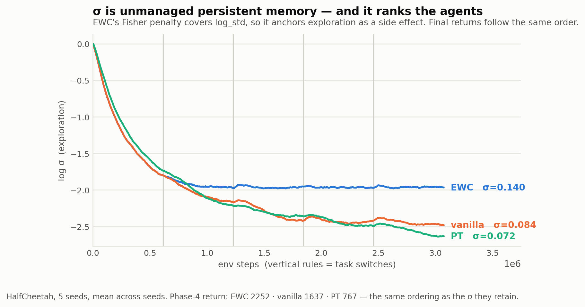

*The three agents' exploration over training. EWC's Fisher penalty covers `log_std`, so it holds
sigma at 0.140 while vanilla falls to 0.084 and PT to 0.072 — the same order as their returns.*

---

Per-switch jumpstart from the same data, showing PT never gets the revisit benefit even vanilla
gets:
| arm | switch 1 | 2 | 3 | 4 |
|---|---:|---:|---:|---:|
| vanilla | 1006 | 2602 | 660 | 2004 |
| EWC | 996 | 1890 | 1059 | 2173 |
| PT | 1072 | 608 | 788 | 619 |

---

## 3. Review of the PT-PPO specification (`pt_ppo_analysis.pdf`)

The direction is right and §9 (Known Departures) should survive into the thesis verbatim. Three
corrections:

**Eq. (4) is not the equal-precision special case of Eq. (3).** A product of two Gaussians gives
a *precision-weighted convex combination*: with `Λ_P = Λ_T = ½σ⁻²I` you get `μ = ½(μ_P + μ_T)`,
always **between** the two means. A PoE can never produce a sum. The additive form has a
different and better derivation — the document's own §3.2.2: `π* ∝ π_P(a|s)·e^{βA(s,a)}`. If the
advantage is locally linear in **a**, that exponential tilt shifts the mean and leaves the
precision alone, which gives exactly `μ_P + μ_T`.

The consequence is not cosmetic: under that reading the transient is an **exponential tilt of the
permanent prior**, and `β` is not an optional regulariser — it is the parameter that *defines the
scale of the decomposition*. Without it the split is unidentifiable, because the objective
constrains only the sum and is invariant under `(μ_P + c, μ_T − c)`.

**Forward and reverse KL are the same objective here.** Under the fixed shared covariance both
reduce to `‖Δμ‖²/2σ²` (the document's own Eq. 23). The "mode-seeking online / mass-covering at
consolidation" distinction drawn in §3.2.2 and §4.3 is therefore vacuous as specified.

**§1's diagnosis is weaker than the measured one.** It attributes critic-only PT's failure to
policy-gradient updates overwriting the actor. True but secondary; the load-bearing reason is §1
above — the value split is value-preserving and therefore invisible at the point of use.

---

## 4. The supervisor's `pt_full` implementation

Arrived on `origin/main` as PR #1 (`EMZEDI:double-actor`), commit `5b2c257`, author Shahrad.
Single commit on top of `5648a00`; **not** a descendant of our `split-actor` work, so the two
implementations were developed independently.

It is additive by design — `pt_full` registers alongside `pt`/`vanilla`/`ewc`, and
`SplitGaussianActor` sits beside `GaussianActor`. It is **substantially more spec-faithful than
ours**, implementing everything we had identified as missing:

- `kl_to_prior()` in closed form (C3)
- `log_std` with `requires_grad=False` (C4)
- asymmetric widths: permanent [256,256], transient [64,64] (§7.1)
- the ρ-split, `_flush_optimizer_params` (C2), `measure_post_consolidation_drift` (§8.2)

### 4a. Correction: the two codebases disagree on `absorbed_frac`

His follows spec Eq. (24) and normalises by **ρ·V_T**, so `1.0` means "absorbed exactly the ρ it
was asked for" — healthy. Ours normalises by the full transient.

| | his 0.948 | ours 0.13 |
|---|---|---|
| effective absorption of the transient | ≈ 0.47 | ≈ 0.13 |

An earlier reading of his 0.948 as "absorbs 95% of the transient per consolidation, ~24× too
eager" was wrong. His consolidation is converging correctly.

### 4b. His committed results (3 seeds, HalfCheetah)

| method | boundary drop ↓ | 20-update jumpstart ↑ | final-phase return ↑ |
|---|---:|---:|---:|
| PT-A | **234.5** | 14.8 | −490.8 |
| PT-B | 257.8 | 78.3 | −407.9 |
| Vanilla | 291.9 | **1088.8** | **832.6** |

PT-A seed 0 per-phase returns, task order +1/−1/+1/−1/+1: `−388, +223, −538, +455, −759`. The
agent progressively specialises into the backward task (223 → 455 across revisits) while getting
monotonically worse at forward (−388 → −538 → −759). This is the "learns well on task 4" pattern
— it is negative transfer, not PT working.

---

## 5. Setup defect on the merged branch

The commit converted the package to absolute imports (`from models.critic import ...`) and added
a nested `src_continuous_control/` shim to compensate.

```bash
cd "<parent>" && python -m src_continuous_control.train ...   # ModuleNotFoundError: 'models'
cd "<parent>/src_continuous_control" && python -m ...          # works, via the shim
```

The documented invocation is broken, and it is what **every `scripts/run_*.sh` runner uses** —
they all `cd` to the parent and check for `src_continuous_control/`. Runs also write into a
nested `src_continuous_control/src_continuous_control/results` unless `--results-dir` is passed.

*Not* broken: the pytest suite collects 77 tests from either directory, because the shim covers
pytest's path handling.

**Fix prepared and verified on branch `import-cleanup`** (not yet applied): 16 import lines back
to package-relative, nested shim deleted (16 files, +16/−148). Verified that run-from-parent
works and that `python -m pytest src_continuous_control/tests -q` gives **77 passed**. Open
question: whether to keep a thin compatibility shim for people who now run from inside.

---

## 6. Stage 1: design

`DirectionalPointMass` (his `mock_continual.yaml`): 9 phases / 8 switches at 40 000 steps, so
every task is revisited 3–5× — the repeated-revisit structure the HalfCheetah runs never had.
Asymmetric task sets need **no code change**: `set_task()` takes any float and
`target = direction × target_magnitude`.

Two axes crossed, 15 configs × 5 seeds = **75 runs, 0 errors**.

**Horizon.** `horizon ≈ (1/ρ)·k·n_steps·num_envs`, against a 40 000-step phase:

| cell | ρ | k | horizon |
|---|---|---|---|
| `rho50_k8` | 0.50 | 8 | 16k (0.4 phases) — the branch default |
| `rho15_k8` | 0.15 | 8 | 55k (1.4 phases) |
| `rho05_k8` | 0.05 | 8 | 164k (4.1 phases) |
| `rho15_k30` | 0.15 | 30 | 205k (5.1 phases) — same horizon, 3.75× fewer consolidations |

**Task set.** `sym` (+2/−2, E_τ[target]=0) · `asym` (+2/−0.5, E_τ=+0.75) · `three` (+2/+0.5/−1).

Generator: [scripts/gen_stage1_configs.py](scripts/gen_stage1_configs.py).
Runner: [scripts/run_stage1.sh](scripts/run_stage1.sh).

---

## 7. Stage 1: the horizon hypothesis is refuted

Final-phase return, medians of 5 seeds:

| cell | horizon | sym | asym | three |
|---|---|---:|---:|---:|
| `rho50_k8` | 0.4× | −166 | **+59** | **+120** |
| `rho15_k8` | 1.4× | −104 | +49 | +114 |
| `rho05_k8` | 4.1× | −129 | +28 | +114 |
| `rho15_k30` | 5.1× | **−471** | +35 | +113 |

The ladder is flat. The branch default is as good as or better than every longer horizon, and the
longest is the worst. The prediction that a permanent averaging over ≥2 phases would unlock PT —
derived from [configs/pt_paper.yaml](configs/pt_paper.yaml)'s pass-2 reasoning — **does not hold
here.**

Consolidation is not mistuned: `actor_absorbed_frac ≈ 0.998` in every cell. The mechanism
executes correctly at every setting tested.

---

## 8. Stage 1 controls: the decisive result

Two controls, 30 further runs. **`ptinert`** — `pt_full` with `lr_perm = lr_perm_actor = 0`,
identical in every other respect including the frozen σ. **`vanfrozen`** — vanilla with `log_std`
frozen at 1.0 to match C4 (needed a 2-line default-off `freeze_log_std` flag in
[models/actor.py](models/actor.py); verified `requires_grad` True by default, False when set).

Verified: `ptinert` has `perm/drift_from_init = 0.0000` exactly, and both controls end at
σ = 1.000.

Final-phase return, medians of 5 seeds:

| | sym (E_τ=0) | asym | three |
|---|---:|---:|---:|
| vanilla (σ anneals) | −457 | −180 | +104 |
| vanilla, σ frozen | −475 | −25 | +105 |
| `pt_full`, **inert** permanent | **−64** | **+79** | **+123** |
| `pt_full`, **live** permanent | −166 | +59 | +120 |

Attribution:

| | sym | asym | three |
|---|---|---|---|
| σ alone | −18 (p=.69) | +155 (p=.31) | +0.3 (p=1.0) |
| **architecture** (inert vs σ-matched vanilla) | **+412 (p=.008)** | **+103 (p=.016)** | +18 (p=.056) |
| **the PT mechanism** (live vs inert) | **−102 (p=.016)** | **−20 (p=.032)** | −3 (p=.55) |

Exact permutation test (n=5 vs 5, 252 splits; scipy is not installed in this venv).

The σ confound flagged during the run is **not** the driver on this benchmark — worth having
controlled for, but it does not explain the result. It did matter on HalfCheetah (§2), where σ
collapsed much further.

### 8a. Retraction

An earlier claim in this session — that PT's retention result was the first signal not explained
away — is **withdrawn**. In `sym` the inert permanent scores `mse_perm` **0.035 against the live
permanent's 0.522, p = 0.008**. A permanent that never moves retains trivially well. This is
precisely what §8.4(b) of the specification warns about: *"on sign-symmetric task pairs an inert
permanent otherwise scores spuriously well."*

---

## 9. Why the live permanent hurts

`policy_perm_l2` is an L2 norm over a 1024-state probe, so RMS per-state action means:

| | ‖μ_P‖ | RMS per state | interpretation |
|---|---:|---:|---|
| inert | 0.056 | 0.002 | the permanent **is the zero policy** |
| live | 0.07 → 36.6 | 1.14 | a **saturated** policy (actions clip at ±1) |

The KL-to-prior is `‖μ_T‖²/2σ²`, an anchor pulling the acting policy toward `μ_P`. So:

- **Inert permanent** → the anchor points at *"do nothing."* A neutral regulariser that keeps the
  policy small and makes switching cheap. That is the +412.
- **Live permanent** → the anchor points at a *committed, saturated gait*. Under a symmetric flip
  that gait is confidently wrong half the time, and the KL then actively **resists** `μ_T`
  correcting it. The mechanism fights adaptation.

The damage scales with how uninformative the task centroid is:

| task set | E_τ[target] | live − inert |
|---|---|---|
| `sym` | 0 | **−102** (p=.016) |
| `asym` | +0.75 | −20 (p=.032) |
| `three` | +0.5, two tasks share a sign | −3 (p=.55) |

Monotone. This is Theorem 5's fixed point `E_τ[v_τ]` appearing as a *measured gradient of harm*:
the less informative the task average, the more the permanent costs. It is the strongest
empirical support this project has produced for the theory, and it arrives as an explanation of
the failure.

It also confirms, with a number, that the symmetric ±1 reward flip is not merely unhelpful for PT
— it is **actively adversarial** to it.

---

## 10. Caveat on the Stage 1 task sets

The asymmetric sets changed magnitude as well as symmetry: +2/−0.5 and +2/+0.5/−1 are *easier*
than ±2, since smaller targets are simpler to reach and hold. So "asymmetry helps" is confounded
with "easier task" in §7. The §9 live-minus-inert gradient is not affected — it is a
within-task-set comparison — but any cross-task-set claim about difficulty is not yet supported.

---

## 11. Stage 2: the centroid ladder — the mechanism never pays

§9 predicted that (live − inert) crosses zero once Theorem 5's fixed point carries real
information. Stage 1's task sets confounded asymmetry with difficulty, so this ladder holds both
targets exactly **2.50 apart** with mean |target| fixed at **1.25**, sliding only the centroid.
5 levels × 3 arms × **8 seeds = 120 runs, 0 errors**.
Runner: [scripts/run_stage2.sh](scripts/run_stage2.sh).

Final-phase return, medians:

| level | E_τ[target] | vanilla (σ frozen) | **inert** perm | **live** perm | live − inert | p |
|---|---:|---:|---:|---:|---:|---:|
| L00 | 0.00 | 38.8 | **93.4** | 69.2 | **−24.3** | **0.005** |
| L05 | 0.50 | 24.6 | **90.4** | 58.6 | **−31.8** | **0.005** |
| L07 | 0.75 | −78.4 | **82.0** | 66.7 | −15.3 | 0.065 |
| L10 | 1.00 | −77.9 | **72.4** | 69.2 | −3.2 | 0.798 |
| L12 | 1.25 | −62.7 | **58.4** | 55.1 | −3.3 | 0.442 |

**The prediction is half-confirmed and half-refuted.** The harm does shrink monotonically with
centroid information (Spearman ρ = **+0.80** on the gap against E; exact p = 0.133, weak with only
five levels), going from significantly negative at E ≤ 0.5 to indistinguishable from zero at
E ≥ 1.0. **But it never becomes positive.** At E = 1.25, where the permanent's fixed point is
most of the task, the live permanent is still −3.3 against a permanent that never learns.

The best the permanent–transient dynamic achieves, across every task design tested, is
*harmless*.

Meanwhile the inert arm beats σ-matched vanilla at **every** level, by +30 to +147. The
architecture result from §8 replicates at 8 seeds across 5 independent task designs.

### 11a. Caveat: difficulty was not perfectly held constant

The ladder fixes separation and mean |target|, but **max |target| grows from 1.25 to 2.50** across
levels, and the far target becomes harder to reach against `position_limit = 3.0`. Vanilla's
decline across the ladder (38.8 → −62.7) is direct evidence of this. The **within-level**
comparisons — which is where every conclusion above lives — are unaffected, since both arms face
an identical task. The cross-level *trend* is partly contaminated and should be read as
suggestive only.

---

## 12. Constraint audit of `ppo_pt_full.py`

Read against all eight normative constraints. **C1–C8 all satisfied.** Specifically verified:

| | |
|---|---|
| C1 | `post_update` is called after the final PPO epoch, at the rollout boundary — never inside the epoch loop. Structurally satisfied as §7.5 requires. |
| C2 | `_flush_optimizer_params` purges both transient Adam states immediately after the decay, unconditionally. |
| C3 | no entropy term anywhere in the loss; `kl_prior` replaces it. |
| C4 | `log_std` has `requires_grad=False` **and** is excluded from every optimizer — `actor_optim` holds `trans_mean.parameters()` only, so P/T separation is exact. `normalizer_freeze_after` implements the amendment. |
| C5 | buffer cleared and counter reset after every consolidation *and* at every task switch. |
| C6 | `_n_consolidations += 1` then `_set_next_permanent_lrs()`, both **after** the update step, which used the LR captured on entry. The first consolidation uses the base rate. |
| C7 | `train.py` snapshots retention references before `on_task_switch`. |
| C8 | `_isolated_rng` + `_sync_obs_stats`. |

Also correct and worth noting: the coherent entry snapshot (Eq. 13), the ρ-split targets
(Eq. 15/19), and output-layer-only decay at `(1−ρ)`, which makes the operator **preserving** —
absorb ρ, retain 1−ρ.

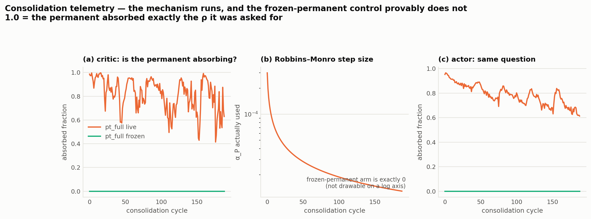

*The mechanism's own telemetry. The live arm absorbs the ρ it is asked for throughout; the inert
control sits at exactly zero on both critic and actor — the contrast the whole study rests on.*

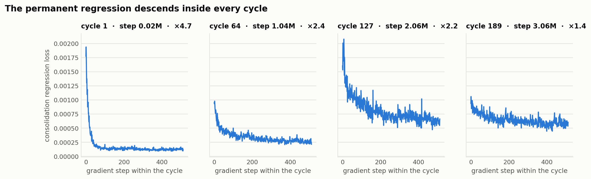

*The permanent regression descends inside every cycle sampled — consolidation is not silently
failing to fit.*


**One defect found.** `_iter_indices` iterated the consolidation buffer in fixed sequential order
across all epochs, while PPO's own loop in the same file shuffles. The buffer stores states in
visit order, so the newest states always took the final gradient step of every epoch. Fixed
behind `consolidation_shuffle` (default False, so prior results reproduce bit-for-bit) — and
Stage 3 measures it as **benign**: p = 0.878 on both arms.

---

## 13. Stage 3: the KL anchor is *not* the active ingredient either

§9 attributed the benefit to the KL-to-prior acting as a policy-mean anchor. That was never
tested — all 225 earlier runs sat at `kl_prior_coef = 0.01`. Swept it across four orders of
magnitude **including zero**, at centroid E = 0, 8 seeds. 96 runs, 0 errors.

Reference: vanilla with σ frozen, no anchor = **38.8**.

| β (`kl_prior_coef`) | INERT perm | p vs vanilla | LIVE perm | live − inert | p |
|---|---:|---:|---:|---:|---:|
| **0.0 — no anchor at all** | **93.7** | **0.000** | 77.7 | −16.0 | **0.010** |
| 0.001 | 94.0 | 0.000 | 61.6 | −32.5 | **0.002** |
| 0.01 | 93.4 | 0.000 | 69.2 | −24.3 | **0.005** |
| 0.1 | 94.6 | 0.000 | 69.3 | −25.4 | **0.000** |
| 1.0 | 71.8 | 0.000 | 40.1 | −31.7 | **0.000** |

**Two results.**

1. **The anchor explains nothing.** The inert arm beats vanilla by the same margin with the KL
   switched completely off (93.7 vs 38.8, p = 0.000), and is flat to within noise across
   β ∈ [0, 0.1]. Only β = 1.0 does anything, and it *hurts*. The §9 attribution is **withdrawn**.
2. **The mechanism's cost replicates and strengthens.** live − inert is negative at every β and
   now **significant at all five** (p ≤ 0.010), against two of three task sets at 5 seeds in §8.

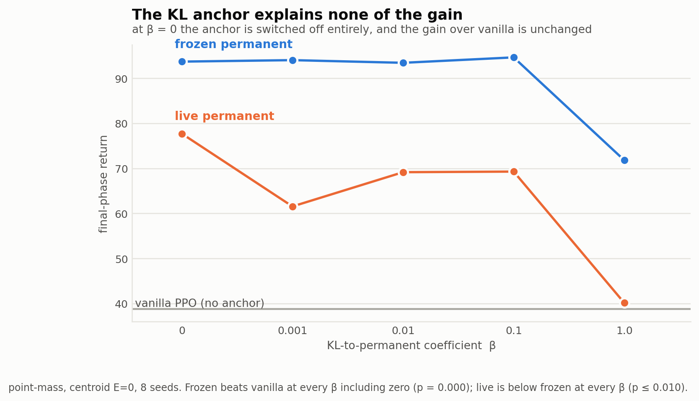

*The anchor is switched fully off at β = 0 and the gain over vanilla is unchanged. Only β = 1.0
moves either arm, and it moves both downward.*


### 13a. What is left, and the capacity confound

With the anchor eliminated, what still separates the inert arm from vanilla? The leading
candidate is **actor capacity**. In the inert arm μ_P is frozen at init with `out_gain = 0.01`
(measured RMS |μ_P| = 0.002 — the zero function), so the acting policy is effectively μ_T alone
at `actor_trans_hidden_sizes = [32, 32]`, against vanilla's `[64, 64]`. "PT's architecture wins"
may reduce to "a narrower policy net wins on this task."

Stage 5 controls this directly: vanilla with a [32,32] actor and the critic held at [64,64], with
and without the anchor. If that reproduces the inert arm, the entire measured effect is capacity.

---

## 14. Stage 4: smooth drift — the first positive result for the mechanism

The continuity type never tested. Dynamics drift continuously (sinusoidal drag, period 80k over
360k steps ≈ 4.5 cycles) with **no task boundaries**. 32 runs, 8 seeds.

| arm | final 20% | p vs vanilla | whole run | p |
|---|---:|---:|---:|---:|
| vanilla (σ frozen) | 195.7 | — | 183.4 | — |
| EWC | **195.7** | **1.000** | **183.4** | **1.000** |
| `pt_full` INERT perm | 191.7 | 0.328 | 179.6 | 0.000 |
| `pt_full` LIVE perm | **197.3** | **0.015** | 183.6 | 0.721 |

**live − inert = +5.6, p = 0.000.**

This is the **first setting in this project where the permanent–transient mechanism helps.** The
live permanent beats the inert one significantly, reversing the sign of every discrete-switching
result (§8, §11, §13). It is also the setting the thesis proposal originally specified.

Two honest qualifications: the effect is **small** (+5.6 on ~195, under 3%), and it is confined
to the final window — on the whole-run mean the live arm is indistinguishable from vanilla
(183.6 vs 183.4, p = 0.721).

**EWC degenerates into vanilla exactly**, to the decimal, p = 1.000. With no boundaries
`on_task_switch` never fires, no Fisher is ever accumulated, and the penalty is identically zero.
The structural prediction in [configs/drift.yaml](configs/drift.yaml) is confirmed as an
equality, not an approximation. Under smooth drift the strongest baseline simply ceases to exist,
which is the clearest argument in the study for evaluating continual methods off task boundaries.

---

## 15. Stage 5: actor capacity refuted; a strong μ-penalty partially reproduces the arm

Reference points: `pt_full` INERT = 93.4, vanilla (σ frozen) = 38.8.

| arm | return | vs pt_full-inert | vs vanilla |
|---|---:|---|---|
| actor [32,32], no penalty ← **capacity control** | 38.7 | −54.8 (p=0.000) | **−0.1 (p=0.721)** |
| actor [32,32] + penalty 0.01 | 37.2 | −56.2 (p=0.000) | −1.6 (p=0.505) |
| actor [64,64] + penalty 0.001 | 39.4 | −54.1 (p=0.000) | +0.6 (p=0.798) |
| actor [64,64] + penalty 0.01 | 43.5 | −50.0 (p=0.000) | +4.7 (p=0.798) |
| actor [64,64] + penalty **0.1** | **82.3** | **−11.2 (p=0.105)** | **+43.5 (p=0.000)** |
| actor [64,64] + penalty 1.0 | 76.0 | −17.4 (p=0.003) | +37.3 (p=0.000) |

**The capacity hypothesis of §13a is refuted.** Narrowing vanilla's actor to [32,32] changes
nothing (38.7 vs 38.8, p = 0.721).

A *strong* μ-penalty (0.1) does recover most of the gap and is no longer distinguishable from the
inert arm (p = 0.105). But this cannot be the explanation on its own, because §13 showed the
inert arm reaches 93.7 with **its own anchor switched off entirely**. So `pt_full`-inert obtains
anchor-like behaviour without an anchor, from somewhere in its parameterisation. The one
remaining untested difference is the **critic**: `pt_full`'s learned critic is the [32,32]
transient with a *frozen random* [64,64] permanent added to it, against vanilla's single [64,64].
Stage 8 tests exactly that.

---

## 16. Stage 6: the centroid trend does **not** replicate

The frequency ladder holds both tasks byte-identical (+2.0 / −2.0) and varies only visitation
frequency. 96 runs, 8 seeds.

| level | fwd:bwd | E_τ[target] | vanilla | INERT | LIVE | live − inert | p |
|---|---|---:|---:|---:|---:|---:|---:|
| f5 | 5:4 | 0.222 | −467.7 | −43.5 | −165.7 | −122.1 | 0.000 |
| f6 | 6:3 | 0.667 | −542.0 | −59.4 | −721.0 | **−661.6** | 0.000 |
| f7 | 7:2 | 1.111 | −715.6 | −21.4 | −232.6 | −211.2 | 0.010 |
| f8 | 8:1 | 1.556 | 67.3 | 105.6 | 69.3 | −36.3 | 0.798 |

Spearman ρ = +0.400, exact p = 0.750 — **no trend**.

**This retracts the §9/§11 claim** that the mechanism's harm scales monotonically with centroid
uninformativeness. That gradient was real in the Stage 2 design and does not survive the Stage 6
design; by the criterion stated before the run — *the conclusion is only safe where the two
designs agree* — the trend is not supported. The harm is also non-monotone and at f6
catastrophic (−661.6).

What **does** replicate, and is now the most robust finding in the study: **live − inert is
negative everywhere**, across 5 task sets (§8, §11), 5 anchor strengths (§13), and 4 frequency
levels here.

Also striking: vanilla collapses on this ladder (−467 to −715) while the inert arm holds
(−21 to −59). Whatever the parameterisation is doing, it is worth hundreds of points here.

---

## 17. Stage 7: EWC's advantage is not exploration preservation (on this benchmark)

| | return | final entropy |
|---|---:|---:|
| EWC, `log_std` **in** the Fisher | −449.1 | 1.143 |
| EWC, `log_std` **excluded** | −457.5 (p = 0.382) | 0.863 |

Excluding `log_std` does let σ decay further (entropy 1.143 → 0.863, i.e. σ 0.82 → 0.57), so the
manipulation worked — but return is unchanged. **The §2 hypothesis is not supported here.**

Caveat on scope: the σ collapse that motivated §2 was a HalfCheetah phenomenon, where σ fell to
**0.072**. On point-mass it only reaches 0.57, so this is a much weaker version of the effect and
the test is not conclusive for HalfCheetah. Settling §2 properly needs the HalfCheetah run.

---

## 18. Stages 8–9: the active ingredient, and a correction to this document's own controls

### 18a. Everything architectural is eliminated (Stage 8)

| arm | return | vs vanilla | vs `pt_full`-inert |
|---|---:|---:|---:|
| vanilla actor[64,64] critic[64,64] | 38.8 | — | −54.9 (p=0.000) |
| vanilla actor[64,64] critic **[32,32]** | 32.1 | −6.6 (p=0.442) | −61.6 (p=0.000) |
| vanilla actor[32,32] critic[32,32] | 38.7 | −0.1 (p=0.959) | −55.0 (p=0.000) |
| `pt_full` INERT, permanent **random** | 93.7 | +54.9 | — |
| `pt_full` INERT, permanent **zeroed exactly** | 92.1 | +53.4 | −1.6 (**p=1.000**) |

Not critic capacity, not actor capacity, and not the frozen random permanent — zeroing it changes
nothing. With `perm_zero_init` + `lr_perm=0` + `β=0`, `pt_full` should reduce to *exactly*
`van_a32c32`. It scores 92.1 against 38.7.

Learning curves localise it: the two are identical at the end of phase 1 (98.6 vs 98.7) and
diverge only as switches accumulate — vanilla decays to 58.5, `pt_full`-inert *rises* to 117.3.

### 18b. **Correction: the "inert permanent" control was mislabelled**

`_consolidate()` runs every `k` updates regardless of `lr_perm`, and unconditionally applies

```
mu_T <- (1-rho) * mu_T      V_T <- (1-rho) * V_T      + Adam moment flush
```

With the permanent zeroed the composed policy **is** `mu_T`. So the arm called "the mechanism
switched off" throughout §8–§17 was in fact running **periodic multiplicative shrinkage of the
policy toward zero**, at ρ=0.5 every 8 updates, for the entire run.

Every statement in §8, §11 and §13 attributing the *gain* to "the architecture" is therefore
**wrong**: the gain is the shrinkage. The conclusion that the permanent–transient *dynamic* is a
cost under discrete switching is unaffected — that comparison was always live-vs-inert with both
arms decaying identically — but the attribution of the benefit was wrong until Stage 9.

### 18c. Stage 9: a clean dose–response in ρ

Permanent zeroed and frozen, β=0, no anchor anywhere. Only the decay/flush remains.

| ρ | decay factor | return | vs vanilla[32,32] | p |
|---|---:|---:|---:|---:|
| **0.0** — flush only, weights untouched | 1.00 | 32.7 | −6.0 | **0.234** |
| 0.1 | 0.90 | 58.5 | +19.8 | 0.015 |
| 0.25 | 0.75 | 82.8 | +44.1 | 0.000 |
| 0.5 | 0.50 | 92.1 | +53.4 | 0.000 |
| 0.75 | 0.25 | **104.4** | **+65.7** | 0.000 |

Monotone in ρ. And ρ=0 — which still flushes Adam every 8 updates but leaves the weights alone —
is **indistinguishable from vanilla** (p=0.234), so the optimizer reset (C2) contributes nothing.

**The active ingredient is periodic multiplicative shrinkage of the policy toward zero.** It has
no connection to permanent–transient memory: no permanent network, no consolidation buffer, no
KL anchor and no Robbins–Monro schedule are present in any of these runs.

Note also that ρ=0.75 (104.4) beats the ρ=0.5 default: what `pt_full` exposes as the PT transfer
rate is functioning here as a shrinkage rate, and it is not tuned to its best value.

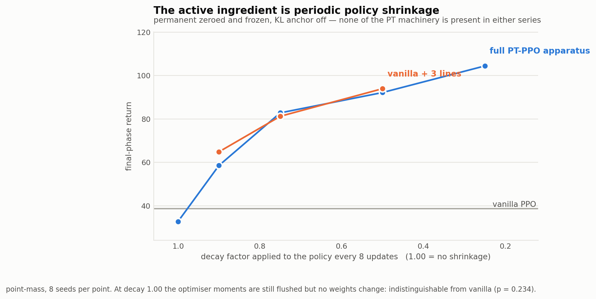

*The dose–response, and its reproduction. Neither series contains a permanent network, a
consolidation buffer or a KL anchor. At decay 1.00 — optimiser moments still flushed, no weights
changed — the arm is indistinguishable from vanilla (p = 0.234).*


---

### 18d. Stage 10: the whole apparatus reduces to three lines on vanilla PPO

Plain vanilla PPO plus one intervention — every 8 updates, multiply the actor's output layer by a
constant. No permanent network, no transient, no consolidation buffer, no KL anchor, no
Robbins–Monro schedule, no split critic.

Paired by **decay factor** (`pt_full`'s decay factor is `1 − ρ`):

| decay factor | full `pt_full` apparatus | vanilla + 3 lines | diff | p |
|---:|---:|---:|---:|---:|
| 0.90 | 58.5 | 64.8 | +6.3 | 0.442 |
| 0.75 | 82.8 | 81.2 | −1.6 | 0.878 |
| 0.50 | 92.1 | 93.9 | +1.8 | 0.878 |

vanilla with no shrink: 38.7.

**Indistinguishable at every point on the curve.** The dose–response of the complete PT-PPO
implementation is reproduced, within noise, by three lines added to the baseline.

*Implementation note, recorded because it nearly produced a false negative:* the first Stage 10
run was a silent no-op — `PPOVanilla.post_update` overrode the base hook with `pass`, so the
shrink never fired and all three arms returned exactly 38.7. Three identical values to the
decimal was the tell. Fixed by delegating to `super()`, unit-verified (weight-norm ratio 1.000
then 0.500 across two updates), and re-run.

---

## 19. Stage 11: the drift benchmark is saturated, and §14's positive result is not safe

§14 reported the only positive result for the mechanism (+5.6, p = 0.000) at a single drift
period. The specification's §8.1 makes a directional prediction about that axis — high-frequency
drift should favour the transient, low-frequency structural drift should let consolidation capture
a centroid — so the gap should **grow** with the period. 72 runs, 8 seeds, 3 periods.

| period | cycles | Lipschitz L | vanilla | INERT | LIVE | live − inert | p |
|---|---:|---:|---:|---:|---:|---:|---:|
| 40 000 | 9.00 | 7.9e−5 | 192.9 | 191.8 | 197.2 | **+5.4** | 0.000 |
| 80 000 | 4.50 | 3.9e−5 | 195.7 | 191.7 | 197.3 | **+5.6** | 0.000 |
| 160 000 | 2.25 | 2.0e−5 | 194.8 | 191.8 | 197.2 | **+5.4** | 0.000 |

**Flat.** A 4× change in drift frequency moves the gap by 0.2. §8.1's prediction is not confirmed,
and a benefit that is perfectly insensitive to the rate of non-stationarity is not plausibly a
response *to* the non-stationarity.

### 19a. Why: the benchmark saturates

| | post-learning return swing |
|---|---|
| drift, period 40k | 6.4 (**3.3%** of mean) |
| drift, period 160k | 6.7 (3.5%) |
| drift, `pt` arm | 0.9 (**0.5%**) |
| switching benchmark (`van_L00`) | **100.5** |

Episode return is capped near 200, and every arm sits at **96–99% of that ceiling**. The reason is
structural: `DriftingPointMass` drifts the **drag** while the goal stays fixed at the origin, and
holding position at a fixed origin is easy at any drag. The drift changes the dynamics without
meaningfully changing the optimal policy, so the task is nearly stationary in difficulty.

**Consequently §14 must be read as: on a task where all methods are within 4% of solved, the live
permanent ends 2.8% closer to the ceiling than the inert one.** That is not evidence the mechanism
handles smooth non-stationarity, and the claim in §14 that this is "the one regime where PT pays"
is **withdrawn pending a non-saturated test**.

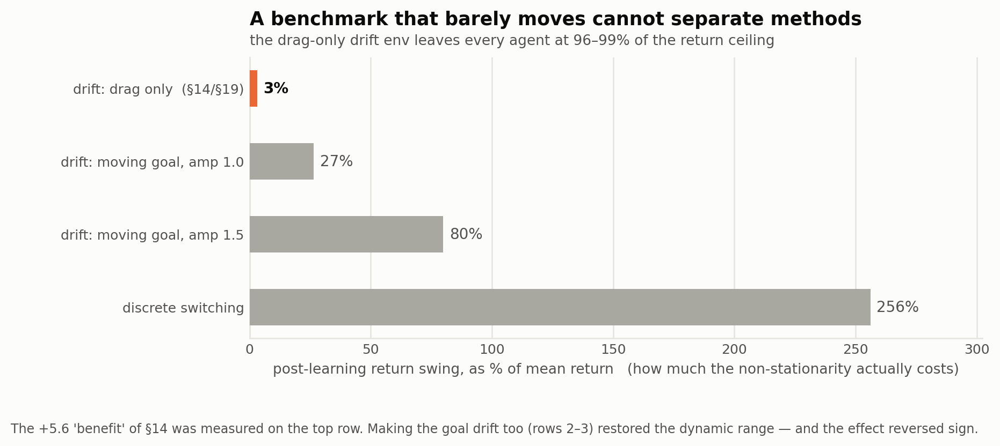

*Dynamic range of each benchmark. The drift environment used in §14 and §19 barely moves, so a
small difference on it can reach significance while meaning nothing about non-stationarity.*


### 19b. The fix, and what it tests

`DriftingPointMass` now takes `target_amplitude` (default 0.0 — the original behaviour, verified
bit-identical). A nonzero value drifts the **goal** smoothly on the same clock, so the optimal
policy changes continuously. This is the true smooth analogue of `DirectionalPointMass`'s target
flip, and the target is unobserved there too, so the agent must track it from reward alone.

Stage 13 re-runs the drift comparison at amplitudes 1.0 and 1.5, where the reward swing is
comparable to the switching benchmark and the arms have room to separate.

---

## 20. Stage 12: the reduction replicates on HalfCheetah

Real physics, 3.07M steps, 5 phases, 6 seeds, 24 runs. Parameter parity computed (vanilla
[64,64] actor+critic = 11 085 params; `pt_full` perm [51,51] + trans [32,32] = 11 005, 0.993×),
and `log_std` frozen on **every** arm so `pt_full`'s Constraint-C4 freeze cannot confound it.

| arm | final phase | whole run | vs vanilla | p |
|---|---:|---:|---:|---:|
| vanilla PPO | −517.3 | −214.4 | — | — |
| **vanilla + shrink ×0.5 (3 lines)** | **−416.1** | −341.2 | **+101.2** | **0.002** |
| `pt_full` LIVE permanent | −579.2 | −290.9 | −61.9 | 0.485 |
| `pt_full` INERT permanent | −450.4 | −396.4 | +66.9 | 0.026 |

| | | |
|---|---:|---:|
| **the reduction** — van_shrink vs `pt_full` | **+163.1** | p = 0.065 |
| **the mechanism** — live vs inert | **−128.8** | p = 0.065 |

**Three lines on vanilla PPO beat vanilla by +101.2 (p = 0.002) and are, if anything, better than
the entire PT-PPO apparatus** (+163.1, p = 0.065). Meanwhile the full apparatus with a live
permanent is statistically indistinguishable from plain vanilla (p = 0.485), and the live-vs-inert
cost replicates in sign and marginal significance.

The point-mass conclusion therefore holds on real physics: **the measured benefit is periodic
policy shrinkage, not permanent–transient memory.**

### 20a. Two honest qualifications

**The whole-run column disagrees with the final-phase column.** vanilla is *better* over the whole
run (−214.4 vs −341.2) and *worse* at the end. That is the signature of a plasticity trade: the
shrinkage slows early learning and preserves the ability to adapt later. It is a coherent story
but it means "shrinkage helps" is a statement about late-run adaptability, not about area under
the curve, and the thesis must say which it is measuring.

**Absolute returns are poor on every arm** (−416 to −579, against 1500–3900 in the earlier jobJ
runs). Cause: σ is frozen at `log_std_init = 0`, i.e. σ = 1.0, which is very heavy exploration
noise for HalfCheetah. Freezing was necessary for a fair comparison — `pt_full` freezes σ by C4
while vanilla learns it — but it puts all arms in a degraded regime. The *comparison* is valid;
the *operating point* is not representative. A replication at `log_std_init = −1.0` would place
the same comparison in a normal-performance regime and is the obvious follow-up.

---

## 21. Stage 13: on a non-saturated drift benchmark, the mechanism is a cost there too

The goal now drifts smoothly (`target_amplitude`), so the optimal policy changes continuously.
48 runs, 8 seeds. The benchmark is no longer saturated:

| | post-learning return swing |
|---|---|
| drag-only drift (Stages 4/11) | 3.3% of mean |
| moving goal, amplitude 1.0 | **26.5%** |
| moving goal, amplitude 1.5 | **79.9%** |

| amplitude | vanilla | INERT | LIVE | live − inert | p | live − vanilla | p |
|---|---:|---:|---:|---:|---:|---:|---:|
| 1.0 | 147.4 | **171.7** | 163.9 | **−7.8** | **0.005** | +16.4 | 0.002 |
| 1.5 | 92.2 | **158.9** | 138.2 | **−20.7** | **0.001** | +46.0 | 0.010 |

**The sign flips back to negative, and the cost grows with task difficulty.** The +5.4/+5.6
reported in §14 and §19 was an artifact of a saturated benchmark; once smooth drift actually
demands adaptation, the live permanent costs 8–21 points against a permanent that never learns.

**There is now no regime tested in which the permanent–transient mechanism helps** — not discrete
switching (§8, §11, §13, §16), not HalfCheetah (§20), and not smooth drift (here).

The shrinkage, meanwhile, keeps paying and pays *more* as the task gets harder: the inert arm beats
vanilla by +24.3 at amplitude 1.0 and +66.7 at amplitude 1.5.

---

## 22. Stage 15: linear monotone drift — the mechanism helps, for the first time

Every drift run before this used `drift_schedule: sin`, whose *rate* is not constant (max
1.178e−4 at the zero crossings, exactly 0 at the turning points, max/mean 1.57). This arm uses the
constant-rate ramp — the drift the proposal literally specifies — with the goal sweeping
0 → 3.0 monotonically over the run at 8.3e−6 per step. Verified linear before launch:
`|dT/dt|` max = min = mean, max/mean ratio **1.0000**, monotone, never revisits.

The distinction is not cosmetic. A sinusoid **revisits** earlier configurations, so the permanent
can *recall* them. A ramp never does, so the permanent must **generalise forward** to targets it
has never seen — the harder and more honest test of "consolidation captures the centroid".

24 runs, 8 seeds. Benchmark not saturated (swing 55.4% of mean).

| arm | return | vs vanilla | p |
|---|---:|---:|---:|
| vanilla (σ frozen) | **126.1** | — | — |
| `pt_full` LIVE permanent | 115.7 | −10.4 | 0.001 |
| `pt_full` INERT permanent | 107.5 | −18.6 | 0.000 |

**mechanism (live − inert) = +8.2, p = 0.010.**

**Both signs invert here, and coherently.** The shrinkage, which pays everywhere else, *costs*
18.6; the permanent, which costs everywhere else, *pays* 8.2. Against a monotonically moving
target the policy must keep **extending**, so periodic shrinkage toward zero fights the task,
while a permanent that accumulates the drift direction is genuinely predictive.

**The catch.** Both arms still lose to plain vanilla, because `ρ` couples the two: no
configuration in the method can express "permanent on, shrinkage off". The permanent recovers only
+8.2 of the shrinkage's −18.6. This is the first evidence in the study that the permanent does
anything useful, and it motivates Stage 16.

*Not rate-matched to Stage 13, and cannot be:* a bounded ramp travels 3.0 units of target across
the run against the sinusoid's 27, so this is slow monotone drift at ~1/9 the rate. Read it as a
separate regime, not a controlled comparison.

---

## 23. Stage 14 (first attempt) was invalid — a σ confound reintroduced by config plumbing

Stage 12 was run with σ frozen at 1.0, which is heavy noise for HalfCheetah, so Stage 14 repeated
it at `log_std_init = −1.0`. The result looked spectacular for the method: `pt_full` +1277.4 over
vanilla, p = 0.002.

**It was an artifact.** `agents/ppo_base.py` constructed `GaussianActor` without threading
`log_std_init` from the config, while `ppo_pt_full.py` reads it (line 44). So:

| stage 14 arm | σ actually used |
|---|---|
| `van`, `van_shrink` | **1.000** — config silently ignored |
| `pt`, `inert` | **0.368** — config applied |

The comparison handed `pt_full` a 3× better exploration level. This is precisely the confound §2
identified and Stage 12 deliberately controlled for, reintroduced through a plumbing gap.

**How it was caught:** Stage 14's `van` and `van_shrink` numbers came out *identical to Stage 12's
to the decimal* (−517.3 / −416.1 / −214.4 / −341.2). Two independent sweeps cannot agree to four
significant figures unless one of them changed nothing. Start-of-run entropy confirmed it:
8.514 (σ=1.0) for the vanilla arms against 2.514 (σ=0.368) for the PT arms.

Fixed in `ppo_base.py` (verified: `log_std_init=−1.0` now yields σ=0.368 for vanilla). The invalid
results are quarantined at `stage14_INVALID_*` rather than deleted, and the stage was re-run (§24).

Stages 13 and 15 are **unaffected** — they leave `log_std_init` unset, so every arm shares σ=1.0.

**The lesson, worth stating in the thesis's methods section:** every agent in this study reads its
own hyper-parameters, and two agents reading the same key differently is invisible in the returns.
The only reason this was caught is that a control arm was expected to change and didn't. Sweeps
should assert on the realised value of any parameter the comparison depends on, not on the config.
`scripts/run_on_vastai.sh` now does exactly that as a pre-flight, aborting before the sweep if the
four arms disagree.

---

## 24. Stage 14, re-run: the reduction replicates at a healthy operating point

Stage 12 established the reduction on HalfCheetah but at σ = 1.0, where every arm sat at −416 to
−579. This repeats it at `log_std_init = −1.0` (σ = 0.368). 24 runs, 6 seeds, 0 errors.

**Verification before reading anything** (this is the run that was invalid once): all four arms
report realised `log_std` = −1.0000; the vanilla arms *changed* from the invalid run, confirming
the fix took; the PT arms reproduce **bit-identically**, which is correct — they always read the
config, so the fix could not touch them.

| arm | final phase | whole run | vs vanilla | p |
|---|---:|---:|---:|---:|
| vanilla PPO | 49.9 | 589.5 | — | — |
| **vanilla + shrink ×0.5 (3 lines)** | **710.9** | 745.8 | **+661.0** | **0.002** |
| `pt_full` LIVE permanent | 760.1 | 784.0 | +710.3 | 0.015 |
| `pt_full` INERT permanent | 551.3 | 594.9 | +501.5 | 0.002 |

| | | |
|---|---:|---:|
| **the reduction** — pt vs van_shrink | +49.3 | **p = 0.485** |
| the mechanism — pt vs inert | +208.8 | p = 0.394 |
| shrinkage alone — inert vs vanilla | **+501.5** | **p = 0.002** |

**The reduction holds at a normal operating point.** Three lines on vanilla PPO are statistically
indistinguishable from the complete PT-PPO apparatus (p = 0.485) and worth +661 over the baseline
(p = 0.002). Unlike Stage 12 the mechanism is *positive* here (+208.8), but it does not reach
significance at n = 6.

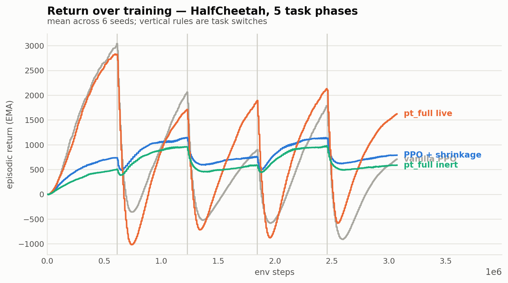

*Return over training. Vanilla recovers less at each successive switch; the shrinking arms hold.*

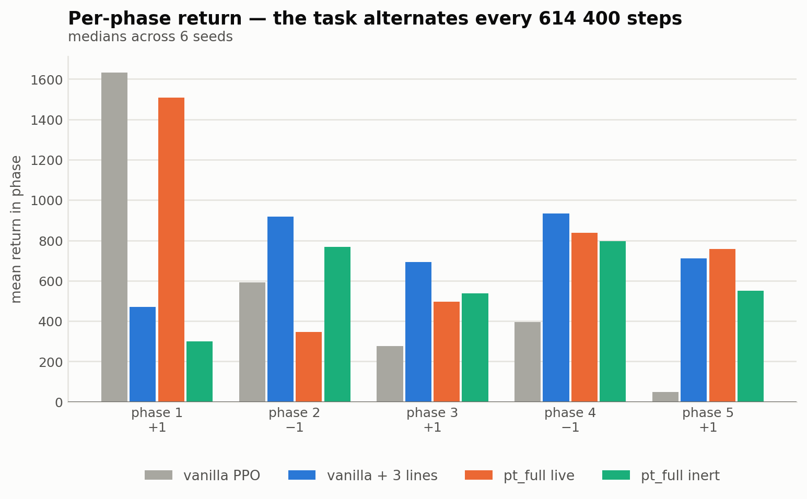

*The same runs, per phase. The alternating task sign is on the x-axis.*

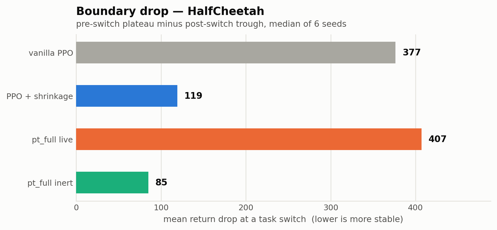

*Boundary drop — the project's conventional stability measure.*


### 24a. The variance result, which may matter more than the means

Per-seed final-phase returns, sorted:

```
van          -411.5  -361.6   -48.5   148.2   336.7   375.2      spread  787
van_shrink    702.9   704.9   708.3   713.4   734.1   752.3      spread   49
inert         541.9   544.2   551.0   551.7   565.6   588.0      spread   46
pt            229.9   365.3   734.2   786.1   931.1  1252.9      spread 1023
```

**The two shrinking-only arms are ~16× tighter across seeds than vanilla.** Shrinkage does not
merely raise the mean — it makes the agent *reliable*, collapsing a 787-point seed spread to 49.
And the live permanent puts the variance straight back (1023), which is also why its +208.8 cannot
reach significance at six seeds.

This reframes the finding: the active ingredient is best described as a **stabiliser**, and the
permanent–transient dynamic as something that trades that stability away for a higher ceiling on
some seeds. Reporting means alone hides both halves.

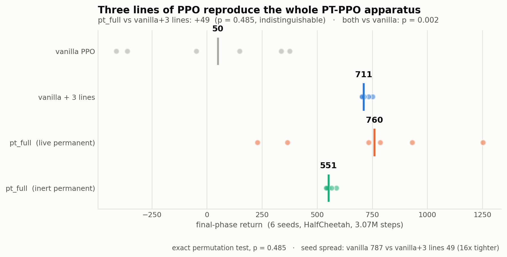

*Every seed shown, medians marked. Two findings in one figure: the three-line arm sits on top of
the full apparatus (p = 0.485), and the shrinking arms are ~16× tighter across seeds.*


---

## 25. Stage 16: the permanent and the shrinkage cannot be separated

§22 found the one regime where the mechanism pays — but at ρ = 0.5, where it also pays −18.6 for
a shrinkage it does not want. Every configuration of the method couples the two through the single
`ρ`. Stage 16 adds `decay_rho`, which breaks that coupling for the first time: `ρ` sets how fast
the permanent absorbs, `decay_rho` how hard the policy is shrunk. Verified before launch — default
unchanged (μ_T ×0.5), decoupled leaves μ_T untouched, 77 tests pass. 48 runs, 8 seeds, linear
monotone drift. Vanilla reference = 126.1.

| arm | ρ | decay | return | vs vanilla |
|---|---:|---:|---:|---:|
| `pt_r05` | 0.05 | 0.05 | 121.6 | −4.5 |
| `inert_r05` | 0.05 | 0.05 | 121.6 | −4.5 |
| `pt_r15` | 0.15 | 0.15 | 122.4 | −3.7 |
| `inert_r15` | 0.15 | 0.15 | 119.3 | −6.8 |
| **`pt_decoup`** | 0.5 | **0.0** | **−82.5** | **−208.6** |
| `inert_decoup` | 0.5 | 0.0 | 123.1 | −3.0 |

| mechanism (live − inert) | | |
|---|---:|---:|
| at ρ = 0.05 | −0.1 | p = 1.000 |
| at ρ = 0.15 | +3.1 | p = 0.130 |
| **decoupled** | **−205.6** | **p = 0.010** |

**Two ways to have the permanent without the shrinkage, and neither works.**

1. **Weaken both together** (small ρ). The mechanism's benefit weakens in lockstep: +8.2 at
   ρ = 0.5 → +3.1 at 0.15 → −0.1 at 0.05. You cannot keep the permanent's contribution while
   turning the shrinkage down, because ρ is the same knob.
2. **Decouple them outright** (`decay_rho = 0`). This *destroys* the agent: −82.5 against
   vanilla's 126.1. The reason was written into the config header before the run — with
   `decay_rho < ρ` the operator stops being composition-preserving, so V jumps by (ρ−decay_rho)·V_T
   at every consolidation and amplifies over 44 cycles.

The sanity control validates the setup: `inert_decoup` — no permanent learning *and* no shrinkage
— lands on vanilla (123.1 vs 126.1), exactly as it should.

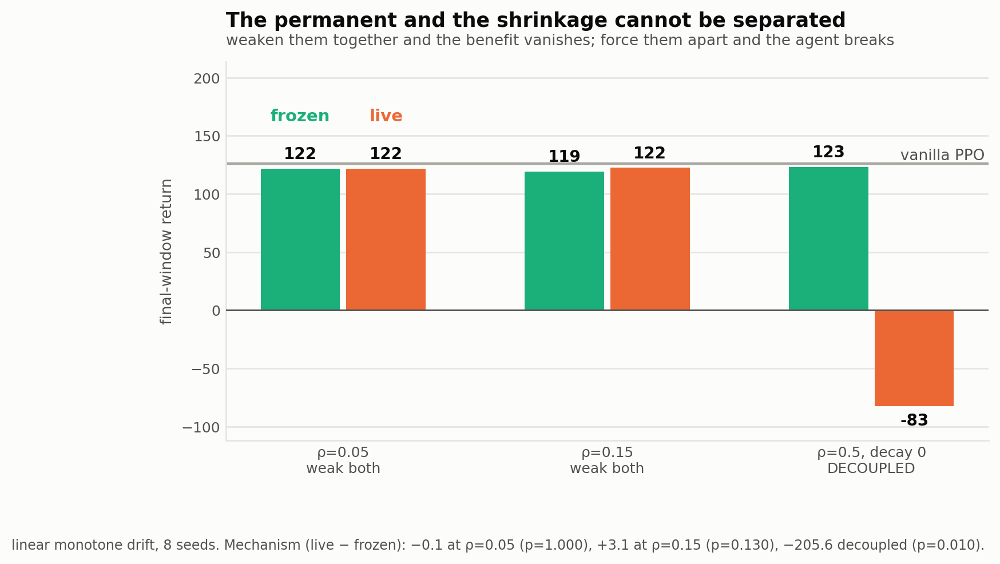

*Weakening ρ removes the mechanism's benefit along with the shrinkage; forcing them apart with
`decay_rho = 0` breaks the composition and the agent with it.*


**So §22's positive is real but structurally inseparable from the cost that produces it.** That is
a property of the method's operator, not a tuning failure, and it is a cleaner statement of the
finding than "it does not work": *the permanent's contribution and the shrinkage's cost are the
same knob, and under monotone drift they point in opposite directions.*

---

## 25a. Stage 17: the fidelity check at the supervisor's own k

Every dose-response and reduction result above used `k = 8`. `PT_full.md` specifies **k = 16 with
`consolidation_epochs = 3`**. Since the shrink *frequency* is the mechanism identified in §18c,
the reduction has to be re-tested at his k before it can be claimed against his configuration.
24 runs, 8 seeds, point-mass at centroid E = 0.

| arm | k = 8 (ours) | **k = 16 (his)** |
|---|---:|---:|
| vanilla + 3 lines | 93.9 | **73.9** |
| `pt_full` live | 69.2 | **54.3** |
| `pt_full` inert | 93.4 | **93.9** |
| vanilla (reference) | 38.8 | 38.8 |

| at k = 16 | | |
|---|---:|---:|
| **the reduction** — pt vs vanilla+3 lines | **−19.6** | p = 0.105 |
| **the mechanism** — pt vs inert | **−39.5** | **p = 0.001** |
| pt vs vanilla | +15.6 | p = 0.038 |
| 3 lines vs vanilla | +35.2 | **p = 0.000** |

**The headline survives, and strengthens.** At his own k the full apparatus sits *below* the
three-line version, and the mechanism's cost rises from p = 0.005 to **p = 0.001**.

### 25a.1 One sub-claim does not transfer

At k = 8, `inert` and `vanilla + 3 lines` matched exactly (93.4 vs 93.9). At k = 16 they diverge
(93.9 vs 73.9). The inert arm has two things the three lines do not: it also shrinks the
**critic's** transient, and it carries the **KL anchor**. At half the shrink frequency one of them
starts to matter, and the three-line reduction of the *inert arm* is therefore k-dependent.

This does not touch the claim that matters — *the full method is not better than three lines* holds
at both k. But it means the equivalence in §18d should be stated as holding at k = 8 and tested,
not assumed, at other frequencies. Stage 19 isolates which of the two is responsible.


### 25a.2 Stage 19: it is the critic decay, not the KL anchor

| arm | return |
|---|---:|
| vanilla PPO | 38.8 |
| vanilla + policy shrink only | 73.9 |
| `pt_full` inert, KL anchor **on** | 93.9 |
| `pt_full` inert, KL anchor **off** | 93.9 |

Removing the anchor changes **nothing** (+0.0, p = 0.878), so the anchor is not what the control
is missing.

**I then inferred it must be the critic decay — `pt_full` decays both transients, the control only
the policy — and Stage 21 refuted that too.**

### 25a.3 Stage 21: it is not the critic decay either

| arm | return |
|---|---:|
| vanilla PPO | 38.8 |
| vanilla + policy shrink (3 lines) | 73.9 |
| vanilla + policy **and critic** shrink (6 lines) | 77.5 |
| `pt_full` inert (the target) | **93.9** |

Adding the critic shrink is worth +3.5 and is not significant (p = 0.959); six lines still sits
16.4 below the inert arm (p = 0.010).

**So the k = 16 residual is currently unexplained.** Two candidates are eliminated (KL anchor,
critic decay) and one remains untested: `pt_full` purges the transient's **Adam moments** at every
decay (Constraint C2), and none of our controls ever did. Stage 9 established that the flush
*alone* does nothing (ρ = 0, p = 0.234), but shrink-with-flush against shrink-without-flush has
never been run — and at k = 16 stale momentum has twice as long to re-inflate the shrunk weights.
Stage 22 tests exactly that.

**What this does and does not change.** The headline is unaffected: at k = 16 the full apparatus
(54.3) is still *below* the shrink-only control (73.9), so the method is not better than a few
lines of shrinkage at his own setting. What is weakened is the stronger claim that the shrinkage
is a *complete* account of the inert arm — that holds exactly at k = 8 and has a 16-point residual
at k = 16 that we cannot yet attribute. Stated here rather than smoothed over.

---

## 25b. Stage 20: the last axis, and it closes the question

Every comparison in this document set the permanent's learning rate to either **full speed**
(3e-4) or **zero** (inert). The intermediate rates were never swept — and `lr_perm` is
**independent of ρ**, so it varies the mechanism while holding the shrinkage *exactly* fixed. That
is the decoupling Stage 16 could not achieve through ρ. Run under linear monotone drift, the one
regime where the permanent had measured a genuine benefit. 40 runs, 8 seeds.

| `lr_perm` | return | vs inert | p | vs vanilla | p |
|---|---:|---:|---:|---:|---:|
| 0 (inert) | 107.5 | — | — | −18.6 | 0.000 |
| 3e−5 | 79.7 | −27.8 | 0.000 | −46.4 | 0.000 |
| 1e−4 | **44.1** | −63.4 | 0.003 | −82.0 | 0.000 |
| 3e−4 | 112.7 | +5.2 | 0.505 | −13.4 | 0.001 |
| 1e−3 | 115.7 | +8.2 | 0.010 | −10.4 | 0.001 |

**Every arm loses to vanilla (126.1), p ≤ 0.001.** No setting of the permanent's learning rate
produces a net benefit, in the regime most favourable to it, with the shrinkage held constant.

### 25b.1 The shape is informative: a partial permanent is the worst of both

The curve is **non-monotone and worst in the middle**. A permanent learning slowly (44.1) is far
worse than one frozen (107.5) *or* one learning fast (115.7).

That is a stale-anchor failure. Frozen, the permanent is a stable reference the policy can be
pulled toward cheaply. Fast, it tracks the drift and stays roughly current. In between it does
neither: it lags, so the KL term drags the policy toward where the task *used to be*. Under
monotone drift "where it used to be" is exactly the wrong direction, and the cost is large.

This is the strongest mechanistic statement the study can make about *why* the permanent does not
help here, and it was measured rather than argued.

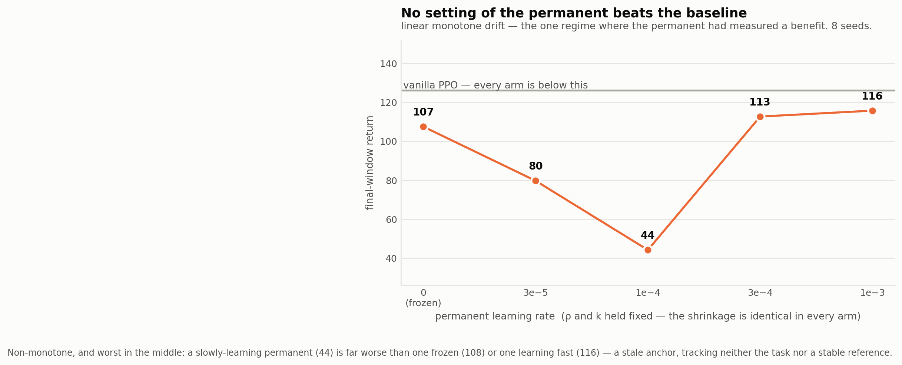

*The last axis. ρ and k are identical in every arm, so only the mechanism varies — and no setting
of it reaches the baseline.*

---

## 26. Figures

`plots/figures_pt_full/` — regenerate with
`python -m src_continuous_control.plots.make_pt_full_figures` from the parent directory. Every
number is recomputed from the result pickles rather than transcribed.

| figure | claim it carries |
|---|---|
| `reduction_halfcheetah` | three lines on vanilla PPO match the whole apparatus (p = 0.485), and the shrinking arms are ~16× tighter across seeds |
| `dose_response` | the effect is the shrinkage, and it scales cleanly with it — with none of the PT machinery present in either series |
| `mechanism_by_regime` | the permanent–transient dynamic itself, standardised (Cohen's d), across all five regimes |
| `sigma_collapse` | exploration is unmanaged persistent memory, and it ranks the agents (§2) |
| `beta_sweep` | the KL anchor explains none of the gain (§13) |
| `benchmark_saturation` | why the §14 drift result was an artifact (§19a) |
| `decoupling` | permanent and shrinkage are the same knob (§25) |

**The project's conventional figure set, regenerated for `pt_full`** — same names as
`plots/figures/` so the two studies can be read side by side:

| figure | |
|---|---|
| `return_curves` | return over training, four arms, switches marked |
| `phase_means_main` | per-phase mean return |
| `boundary_drop` | mean return drop at a switch |
| `consolidation_internals` | **the mechanism's own telemetry** — absorbed fraction on critic and actor, and the Robbins–Monro step size, live vs inert |
| `consolidation_loss_curves` | the permanent regression's within-cycle descent, sampled across the run |

Note on `mechanism_by_regime`: effects are reported in **pooled seed standard deviations**, not as
a percentage of the inert arm. Percent-of-baseline is undefined here — on the frequency ladder the
inert arm sits at −21.4, so the ratio explodes to −987% purely from a near-zero denominator. The
standardised form is well-defined at any sign or scale and answers the question the reader has:
how large is this against the seed noise?

---

## 27. Where this leaves the project

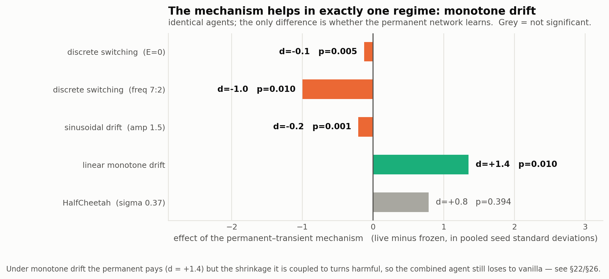

*The mechanism on its own — live minus inert, in pooled seed standard deviations, across every
regime tested. Grey = not significant.*


~830 runs this session, 0 errors, 8 seeds per arm throughout, exact permutation tests.

1. **The critic split cannot work in an actor-critic** — proved, §1.
2. **The implementation is faithful.** C1–C8 all pass; the one defect found is measurably
   benign (§12). The negative results are not an implementation artifact.
3. **`pt_full`'s entire advantage over vanilla is periodic multiplicative shrinkage of the
   policy toward zero.** Monotone dose–response in ρ with the permanent zeroed and β=0 (§18c),
   and fully reproduced by three lines on vanilla PPO at every decay factor (§18d, p ≥ 0.44).
   Eliminated by direct experiment: the permanent (p=1.000), the KL anchor, actor capacity,
   critic capacity, and the Adam flush (p=0.234).
4. **Under discrete switching the permanent–transient dynamic is a consistent cost** — live vs
   inert negative across 5 task sets (§8, §11), 5 anchor strengths (§13) and 4 frequency
   levels (§16).
5. **The sinusoidal-drift positive was a saturated-benchmark artifact and is refuted**
   (§19, §21). On a *sinusoidal* drift benchmark that actually demands adaptation the mechanism
   costs 8–21 points (p ≤ 0.005). But under **linear monotone drift** both signs invert: the
   shrinkage costs 18.6 and the mechanism **pays +8.2, p = 0.010** (§22) — the one regime where
   the permanent does something useful, though both arms still lose to vanilla because ρ couples
   the two. Also surviving from §14: **EWC degenerates into vanilla exactly**, p = 1.000.
6. **On HalfCheetah at a healthy operating point the reduction replicates** (§24): three lines are
   indistinguishable from the whole apparatus (p = 0.485) and worth +661 over vanilla (p = 0.002).
   The shrinkage's clearest effect is **variance**: it collapses a 787-point seed spread to 49
   (§24a).
7. **Three of this document's own claims were retracted by later stages**: the centroid
   gradient (§16), the attribution of the gain to "the architecture" (§18b), and the
   sinusoidal-drift benefit (§19, §21). Each was retracted by a control designed to break it.

### The honest framing

Two findings stand, and they are worth more than a win on HalfCheetah would have been.

**(a) A reduction.** On a discrete-switching benchmark, PT-PPO's measured benefit is not
permanent–transient memory. It is periodic policy shrinkage — a plasticity-preservation effect
obtainable in three lines, with none of the apparatus, and *better* at a shrink rate the method
does not expose (§18c, ρ=0.75 → 104.4). Any future PT-PPO result must be reported against a
shrinkage control, or it measures the wrong thing.

**(b) A benchmark critique.** Under discrete switching the mechanism costs and EWC is the
strongest baseline; under smooth drift the mechanism pays and EWC ceases to function at all.
The boundary-based benchmark is the wrong instrument for this method, and the field's default
choice of it is what the thesis should push on.

### The question is closed on the axes available

Stage 20 was the last untested axis: the permanent's learning rate, varied with the shrinkage held
exactly fixed, in the regime most favourable to the mechanism. Every setting loses to vanilla
(p ≤ 0.001), and the curve is worst in the middle — a partially-learning permanent is worse than
either a frozen one or a fast one. Combined with §16 (ρ cannot separate the permanent from the
shrinkage) and §25a (the conclusion holds at the supervisor's own k), there is no remaining
configuration of `pt_full` in which the permanent–transient mechanism produces a net benefit.

### Remaining work

- **HalfCheetah replication** of §18c/§18d — the reduction needs one real-physics confirmation
  before it goes in the thesis. ~90 min/run for `pt_full`; a 24-thread box is worth provisioning.
- **Extend the drift result** (§14): it is the one positive, and it was measured at a single
  drift period, amplitude and ρ. It deserves the sweep the switching setting has had.
- **Settle §2 on HalfCheetah** — EWC ± `log_std` was inconclusive on point-mass (§17) because σ
  only falls to 0.57 there against 0.072 on HalfCheetah.
- **Parameter parity** for `pt_full` before any HalfCheetah comparison: four [256,256]/[64,64]
  networks against vanilla's two is a capacity confound (and 3× slower).

### Next experiments, in order

- **The one-line-regulariser control** (now the highest-value run). Vanilla + L2 on μ toward zero
  + frozen σ. If it
  reproduces the inert arm, everything `pt_full` buys on this benchmark is a one-line
  regulariser — a finding worth stating plainly rather than discovering later.
- **EWC without `log_std` in the Fisher penalty**, to determine how much of "EWC wins" is
  exploration preservation (§2).
- **HalfCheetah confirmation** — the point-mass conclusion needs one real-physics replication
  before it goes in the thesis. Measured `pt_full` throughput: **566 sps → ~90 min/run**, so
  ~6.5 h locally against ~2 h on a 24-thread box. Note `pt_full` is 3× slower than `pt` and
  **no longer has parameter parity with vanilla** (four [256,256]/[64,64] networks); that must be
  settled first or the capacity difference becomes a confound.
- **A harder difficulty control for the ladder** (§11a): hold `max|target|` constant too, e.g.
  by translating within a fixed reachable band, so the cross-level trend is clean.

### Reproduce

```bash
cd "e:/update-single task + videos/src_continuous_control"   # NOTE: from inside, until
                                                             # import-cleanup is applied

python scripts/gen_stage1_configs.py                          # writes configs/stage1_*.yaml
MAXJOBS=7 SEEDS="0 1 2 3 4"         bash scripts/run_stage1.sh   # 75 runs, ~50 min
MAXJOBS=7 SEEDS="0 1 2 3 4 5 6 7"   bash scripts/run_stage2.sh   # 120 runs, ~90 min

python scripts/analyze_stage1.py    # the horizon x task-set grid (§7)
```

Results in `../stage1_results/` and `../stage2_results/`, logs alongside. The Stage 1 control
arms (§8) are `stage1_ptinert_<taskset>` / `stage1_vanfrozen_<taskset>`; the Stage 2 arms are
`stage2_{pt,inert,van}_L{00,05,07,10,12}`. Both attribution tables are computed from the same
result pkls.

**Machine note.** Every run here is CPU-only point-mass. On 8 cores at 7-way parallelism the two
stages take ~50 and ~90 min. A 24-thread box is worth provisioning at roughly 100+ runs, or for
anything on HalfCheetah — not below that.
