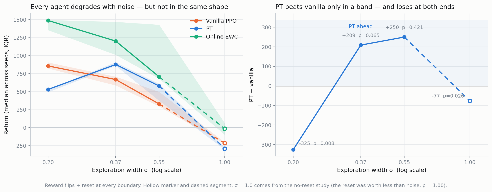
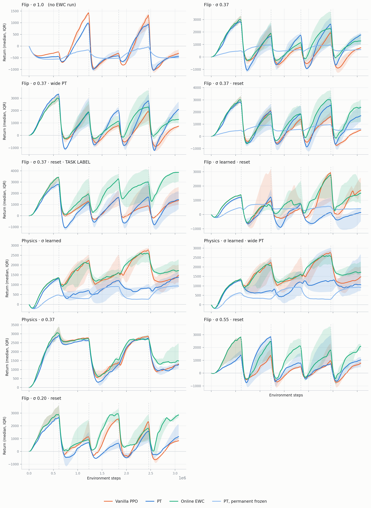

# Phase 2 results

Working notes, for me. **157 runs**, all finished, all clean. 292 tests pass.

**This file covers HalfCheetah with observable task boundaries only.** The other studies have
their own reports: `CARTPOLE_RESULTS.md` (second environment), `SWITCHRATE_RESULTS.md` (phase
length), `DRIFT_RESULTS.md` (smooth boundary-free drift).

93 runs through 2026-08-17, then 61 on 2026-08-18: LayerNorm on both benchmarks, the stationary
ceiling, the capacity sweep, the consolidation-order ablation and the allocation test. Those five
sections sit immediately below the tables because they change how the tables should be read.

Then, also on 2026-08-18, **a second environment** — `cartpole-swingup`. Its section sits directly
below the tables because every number in them is HalfCheetah, and that is the largest open threat to
the conclusions. The full cartpole results are in `CARTPOLE_RESULTS.md`.

---

## How to read this

Every run: HalfCheetah-v5, 3.07M steps, 5 task boundaries, 5–10 seeds.

- **Reward flips** — the goal reverses at each boundary (run forward, then backward…)
- **Physics change** — damping/friction/mass/armature change; the goal stays "run forward"
- **σ** — how much randomness the policy adds to each action. *Held* at a fixed value, or *learned*
  (starts at 1.0 and the agent shrinks it — standard PPO)
- **reset** — the cheetah restarts standing at each boundary

Numbers are the **median across seeds of each seed's average return over the whole run**.
p-values: exact Mann–Whitney; the floor is 0.0079 at 5 seeds, 0.0022 at 6.

⚠️ **The average and the final-phase disagree for PT.** PT reaches higher peaks but crashes deeper at
boundaries, and the average is the area under the curve. Read both tables.

---

## Average return

| setup | seeds | vanilla | PT | EWC | PT frozen | PT−van | p | PT−EWC | p |
|---|---:|---:|---:|---:|---:|---:|---:|---:|---:|
| Flips · σ 1.0 | 6 | −214 | −291 | **−14** | −396 | −77 | **0.026** | −277 | **0.002** |
| Flips · σ 0.37 | 6 | 589 | 784 | **990** | 595 | **+194** | 0.394 | −206 | 0.394 |
| Flips · σ 0.37 · big PT | 6 | 589 | 743 | **990** | — | **+154** | 0.132 | −246 | 0.485 |
| Flips · σ 0.37 · reset | 6 | 668 | 877 | **1202** | 585 | **+209** | 0.065 | −325 | 0.093 |
| Flips · σ 0.55 · reset | 5 | 328 | 578 | **706** | — | **+250** | 0.421 | −127 | 0.056 |
| Flips · σ 0.20 · reset | 5 | 856 | 531 | **1487** | — | −325 | **0.008** | −956 | **0.008** |
| Flips · σ learned · reset | 5 | 728 | 79 | **848** | 405 | −648 | **0.008** | −769 | **0.008** |
| **Flips · σ 0.37 · reset · TASK LABEL** | 6 | 979 | 577 | **1928** | — | −402 | **0.015** | −1351 | **0.002** |
| Physics · σ learned | **10** | 1351 | 776 | **1503** | 471 | −575 | **0.004** | −727 | **0.0005** |
| Physics · σ learned · big PT | **10** | 1351 | 1145 | **1503** | 495 | −206 | **0.043** | −359 | **0.002** |
| Physics · σ 0.37 | 5 | 1762 | 1689 | **1974** | — | −72 | 0.310 | −285 | 0.095 |

## Final-phase return (last 20%)

| setup | vanilla | PT | EWC |
|---|---:|---:|---:|
| Flips · σ 1.0 | −524 | −582 | **−252** |
| Flips · σ 0.37 | 42 | 753 | **756** |
| Flips · σ 0.37 · big PT | 42 | 507 | **756** |
| Flips · σ 0.37 · reset | −97 | 699 | **1424** |
| Flips · σ 0.55 · reset | 102 | 452 | **943** |
| Flips · σ 0.20 · reset | 184 | 337 | **1840** |
| Flips · σ learned · reset | 997 | −120 | **1039** |
| **Flips · σ 0.37 · reset · TASK LABEL** | 757 | 535 | **2858** |
| Physics · σ learned | 1337 | 1078 | **1707** |
| Physics · σ learned · big PT | 1337 | 1184 | **1707** |
| Physics · σ 0.37 | 1200 | 1132 | **1490** |

Regenerate both tables with `python -m src_continuous_control.scripts.report_tables`.

---

## The second environment, in one paragraph

`cartpole-swingup` was added 2026-08-18 because **every number above this line is HalfCheetah**, so
none of them can distinguish "a property of the PT method" from "a property of HalfCheetah". It is
the opposite of HalfCheetah on every axis that matters — 1 actuator vs 6, 5 observations vs 17,
balancing at a point vs a running gait — and its maximum return is 1000 by construction.

**The findings do not carry over.** On cartpole `pt` beats vanilla and online EWC (final-phase 720
vs 619 and 631, p = 0.0011 and 0.0003), and an ablation shows it is the permanent's *learning* that
does it, not the split. The measured difference between the environments is how much competence
carries from one task to the next: **0.56 on cartpole against 0.23 on HalfCheetah**, disjoint
groups, p = 1.08e-5.

Everything else — the dynamic-range gate, the external cross-check on the port, parameter parity at
these dimensions, the ablation, the transfer metrics, the mechanism diagnostics and the defects
found along the way — is in **`CARTPOLE_RESULTS.md`**, and is not repeated here.

## ⚠️ The ceiling: sigma collapse costs 3x, and it is not a continual-learning problem

Measured 2026-08-18. Vanilla PPO, `disable_task_switch: true`, nominal physics, 3 seeds. Nothing
changes during these runs — they exist to say how good this codebase's PPO gets when the
non-stationarity is switched off, which no run had ever measured.

| stationary vanilla | whole-run | final 20% | per-seed final |
|---|---:|---:|---|
| sigma LEARNED (standard PPO) | 1421 | 1681 | 1584, 1681, 2888 |
| sigma FROZEN at 0.37 | **3960** | **5040** | 4822, 5040, 5490 |

The groups are **completely disjoint** — the learned-sigma best seed (2888) is far below the
frozen-sigma worst (4822) — so 3 seeds settles it. Frozen sigma reaches 5040, which is at the
classic "solved" threshold for HalfCheetah (~4800).

**This closes the question the sigma section below left open.** The collapse was documented across
task boundaries, so it could have been about failing to recover from switches. It is not. With no
boundaries at all, learning sigma costs a factor of three. It is an inherited PPO pathology, not a
continual-learning one, and it was suppressing every learned-sigma number in this file by ~3x.

**It also answers the dynamic-range question.** Continual arms at sigma 0.37 reach 1200-1500
final-phase against a 5040 stationary ceiling, i.e. about a quarter of what this setup can do. The
benchmark is nowhere near saturated — the opposite of the Phase 1 failure — and there is ample room
for a method to show a difference.

---

## Capacity: `pt` is the only arm that needs parameters, and C.3's prediction fails backwards

Appendix C.3 names the method's own boundary condition: PT should be **beneficial** where the
agent's budget is small relative to the environment. This is the directional test, run at frozen
sigma 0.37 on the physics benchmark, with total-parameter parity re-verified at **1.000x**
(1,245 params on every arm).

| physics, sigma 0.37 | vanilla | pt | ewc | pt−van | p |
|---|---:|---:|---:|---:|---:|
| [64,64] — 11,085 params | 1761 | 1689 | 1974 | −72 | 0.310 |
| [16,16] — 1,245 params | 1786 | **797** | 1773 | **−988** | **0.008** |

Read down the columns instead, which is where it becomes unambiguous. Cutting parameters **9x**:

| arm | [64,64] -> [16,16] | change | p |
|---|---:|---:|---:|
| vanilla | 1761 -> 1786 | **+1.4%** | 0.548 |
| ewc | 1974 -> 1773 | −10.2% | 0.151 |
| **pt** | 1689 -> **797** | **−52.8%** | **0.008** |

**Vanilla does not notice a 9x capacity cut. `pt` loses half its return.** The paper predicts `pt`
should gain ground here; it loses it, at the 5v5 significance floor.

### The likely mechanism, and it is structural

Parity is matched on TOTAL parameters, but **PPO only ever trains the transient** — `mu_P` is
detached in the training forward. So `pt`'s learnable capacity is not 1,245, it is the transient
alone: **1,830 actor parameters at [64,64], and 270 at [16,16]**, against vanilla's 668 at the
small width. At the large width the transient is big enough to compete, which is why `pt` ties
there. At the small width it is not.

This is exactly the `diag_bigtrans` suspect recorded in `PHASE2_INSTRUCTIONS.md` and never run:
*"parity was matched on TOTALS, which count a network PPO never touches."* The capacity sweep is
strong evidence for it.

It also reframes the C.3 test honestly: **vanilla was indifferent to the cut, so this benchmark
never entered a "big world - small agent" regime at all.** The agent was never the bottleneck —
except for `pt`, by construction.

**That test has now been run — see the next section. It came back null**, which is why the
allocation story below is reported as *refuted at full width* rather than as the explanation.

---

## The allocation test: giving `pt` a fair trainable budget changes nothing

The section above proposed that `pt` underperforms because parity is matched on TOTAL parameters
while PPO's gradient reaches only the transient. `bigtrans_physics_s037` tests it directly: both
transients go [32,32] -> [64,64], one key, same benchmark, same frozen sigma, 5 seeds.

Realised capacity, asserted before launching rather than inferred from the config:

| | trainable (actor+critic) | vs vanilla | total | vs vanilla |
|---|---:|---:|---:|---:|
| vanilla | 11,085 | 1.00x | 11,085 | 1.00x |
| `pt`, [32,32] transients | 3,495 | **0.32x** | 11,005 | 0.99x |
| `pt`, [64,64] transients | 11,079 | **1.00x** | 18,589 | **1.68x** |

| physics, sigma 0.37 | whole-run | final 20% |
|---|---:|---:|
| vanilla | 1761 | 1200 |
| `pt` (as always run) | 1689 | 1132 |
| **`pt` BIGTRANS** | **1630** | **1126** |
| ewc | 1974 | 1490 |

| comparison | delta | p |
|---|---:|---:|
| BIGTRANS vs `pt` — **the test** | −59 | 0.690 |
| BIGTRANS vs vanilla | −131 | 0.151 |
| BIGTRANS vs ewc | −344 | **0.032** |

**Tripling the trainable capacity and handing `pt` 1.68x vanilla's total parameters moved the
result by −59 points, p = 0.690.** The allocation explanation is refuted at this width.

**This is the strongest negative result in the file.** `pt` was given an equal trainable budget AND
a 68% total-parameter advantage — a comparison deliberately rigged in its favour — and still did not
beat vanilla, and still lost to EWC. Every previous `pt`-loses result had a live objection attached
(unmatched sigma, unmatched trainable capacity); this one has none.

**One honest limitation on what it tests.** The allocation hypothesis was invented to explain the
[16,16] collapse, and this run was done at [64,64], where `pt` was already tied with vanilla and
there was no deficit to explain. It establishes that trainable capacity is not the binding
constraint where `pt` is fine; it does not explain the small-agent collapse. The matched test —
[16,16] permanent with a full-width [16,16] transient — has not been run.

### Phase 1 already ran the capacity question, in the STATIONARY case

`archive/phase1/docs/FINDINGS.md` §8.2.1a, "The ceiling is capacity, not the decomposition"
(`configs/abl_pt_wide.yaml`, 8 seeds, **no non-stationarity at all**). Final-quarter returns:

| arm | sorted seeds | high mode | modal |
|---|---|---:|---:|
| vanilla [64,64] 1x | 1128 1244 1276 1276 1431 1496 \| 3450 3608 | 2/8 | 1308 |
| pt-0.5x [43,43] 1x | 1016 1045 1236 1329 1391 1402 1417 1434 | **0/8** | 1284 |
| pt-2x [64,64] 2x | 1188 1269 1280 1285 1342 \| 3012 3187 3313 | 3/8 | 1273 |

All three agree on the typical outcome; the only thing width changes is whether a high-performing
gait is **reachable at all**, and parameter-matched `pt` never reaches it. Fisher one-sided,
0.5x vs 2x, p = 0.10 — a consistent pattern rather than a demonstrated effect at n = 8, but
monotone in per-component width.

**This is citable.** `archive/phase1/README.md` rules that comparisons of `pt_full` against vanilla
or against its own controls stand independently of the disputed shrinkage baseline, and §8.2.1a
involves no shrinkage arm.

### The two together, which is the useful reading

They do not conflict — they measure different things and both are needed:

- **Stationary (Phase 1):** per-component width decides whether `pt` can reach the *ceiling*.
  Halving it removes the high mode; doubling restores it.
- **Continual (here):** equalising trainable capacity does **not** help `pt` *adapt*. Null at
  p = 0.690.

So capacity governs how good `pt` can get on a fixed task, and explains none of its deficit when the
task changes. Phase 1's own conclusion — that §6.1's parameter-matching convention is what
handicaps `pt`, "a domain-level qualification of App. C.3" — survives, and the capacity sweep above
extends it to a second domain and a much larger effect (−52.8%, p = 0.008).

**A Phase 1 instruction that is still only half-done.** §8.2.1a insists the continual sweep carry
BOTH `pt` arms — parameter-matched and wide — because they answer different questions
(*is `pt` better at equal parameters?* vs *does the decomposition help at all?*). Phase 2 added a
wide arm, `results/clean/pt_sup`, but only at **learned sigma**, which the ceiling section shows
costs ~3x. There has never been a wide-`pt` arm at frozen sigma. This run closes most of that gap
at 1.68x rather than 2x, and closes it with a null.

---

## LayerNorm: helps vanilla and EWC, and is the second intervention that hurts `pt`

`nn.LayerNorm` on every hidden layer of every network, applied to ALL THREE ARMS so it cannot
flatter one of them. Never on the output layer — the `pt` decay scales that layer and is exact only
because it is affine (`tests/test_layer_norm.py` pins this, plus Theorem 1's zero-init and that the
normalisation is not a no-op). Parity with LN on: pt/van 0.993 -> 1.006. Each arm's control is its
own existing unnormalised run, so only the normalised arms were run.

| physics, sigma 0.37 | control | +LN | change | p |
|---|---:|---:|---:|---:|
| vanilla | 1761 | 1813 | +51 | 1.000 |
| pt | 1689 | 1767 | +77 | 0.841 |
| ewc | 1974 | 1978 | +4 | 1.000 |

Nothing significant on physics. Final-phase moves more (vanilla +172, `pt` +341, ewc +384) but at
5v5 the floor is 0.0079, so that is directional only — and ewc gains slightly more than `pt`.

| reward flips, sigma 0.37 | control | +LN | change | p |
|---|---:|---:|---:|---:|
| vanilla | 668 | 966 | **+299** | 0.052 |
| **pt** | 877 | **504** | **−373** | **0.017** |
| ewc | 1202 | 1381 | +179 | 0.931 |

On flips it separates, and **`pt` is the only arm LayerNorm harms.** That is now a pattern rather
than an oddity: the task label (finding 0) helped vanilla and EWC and not `pt`; LayerNorm helps
vanilla and EWC and actively hurts `pt`. Two independent interventions, same asymmetry.

---

## Consolidation order: cleared, it is not the defect

`consolidation_shuffle: true` against `pt_physics_s037`, one key, 5 seeds.

| | whole-run | final 20% |
|---|---:|---:|
| visit order (every pt run ever) | 1689 | 1132 |
| shuffled | 1679 (−10, p=0.841) | 1305 (+173) |

Every `pt` run on disk fit its permanent in visit order, so the newest states of each window took
the final gradient step of every consolidation epoch — a real inconsistency, flagged in
`_iter_indices`' own docstring. It costs nothing measurable. A reasonable suspect, now eliminated.

---

## ⚠️ The physics headline is confounded: exploration collapses, and PT's collapses hardest

Measured 2026-08-17, from the runs already on disk. No new training.

`log_std_mean` was logged by `pt` only — `PPOBase.update()` returned four keys and sigma was not
one of them — so **vanilla and EWC never recorded their exploration width.** For a diagonal
Gaussian with state-independent `log_std` it is recoverable exactly from `entropy`, which every arm
does log:

    mean log sigma = (H - (d/2)·log(2πe)) / d

`scripts/check_sigma_collapse.py` does the inversion over all 93 runs. `pt` logs both quantities,
so the recovery is checked against ground truth: it agrees to 1.1e-2 in log space (~1% in sigma),
the residual being that `entropy` is averaged over an update's epochs while `log_std_mean` is
sampled at the end of one. The sigma-frozen arms come out at **exactly 1.00x** across the whole
run, which independently confirms both the freeze and the method.

**Every learned-sigma arm collapses from sigma ≈ 1.0 to near-determinism, and the arms collapse at
different rates.** Sigma just before each boundary, median over seeds:

| benchmark | arm | b1 | b2 | b3 | b4 | end |
|---|---|---:|---:|---:|---:|---:|
| physics | vanilla | 0.169 | 0.125 | 0.086 | 0.111 | 0.072 |
| physics | **pt** | 0.141 | **0.077** | 0.069 | 0.057 | **0.054** |
| physics | ewc | 0.169 | 0.135 | 0.102 | 0.129 | 0.094 |
| flips | vanilla | 0.171 | 0.120 | 0.091 | 0.099 | 0.092 |
| flips | **pt** | 0.141 | **0.075** | 0.054 | 0.042 | **0.040** |
| flips | ewc | 0.171 | 0.121 | 0.110 | 0.110 | 0.119 |

**`pt` is the least exploratory arm at every boundary of both benchmarks**, entering the second
half of each run with roughly 60% of the exploration of the arms it is compared against.
`ent_coef` is 0, so nothing in the objective resists this: PPO's ratio term shrinks sigma
monotonically and no term pushes back.

### The matched-sigma control was already run, and it holds

`results/{van,pt,ewc}_physics_s037` is the same benchmark with sigma frozen at 0.37. Diffed against
`phase2_hard`, the configs are identical on every training-relevant key — same four drift targets,
same task sequence, same PPO settings — differing only in `freeze_log_std` and `log_std_init`.
One variable.

| physics benchmark | vanilla | pt | ewc | pt−van | p |
|---|---:|---:|---:|---:|---:|
| sigma learned (10 seeds) | 1351 | 776 | 1503 | **−575** | **0.004** |
| sigma 0.37 frozen (5 seeds) | 1761 | 1689 | 1974 | −72 | 0.310 |

Freezing sigma lifts every arm, but it lifts `pt` about twice as much as the others: vanilla +410,
EWC +471, **`pt` +913 — it more than doubles.** With exploration held fixed all three land within
15% of each other and none of `pt`'s gaps reach significance.

**Five seeds is enough to settle this one, because the spreads are tight.** Per-seed whole-run
return at sigma 0.37 — vanilla 1684/1728/1761/1920/1957 (spread 273), pt 1518/1665/1689/1838/1895
(spread 377), ewc 1802/1838/1974/2036/2181 (spread 379) — against spreads of 855/1202/1189 on the
learned-sigma arms. At a spread of ~380 a −575 effect cannot hide: `pt` would centre near 1186 and
top out around 1380 while vanilla's *worst* seed is 1684, so the groups would be disjoint and the
test would return the 0.0079 floor immediately. They overlap almost entirely instead. **A −575
effect is ruled out here; a −200 one is not.**

### What this does and does not overturn

It does **not** show that `pt` beats anything. At matched exploration `pt` is still last of the
three on the physics benchmark, and EWC still leads.

It does mean **the sentence "`pt` is significantly worse than standard PPO on the physics
benchmark" cannot be reported as it stands**, because the one condition in which it is true is also
the condition in which `pt` explored least. Finding 2 below must be read against this section.

`log_std_mean` and a new `log_std_min` are now logged by `PPOBase` for every arm. The min is there
because the mean hides a single collapsed action dimension, and that case is not recoverable from
entropy at all — so it exists only for runs made after this date.

---

## The five findings

### 0. The reward-flip benchmark was mis-specified — and fixing it does not rescue PT

Until now the agent was told *that* a boundary happened but never *which* task it was in. On a
reward flip the two tasks demand **opposite actions from identical observations**, so the policy was
being asked to be two different functions of one input — a contradiction, not a memory problem.
Anand & Precup's own control experiment supplies the missing signal (a feature encoding which end of
the chain holds the reward) and their transient reads it. We added the same thing: a one-hot task
label appended to the observation, given to **every** arm; for PT it goes to the **transient only**,
so the permanent stays blind, as in their design.

| flips + reset · σ 0.37 | no label | **with label** | effect | p |
|---|---:|---:|---:|---:|
| vanilla | 668 | **979** | +311 | **0.015** |
| Online EWC | 1202 | **1928** | +726 | **0.026** |
| PT | 877 | 577 | −300 | 0.180 |

The label is worth a great deal — vanilla's final-phase return moves from −97 to 757 (p = 0.0022,
the floor at 6 seeds) and EWC's reaches **2858**. **PT is the only arm it does not help.** With every
arm properly informed, PT is now behind vanilla (−402, p = 0.015) and far behind EWC (−1351,
p = 0.0022).

**A pre-registered prediction, and it failed.** Before running this we predicted that if the
contradiction was the cause of PT's boundary collapse, the label would shrink PT's drop toward EWC's.
Measured drop (trough ÷ pre-flip performance):

| with label | boundary drop |
|---|---:|
| Online EWC | **+0.250** (it *gains* after a switch) |
| vanilla | −0.157 |
| PT | **−0.525** |

PT: −0.499 without the label → −0.525 with it, change −0.025, **p = 1.000**. Not a nudge. The stated
alternative therefore holds: **the boundary collapse is a defect in the mechanism, not an artefact of
the benchmark.**

**Why, most likely.** `envs/directional_half_cheetah.py` already warned about this: under a symmetric
±1 flip the task-discriminative term cancels, so E_τ[r_τ] is just the control cost and the permanent
has nothing to store. Hiding the label from the permanent guarantees it: the permanent's regression
target is the task-*average* policy, which is empty. Worse, consolidation then pushes ρ·μ_T —
task-specific content — into a network that cannot represent it, and the (1−ρ) decay throws away the
correction the agent needs. Every consolidation corrupts the permanent and discards the useful part.

Two independent fixes follow, both untested: give the label to the **permanent too** (so it can learn
the conditional policy, which genuinely is shared structure), or make the tasks **asymmetric**
(`tasks: [1.0, -0.5]`, already scaffolded in `configs/pt_paper_asym.yaml`) so the average is
non-degenerate. The paper's own benchmarks are asymmetric by construction.

## The other four findings

### 1. PT's advantage over vanilla is a BAND, not a slope

| σ | vanilla | PT | EWC | PT−van |
|---:|---:|---:|---:|---:|
| 0.20 | 856 | 531 | **1487** | −325 (p=**0.008**) |
| 0.37 | 668 | **877** | **1202** | +209 (p=0.065) |
| 0.55 | 328 | **578** | **706** | +250 (p=0.421) |
| 1.00 | −214 | −291 | **−14** | −77 (p=**0.026**) |

*(σ 0.20/0.37/0.55 all use the boundary reset; the σ 1.0 row is the no-reset study — the reset was
measured to be worth less than noise, p = 1.00, so it is comparable, but it is drawn hollow in the
figure rather than blended in.)*

PT beats vanilla in the middle and loses **significantly at both ends**. The reason is the shape of
the two curves: **vanilla improves steadily as noise falls** (−214 → 856), while **PT peaks at 0.37**
(−291 → 578 → **877** → 531) and declines either side.

So "PT wins at 0.37" was two differently-shaped curves crossing. σ = 0.37 is `log_std_init = −1.0`,
i.e. e⁻¹ — a round number in log space that was never swept, so the crossing was mistaken for a
property of the method. EWC wins at every σ, and its best value (0.20) is exactly where PT is worst.

### 2. 10 seeds went against PT on physics — but at unmatched exploration

⚠️ **Read the confound section above first.** These runs learn sigma, and `pt` collapses to 0.054
against vanilla's 0.072 and EWC's 0.094. At matched sigma on the same benchmark the −575 becomes
−72 (p = 0.310). The seed-count point below stands; the effect size does not.

PT is significantly behind vanilla (−575, p = 0.004) and behind EWC on both metrics
(p = 0.0005, p = 0.00008).

The wide-PT final-phase lead did not survive: **1820 at 5 seeds (best arm) → 1184 at 10 seeds**
(behind both). Per-seed values were 712, 2156, 2013, 47, 1820 | 1473, 895, 1562, 566, 878 — nothing
changed except which seeds were counted. **A 5-seed median here can move by 600+**, so every 5-seed
number in this file is provisional, including the ones that favour PT.

PT is also the least reliable arm: spread 321–1523 against vanilla's 1021–1876.

### 3. The mechanism is real — the permanent is not inert

Freezing the permanent (`lr_perm = 0`) costs **650 on wide PT (p = 0.013)** and 305 on matched PT.
This rules out the deflationary explanation that PT was just a slower single network with dead
machinery. It works; it is simply not worth its cost here.

### 4. PT loses far more at each boundary than EWC

PT drops to **−45 to −52%** of its pre-flip performance at a switch; EWC drops **12%** (p = 0.013).
This is *not* explained by PT running faster beforehand — pre-flip speeds are indistinguishable, and
PT also recovers *slower* (p = 0.013 on wide PT). For a method whose purpose is retention across
boundaries, this is backwards, and it is the most localised anomaly we have.

---

## Plots

---

## What to run next

| run | why |
|---|---|
| **σ sweep at 10 seeds** | the band is the headline finding and rests on the thinnest evidence in this file |
| **σ 0.45 and 0.70** | four points cannot resolve a curve; locate PT's optimum and the upper crossing |
| **`[16,16]` with a full-width transient** | the one capacity question left open. The allocation test was run at [64,64], where `pt` had no deficit to explain, and came back null. The [16,16] collapse (−52.8%, p=0.008) is still unexplained: is the transient starved, or is it the split itself? |
| **a wide `pt` arm at FROZEN sigma** | Phase 1 §8.2.1a instructed the continual sweep to carry both a parameter-matched and a wide `pt`. `clean/pt_sup` exists but runs at learned sigma, which costs ~3x. The allocation test closes most of this at 1.68x |
| **stop reporting learned-sigma arms as headline** | the ceiling shows learning sigma costs 3x with no boundaries at all. Every learned-sigma row above is depressed by a PPO pathology unrelated to continual learning |
| **why PT's sigma collapses fastest** | the confound section above. `pt` is the least exploratory arm at every boundary of both benchmarks and nobody knows why. The KL anchor pushes sigma *up*, so it is not that. Start from whether `log_std` sitting in the transient parameter group interacts with the decay |
| **whether the sigma band survives freezing** | finding 1 is a sweep over *frozen* sigma, so it is not itself confounded — but it now needs reading beside the fact that learned-sigma runs pass through the whole band on their way down |
| **why PT has an interior optimum** | the real thesis question — start from `probe/decay_gain`, `actor_absorbed_frac` and the transient/permanent ratio as functions of σ |
| **PT with the label given to the PERMANENT too** | finding 0 — the permanent is currently blind, so on a symmetric flip its target is empty. The most direct test of the diagnosis |
| **asymmetric tasks** (`tasks: [1.0, -0.5]`) | the other half of the same fix; the paper's own benchmarks are asymmetric, ours is the one regime where the theory says the permanent has nothing to store |
| **the boundary drop** | finding 4, unchanged by the task label, so it is a mechanism defect |
| **longer runs (6–9M)** | PT starts slow; 3M may cut it off before the permanent pays for itself |

**Why PT has an interior optimum in exploration is unexplained**, and it is the most interesting
open question here. Anand & Precup decompose a *value function* using ε-greedy value-based methods —
no Gaussian policy, no σ. The exploration sensitivity is a property of **this port**, not of the
theory, which is a real gap worth writing about.

---

## Bugs found and fixed

| | |
|---|---|
| σ frozen at 1.0 in the first sweep | a value already tested and rejected |
| `anneal_lr: true` | silently overwrote PT's Robbins–Monro schedule; `rm_power` was dead |
| `ewc_gamma` never read | EWC was not online EWC |
| EWC penalty ÷ parameter count | `ewc_lambda: 50` actually meant 0.0088 |
| EWC anchoring `log_std` | gave EWC ~2× the exploration of the arms it was compared against |
| `mass` × 1.0 was not a no-op | a MuJoCo inertia refresh perturbed the simulation every step |
| **two different significance tests in one column** | the report mixed Mann–Whitney with a median-permutation test; now regenerated from source by one script |
| **every `store_true` flag unsettable from YAML** | argparse defaults them to `False`, not `None`, and `build_config` merges any non-None CLI value over the config — so `disable_task_switch`, `save_checkpoints`, `render`, `no_eval`, `no_wandb`, `no_tb` were silently overwritten. A config with `disable_task_switch: true` trained with switching fully on. No Phase 2 result affected (no live config set one); Phase 1's `cleanrl_match.yaml` did, so its "single-task baseline" was switching tasks. Pinned by `tests/test_config_merge.py` |
| **sigma logged by `pt` only** | `PPOBase.update()` never returned it, so for 93 runs the exploration width of vanilla and EWC went unrecorded — while differing between arms by up to 2x. Recovered retrospectively from `entropy`; now logged directly, with the per-dimension min alongside |

---

*Directory → experiment map: `results/MANIFEST.md`. Phase 1 numbers are not used anywhere here.*
