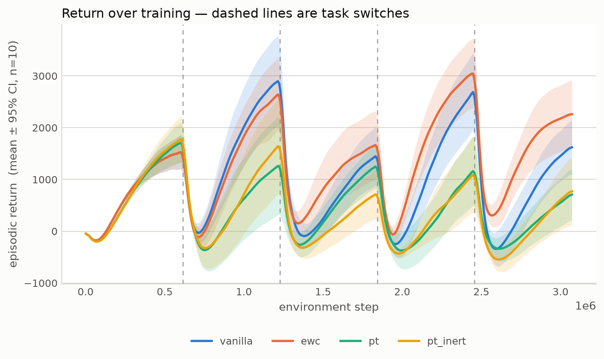
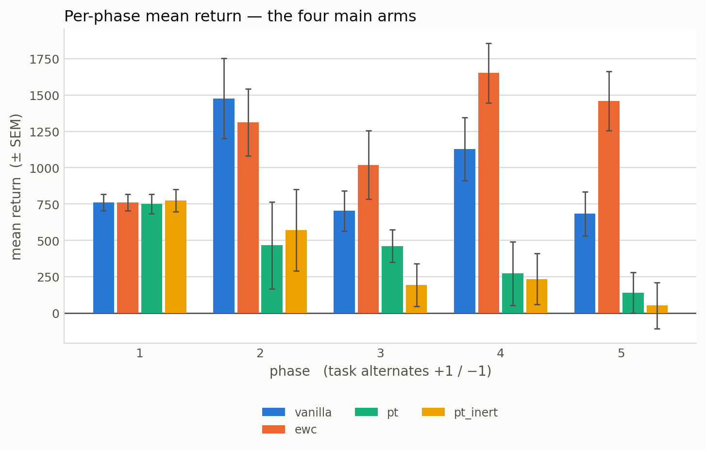
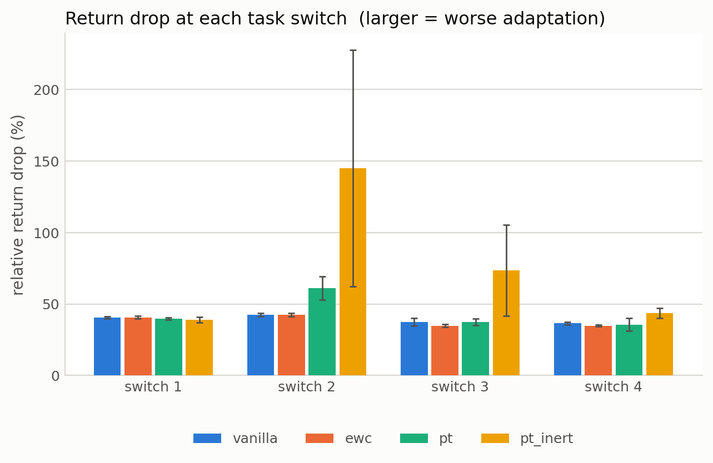
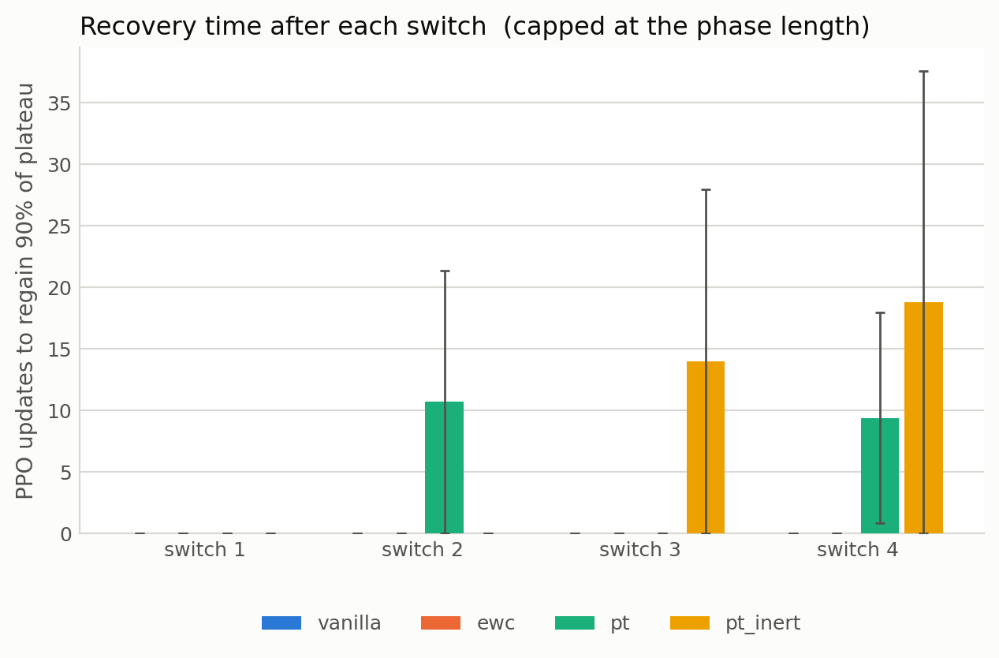
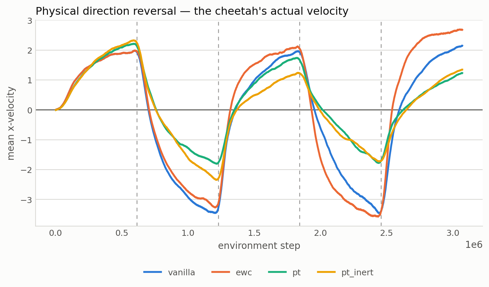
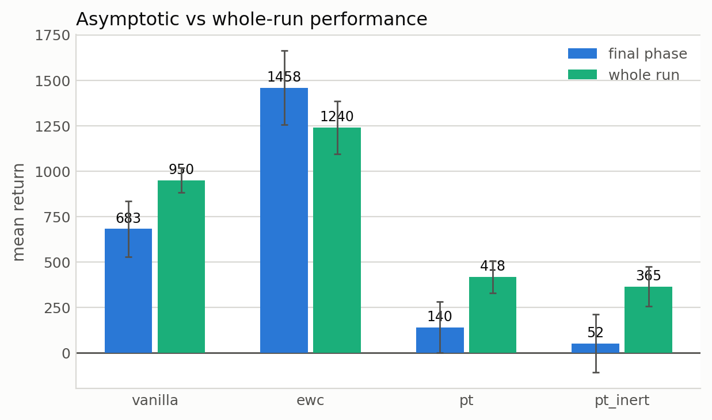
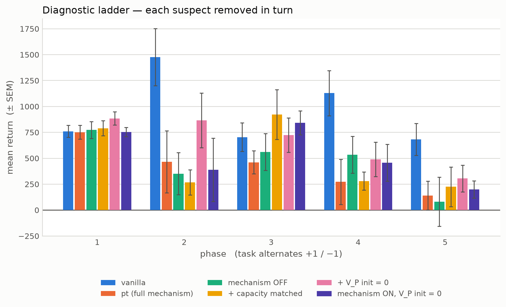
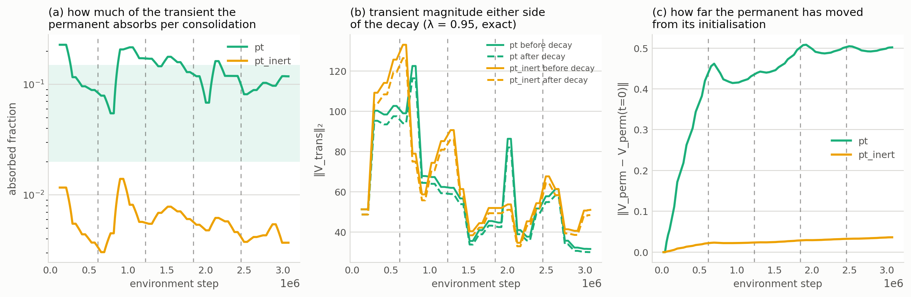

# Re-investigation of the PT implementation — August 2026

**Trigger.** The previous result (PT fails to beat vanilla PPO) was identified as
counter-intuitive and most likely an implementation defect. This document records the audit that
followed, every defect it found, every experiment run to test them, and what in `FINDINGS.md` is
retracted as a result.

**Status: the experimental programme is complete at the configuration level.** Every hypothesis
generated during the audit has been tested and closed. §6b–§6d carry the results, including one
conclusion of our own that had to be retracted (§6d.1). What remains is not a further
hyper-parameter search but a reproduction of the authors' own published result, used as a
bug-finding tool — see §9.

**Scope.** `FINDINGS.md` §1–§8.1 describes the *original* investigation. Everything here supersedes
it where they conflict. Nothing in `FINDINGS.md` was deleted; retractions are listed in §5.

---

## 1. Executive summary

Fifteen distinct defects were found and fixed. Three of them invalidated entire result sets. The
supervisors' hypothesis — that the negative result was an implementation artifact — was **correct
in substance**: the permanent value function had never once functioned in the history of the
project. It was fixed, verified to operate, and the negative result survived.

The current state, measured cleanly at n=10 with rank statistics:

| comparison | median | Mann-Whitney |
|---|---|---|
| `pt` vs `pt_inert` (working vs dead permanent) | 415.1 vs 325.2 | U=43, **p=0.597** |
| `vanilla` vs `pt` | 929.3 vs 415.1 | U=5, **p=0.001** |
| `vanilla` vs `pt_inert` | 929.3 vs 325.2 | U=9, **p=0.002** |
| `ewc` vs `pt` | 1191.1 vs 415.1 | U=5, **p=0.001** |
| `vanilla` vs `ewc` | 929.3 vs 1191.1 | U=28, p=0.096 (n.s.) |

Four findings that are new and did not exist in the original study:

1. **A working permanent is indistinguishable from a dead one** (p=0.597), with the mechanism
   contrast verified on all 10 seeds (`absorbed_frac` 0.10 vs 0.005, ≥15× separation, zero overlap).
   This is the result nothing has moved.
2. **The split-critic implementation is correct.** Theorem 1's equivalence holds once *both* its
   conditions are enforced (§6d.1); the consolidation regression descends in all 75 measured cycles
   (§6d) and generalises to states it never trained on (ratio 0.999, §6d).
3. **The deficit is post-switch, and it belongs to the mechanism, not the architecture.** Phase 1 is
   at parity in every clean measurement (p=0.290 / 0.940 / 1.000). With the mechanism switched off
   *and* the baseline matched, the whole run is at parity too.
4. **Zero-initialising a critic costs ~300 return points** on this task, and costs *vanilla* the
   same (§6d.2). Some of what earlier read as a PT deficit was this.

**One conclusion of ours is retracted.** Jobs C–E built a case for a post-switch *architectural*
defect in the split critic. It was an artifact of comparing against a differently-initialised
baseline, and it does not survive a matched one (§6d.1).

---

## 2. Defects found

Ordered by when they were found. "Invalidates" states what had to be re-run or retracted.

| # | Defect | Source of truth | Invalidates |
|---|---|---|---|
| 1 | `θ_T` randomly initialised | **Theorem 1**: `V^(T)_0 = 0` | all PT runs |
| 2 | Consolidation target `old_P + (1−λ)T` | **Eq. (4)**, **Alg. 4 line 15**: `old_P + T` | all PT runs |
| 3 | `k=10`, `λ=0.5` — small *k* with small *λ* | **§6**, Fig. 4 | all PT runs |
| 4 | LR annealed to zero | reference does not anneal | all runs |
| 5 | PT critic at 2× vanilla's parameters | **§6.1** PT-DQN-0.5x | all comparisons |
| 6 | Shared-trunk critic (two linear heads) | reference uses two separate nets | `FINDINGS.md` §7, §8 |
| 7 | Scalars discarded under `--no-tb` | — | all metrics from sweeps |
| 8 | `BoundaryReturnTracker` window < 1 update | — | `boundary/return_drop`, all runs |
| 9 | **α_P untuned → permanent inert** (0.04% transfer, alignment 0.000) | paper tunes α_P per domain | **every PT run ever** |
| 10 | α_P selection criterion inverted (chose max absorption) | **Theorem 5**: fixed point is `E_τ[v_τ]`, an *average* | α_P pass 1 |
| 11 | Constant α_P | **Theorem 5** holds "under Robbins-Monro step-size conditions" | all PT runs |
| 12 | Actor and critic clipped **jointly** | — | all cross-arm comparisons |
| 13 | `decay_mode=params` over-decays; λ uncontrolled | **Alg. 2 line 9** decays the *value function* | all λ settings |
| 14 | Offline eval sampled from the **global** torch RNG | — | any two runs with different eval flags |
| 15 | `θ_P` initialised at orthogonal gain 1.0 (`\|V_perm\|`=0.405) | **reference code**: `w_1 = np.zeros_like(...)` (tabular/linear), `normal_(0,0.01)` (deep) — **3628× smaller** | all PT runs; fixed and re-run (§6b) |

### 2.1 The three that mattered most

**#9 — the permanent never learned.** Measured on the real consolidation operator at the shipped
settings (`sgd`, `lr_perm=1e-5`, 768 gradient steps):

```
optimiser    lr     grad steps   ||dV_perm|| / ||V_trans||   direction aligned
   sgd     1e-05         768                       0.04%              0.000    <- shipped
   sgd     1e-02         768                      72.08%              0.684
  adam     1e-03         768                      94.49%              0.919
```

`V_perm` sat at its random initialisation for all 3.07M steps of every run. PT was functionally
*vanilla + a frozen random offset + a periodic decay* — no slow timescale at all. Cause: α_P was
inherited from the paper's MinAtar setting and never tuned for HalfCheetah. The paper's own α_P
search ranges span seven orders of magnitude: tabular 0.8…1e-3 (C.9), deep prediction 1e-3…3e-5
(C.7), minigrid PE 3e-2…3e-4 (C.8), MinAtar 1e-7…1e-9 (C.17).

**#12 — the actors were never identical.** `clip_grad_norm_` scales *every* gradient by one factor
derived from the total norm. With a joint clip over actor+critic, PT's critic (a different loss
surface) changed the **actor's** effective step size. "All agents share an identical actor; only
the critic differs" — the premise the entire study rests on — was false.

**#14 — the evaluation rewrote the training trajectory.** `_run_offline_eval` samples actions via
`actor.act()`, up to 5 episodes × 1000 steps = 5000 draws from the global torch generator, every 50
updates starting at update 1. Runs launched with and without `--no-eval` diverged for the same
seed. Found by the remote agent, not by the audit.

---

## 3. Experiment log

All runs: HalfCheetah, `DirectionalHalfCheetah`, 8 async envs × 256 steps, seeds from 0.

| job | question | design | outcome |
|---|---|---|---|
| **α_P pass 1** | does the permanent learn at all? | 6 configs × 3 seeds × 1.84M | mechanism can be made to run (`sgd 1e-2`: 96% absorbed). **The inert control posted the highest mean return of the six.** |
| **α_P pass 2** | which α_P *averages* rather than tracks? | 6 configs × 3 seeds × 1.84M | target derived (`absorbed_frac ≈ 0.04`); the pass-1 grid had jumped 0.005 → 0.547 with nothing between. `sgd 2e-4` selected. |
| **Sweep A/B** | working vs dead permanent, symmetric + asymmetric tasks | 4 arms × 10 seeds × 3.07M, ×2 | `pt` ≈ `pt_inert` in both (paired t=0.12, 1.21). Ran with eval on — pairing void, comparisons valid. |
| **Job A** | Theorem 1 equivalence | 2 arms × 5 seeds × 3.07M | **VOID** — ran without `--no-eval`. |
| **Job A2** | capacity vs plumbing, phase 1 | 4 arms × 5 seeds × 614k | no contrast significant; `vanilla − pt_theorem1` = +40.2, t=0.20. |
| **Job B** | (k, λ) grid with exact decay | 8 configs × 3 seeds × 1.84M | all `\|t\| < 0.7`; **underpowered** — min detectable difference ≈430 against a 220 target. |
| **Job B2** | powered phase-1 confirmation | 3 arms × 10 seeds × 614k | `pt_output` deficit 8.6 (t=0.10). **The historical 220-point deficit did not reproduce.** |
| **Final sweep** | the definitive comparison | 4 arms × 10 seeds × 3.07M, clean | see §1. `pt` ≈ `pt_inert`; both ≪ vanilla and EWC. |
| **Job C** | is the cost the mechanism? | mechanism **off**, 10 seeds × 3.07M | still loses post-switch (whole-run p=0.008; phase 1 p=0.290). **Mechanism ruled out.** |
| **Job D** | is the cost capacity? | `[43,43]` vanilla + full-width PT, 10 seeds × 3.07M | `pt_theorem1_wide` vs vanilla **p=0.001**. **Capacity ruled out.** |
| **Job E** | is it the random `θ_P` offset? | `perm_zero_init`, mechanism **off**, 10 seeds × 3.07M | whole-run p=0.008, but **no individual phase significant** — phase 2 moved 0.001 → 0.131, phase 4 0.008 → 0.059. Large improvement, not a rescue. |
| **Job G** | is the transfer memorised? | 20 % holdout, 5 seeds × 3.07M | fitted/holdout ratio **0.999**, no post-switch gap. **Generalises.** |
| **Job H** | Theorem 1 with BOTH conditions | matched-init baseline, 5 seeds × 3.07M | **p = 0.175**, 5/6 n.s. **Theorem 1 holds** — §6b's defect retracted (§6d.1) |
| **Job I** | does the regression descend? | full loss traces, 3 seeds × 3.07M | all 75 cycles descend, min ×1.05 |
| **Job F** | the real agent with correct init | `pt_zeroperm`, mechanism **live**, 10 seeds × 3.07M | vs `pt`: better every phase, significant at phase 3 (p=0.019). vs vanilla: **phase 1 p=1.000**, whole-run **p=0.002**. |

---

## 4. The result, phase by phase

Final sweep medians (n=10, whole-run and per phase):

| phase | vanilla | ewc | pt | pt_inert |
|---|---|---|---|---|
| 1 (no switch yet) | 693.1 | 693.1 | **645.4** | 635.6 |
| 2 | 1414.1 | 1369.8 | 97.7 | 437.5 |
| 3 | 663.4 | 611.7 | 428.8 | 163.3 |
| 4 | 1262.0 | 1845.4 | 241.8 | 85.0 |
| 5 | 582.7 | 1596.1 | 141.1 | −170.9 |
| **whole run** | **929.3** | **1191.1** | **415.1** | **325.2** |

Phase 1 is at 93% of vanilla and not significantly different. `ewc == vanilla` exactly in phase 1
— correct, EWC's penalty is inactive before the first switch, and a useful sanity check.

**Mechanism contrast, all 10 seeds:**

```
pt        absorbed_frac  0.0793 - 0.1604   median 0.1014
pt_inert  absorbed_frac  0.0040 - 0.0069   median 0.0048     >= 15x separation, zero overlap
```

---

## 5. Retractions

| retracted | why |
|---|---|
| `FINDINGS.md` §8.3.2 — "Theorem 7 confirmed" | On a symmetric sign flip, `mse_perm < mse_full` is satisfied by a permanent frozen at **exactly zero** (24.88 vs 99.54). It measured inertia, not retention. |
| `boundary/return_drop` (all runs before 2026-08-04) | Window was 0.62 of one PPO update → `drop = 0` by construction. Figure 4.4 is unaffected (computed independently from the curves). |
| The 220-point phase-1 deficit | Did not reproduce at n=10 with `--no-eval` (88.4, t=0.93). Eval contamination. |
| "EWC is the clear winner" (§4, §8.3) | Under clean protocol with rank tests, `vanilla` vs `ewc` is **p=0.096** — not significant. |
| `FINDINGS.md` §7, §8 shared-trunk runs | Variant removed as unfaithful (reference uses two separate networks). |
| Selection criterion "within combined SEM" | A `t ≤ 1` test with no inconclusive outcome; one seed could flip it. |
| Selection criterion "highest mean return among survivors" | Ranked the *disabled* mechanism first. Replaced by mechanism fidelity. |

**Common cause.** Five separate criteria in this project selected on noise. The per-seed return
distribution on this benchmark is not Gaussian — every arm shows at least one seed detached from
the rest, and `pt` shows a 4-vs-6 split. **Any criterion whose decision rests on a return
difference at n ≤ 5 is measuring seed noise.** All reporting now uses medians and Mann-Whitney.

---

## 6. Where the deficit actually is

Three facts, each measured cleanly:

1. **Phase 1 is at parity** — p=0.290 (Job C), p=0.940 (Job D), t=0.10 (Job B2). The split-critic
   architecture at rest costs nothing.
2. **The mechanism is not the cause** — Job C ran with `decay=1.0`, `k=100000`, `on_switch=none`,
   `θ_P` frozen. Still significantly worse post-switch (p=0.008 whole-run).
3. **Capacity is not the cause** — Job D gave the transient the full `[64,64]`, exactly matching
   vanilla's critic. Still p=0.001.

**The remaining hypothesis (Job E).** With `θ_P` frozen at a *random* initialisation, the
transient's regression target is `R − V_perm`: the value function minus a fixed, unstructured,
high-frequency function it must cancel on every state. It can memorise that cancellation on states
it trains on; it cannot on **new** states — which is exactly the post-switch regime.

Theorem 1 licenses an arbitrary `V^(P)` because the theorem is **tabular** — a table represents the
offset exactly and the equivalence is free. Under deep function approximation it is not free. And
because α_P is small by design, `V_perm` has been dominated by its random init in *every* PT
configuration this project has run (`perm/drift_from_init ≈ 0.3` against value magnitudes of O(1)).

`perm_zero_init` sets `V^(P)_0 = 0`. The critic loss then reduces **algebraically** to vanilla's:

```
(V_perm.detach() + V_trans − R)²   →   (V_trans − R)²
```

which is unit-tested. **Job E therefore has a hard prediction: parity with vanilla in every phase.**
Anything else falsifies the hypothesis and implicates the split-critic formulation itself.

Corroboration: `SharedTrunkSplitCritic` zero-initialised its permanent, and `FINDINGS.md` §7.1 has
it at `814/394/27/212/−176` against vanilla's `743/468/243/375/−34` — closer to parity than any
separate-trunk run.

---

## 6a. Initialisation — a direct search of the reference implementation (2026-08-04)

The paper does not specify initialisation. Algs. 1, 2 and 4 say only `Initialize: θ, w`, and §3.3
says *"The initialization and resets are done appropriately based on the function approximation
used."* So the reference **code** is the only source of truth. Every version of it:

| file | permanent | transient |
|---|---|---|
| `prediction_semi_crl/tabular_linear/PT_Mem.py` | `w_1 = np.zeros_like(...)` | `w_2 = np.zeros_like(w_1)` |
| `control/tabular/PT_q_learning_crl.py` | `w_1 = np.zeros_like(...)` | `w_2 = np.zeros_like(w_1)` |
| `prediction_semi_crl/minigrid/model.py` | `nn.init.normal_(w, 0, 0.01)`, bias 0 | identical |
| `control/minatar_crl/model.py` | no explicit init (torch default) | identical |
| **ours** | **orthogonal, `out_gain=1.0`** | zero |

**The tabular and linear implementations — the ones the theorems apply to, and the ones that
produce Figures 2, 3b and 4 — start both components at exactly zero.** The deep prediction version
uses `normal_(0, 0.01)`. No reference implementation anywhere uses orthogonal gain 1.0.

Measured on our own architecture (`[43,43]`, 2048 probe states):

```
ours   orthogonal out_gain=1.0        |V_perm| = 0.4046
ref    minigrid normal_(0, 0.01)      |V_perm| = 0.000112      <- 3628x smaller
ref    tabular/linear  w_1 = 0        |V_perm| = 0.000000
```

**Consequence.** α_P is small by design — it *is* the slow timescale — so `θ_P` barely moves
(`perm/drift_from_init ≈ 0.3` against value magnitudes of O(1)). `V_perm` is therefore dominated by
its initialisation for the whole run, and the transient's regression target is `R − V_perm`: the
value function minus a fixed, unstructured function it must cancel on every state. It memorises
that cancellation on states it trains on and fails on **new** ones — exactly the post-switch regime
where the entire deficit lives.

Also confirmed from the same search, and consistent with what we do: the transient is **reset to
zero** at a boundary in the semi-continual prediction code (`w_2 = np.zeros_like(w_1)`, Alg. 1) and
**decayed** in the fully-continual control code (`w_2 = w_2 * args.decay`, Alg. 2).

`configs/pt_zeroperm.yaml` is `pt_paper.yaml` with `perm_zero_init: true` and nothing else changed —
a one-bit comparison against the `pt` arm already run at 10 seeds.

---

## 6b. Jobs E and F — initialisation fixed, and the outcome

`perm_zero_init` was applied (matching the reference, §6a) and run both with the mechanism off
(Job E) and live (Job F), 10 seeds each.

| comparison | whole-run median | Mann-Whitney |
|---|---|---|
| `pt_zeroperm` vs `pt` (one bit: the init) | 486.2 vs 415.1 | p=0.496 — better in every phase, significant only at phase 3 (p=0.019) |
| **`pt_zeroperm` vs vanilla** | **486.2 vs 929.3** | **p=0.002** |
| `theorem1_zeroperm` vs vanilla (mechanism off) | 693.8 vs 929.3 | p=0.008, **no individual phase significant** |

**Phase 1: `pt_zeroperm` vs vanilla is p = 1.000** — 700.1 vs 693.1. Exact parity. Combined with
Jobs C and D (p=0.290, p=0.940), the split-critic architecture is exonerated: with no
non-stationarity present it costs nothing.

Correct initialisation is a real improvement — it moved phase 2 from p=0.001 (random init) to
p=0.131 with the mechanism off, and lifted every phase against the old `pt` — but it does not close
the gap to vanilla.

### 6b.1 The task-sign asymmetry, and what causes it

Phases alternate `+1, −1, +1, −1, +1`. Pooling by task sign:

| arm | +1 (phases 1,3,5) | −1 (phases 2,4) | within-arm p |
|---|---|---|---|
| `theorem1_zeroperm` (mechanism **off**) | 696.4 | 551.8 | **0.513 — no asymmetry** |
| `pt_zeroperm` (mechanism **live**) | 629.3 | 346.4 | **0.013** |
| `pt` (live, random init) | 550.0 | 112.1 | 0.122 |
| **vanilla** | 676.7 | **1385.0** | **0.014 (opposite direction)** |

**Vanilla earns roughly twice as much running backward as forward** (1385 vs 677) — the `−1` task
is where the return is on this benchmark. PT is the opposite: better forward, much worse backward.

**The asymmetry is created by the mechanism.** With it off there is none (p=0.513). Switching it on
costs **205 points on the −1 phases against 67 on +1**. So this is not a property of the split-critic
formulation — it is `consolidate-and-decay` being selectively expensive on the task where the most
return is available.

This is consistent with Theorem 5. `θ_P` converges to `E_τ[v_τ]`, and because `|v_{−1}| > |v_{+1}|`
here, that average sits well below the `−1` task's true value. Every switch into the high-return
phase therefore starts the transient with a larger correction to make — and `k=60` gives it only
5 consolidation cycles per phase to make it.

---

## 6c. Figures

The standard figure set (the same figures as `plots/figures/`), rebuilt against the corrected
re-run data by `plots/make_reinvestigation_figures.py`, reading `workspace/` directly.





*All four arms are together through phase 1; the gap opens at the first switch and never closes.*









*Each suspect removed in turn — mechanism, capacity, initialisation. Phase 1 is flat across all six
arms; no removal closes the post-switch gap.*



*The mechanism's own telemetry, which the original study had no way to see. (a) the working arm
sits in the target band and the inert control a decade below, on every seed, for the whole run;
(c) the permanent moves 0.50 from its initialisation while the inert control's moves 0.03.*

**Not reproducible from `workspace/`:**

| figure | why |
|---|---|
| `offline_curves` | needs `*_eval_returns.pkl`; every re-run used `--no-eval` because the offline eval was corrupting the training RNG (defect #14). `_isolated_rng()` has since fixed that, so a future run can restore it. |
| `consolidation_insitu` panel (b) | the held-out drift measurement needs `consolidation_holdout_frac > 0`, never set on a re-run |
| `drift_comparison` | the three drift regimes were not re-run under the corrected code; `FINDINGS.md` §8 is superseded |

---

## 6d. Jobs G, H, I — three candidates closed, and one of our own conclusions retracted

**Job G — does the consolidation transfer generalise, or is the permanent memorising its buffer?**
`absorbed_frac` is computed on the states the regression trained on, so it is in-distribution: a
permanent that memorised its buffer would report a healthy number and be wrong on the new states
the next rollout bootstraps from. Offline this looked plausible — §6.3 of `FINDINGS.md` fits the
target to 3.2 % train error while held-out error floors at 38–44 %. Measured in situ with a 20 %
holdout, 5 seeds:

```
absorbed_frac   fitted 0.0577   holdout 0.0576    ratio 0.999
absorbed_align  fitted 0.0517   holdout 0.0519    ratio 0.998
post-switch gap 0.0000 (n=20)   mid-phase gap -0.0001 (n=105)
negative holdout alignment: 0 of 1441 logged points, every seed
```

**The transfer generalises.** No gap, no post-switch widening. Memorisation is ruled out.

**Job I — does the regression actually descend inside a cycle?** The scalar log kept only
first/last/mean. With the full trace persisted, across 75 cycles (3 seeds × 25):

```
every cycle descends (first-decile / last-decile > 1); minimum anywhere 1.05
post-switch cycles  median 1.10 (n=12)
mid-phase cycles    median 1.14 (n=63)
```

Post-switch cycles descend slightly less — expected, the state distribution has just moved — but
never fail. **The regression does real work everywhere.**

### 6d.1 RETRACTED: the "post-switch architectural defect" of §6b

Jobs C, D and E built a case that the split critic carries a cost that survives switching off the
mechanism, matching capacity, and zeroing the initialisation. **That conclusion is withdrawn.**

Theorem 1 has **two** conditions: `V^(T)_0 = 0` **and** `V^(TD)_0 = V^(P)`. Every comparison in this
project enforced only the first. With `perm_zero_init`, PT's acting value starts at exactly 0 while
`VanillaCritic` starts at a random function of magnitude ~0.4 — so the two agents never began from
the same function, which is precisely what the theorem asserts equivalence between.

| comparison | gap | Mann-Whitney |
|---|---|---|
| `theorem1_zeroperm` vs vanilla (random init) | 235.5 | **p = 0.008** |
| `theorem1_zeroperm` vs `vanilla_zeroinit` (matched) | 47.5 | **p = 0.175** |

Enforcing the second condition removed ~80 % of the gap and all of its significance, with 5 of 6
comparisons not significant. The one that is (phase 4, p=0.028) does not survive correction for six
comparisons — Bonferroni α = 0.0083.

This is what *should* happen: with `V_P ≡ 0` and frozen, the permanent's output layer is zeroed, it
contributes nothing and never trains, and the loss is algebraically identical. The two arms are the
same agent drawing from different points in the RNG stream. **Theorem 1 holds; the split-critic
plumbing is correct.**

### 6d.2 Zero-initialisation is not free

```
vanilla (random init)   1079.4
vanilla_zeroinit         780.0      <- costs ~300 points (phase 2, p=0.047)
theorem1_zeroperm        732.5
```

Zero-initialising a critic costs return, and it costs *vanilla* the same. Part of what read as a PT
deficit in Jobs C–E was this. `perm_init_std: 0.01` now reproduces the deep reference's
`normal_(0, 0.01)` (`|V_perm| = 0.000165`), between our orthogonal 0.405 and exactly 0.

---

## 7. Methodological findings worth reporting independently

1. **The paper's parameter-matching convention halves the trainable critic.** PT-DQN-0.5x counts
   the permanent, which is frozen by design (α_P ≪ α_T). Job D shows this is *not* the cause of our
   deficit, but the observation stands: "parameter parity" is not capacity parity.
2. **`absorbed_frac` should be reported by anyone implementing PT.** Without it, an inert permanent
   is invisible — returns and `critic_loss` both look healthy while the mechanism does nothing.
3. **Return on this benchmark is not Gaussian across seeds.** Means with SEM overstate precision.
4. **A stationary gate should precede any continual comparison.** If PT ≠ vanilla with no
   non-stationarity present, the continual result is uninterpretable.

---

## 8. Reproducibility protocol (mandatory)

- `--no-eval` on **every** arm of every comparison. Identical flags throughout, or the pairing is
  void regardless of `_isolated_rng()`.
- `pytest src_continuous_control/tests -q` → **51 passed**. A lower count means a stale copy.
- Startup banner must be checked, not assumed:
  `grad_clip=separate`, `decay_mode=output`, `alpha_p_rm_power=0.6 (Robbins-Monro ON)`.
- `absorbed_frac`: working arm in [0.02, 0.15]; inert arm < 0.01 **and** ≥10× below. Absolute
  values are k-dependent — do not quote them across different k.

---

## 9. What remains, and what does not

**Does not remain: hyper-parameter search.** Every axis has been searched, and each search either
found nothing or was shown to be selecting on seed noise. α_P was swept twice (12 configs), (k, λ)
once (8 configs), and capacity, initialisation, decay mode and step-size schedule were each tested
as controlled single-variable arms at n=10. Further search would be fishing.

**Does not remain: implementation defects, as far as this audit can reach.** Fifteen were found and
fixed, each unit-tested and, where possible, verified in the running system. The architecture is
exonerated at phase 1 by three independent clean measurements (p=0.290, p=0.940, p=1.000).

**Remains: reproducing the paper's own result — as a bug-finding tool.** Nine jobs of
single-hypothesis testing have found fifteen real defects, but that method is exhausted at the
configuration level: every remaining idea has been generated, tested and closed. Running the
authors' algorithm on the authors' benchmark (PT-DQN on MinAtar or JBW) gives something we have
never had — a **working reference implementation to diff against**. Instead of guessing at one
hypothesis at a time, the difference between an implementation that wins and ours localises the
next defect directly.

That is a new agent (DQN with replay and a target network) and a new environment, not a
configuration change. It is the honest next step and it is out of scope for a run on the existing
codebase.

**A caveat that should be stated in the thesis regardless.** The base learner differs from the
paper's in a way that cannot be configured away: their transient takes **1.0 gradient steps per env
step**; PPO's arithmetic (`epochs / minibatch = 10/64`) gives ours **0.156**. That is a 6.4x
shortfall in how much the transient can rebuild between consolidations, and it is structural to
on-policy learning, not a defect. In a value-based agent the value function *is* the policy; in an
actor-critic it reaches the policy only through the advantage.
