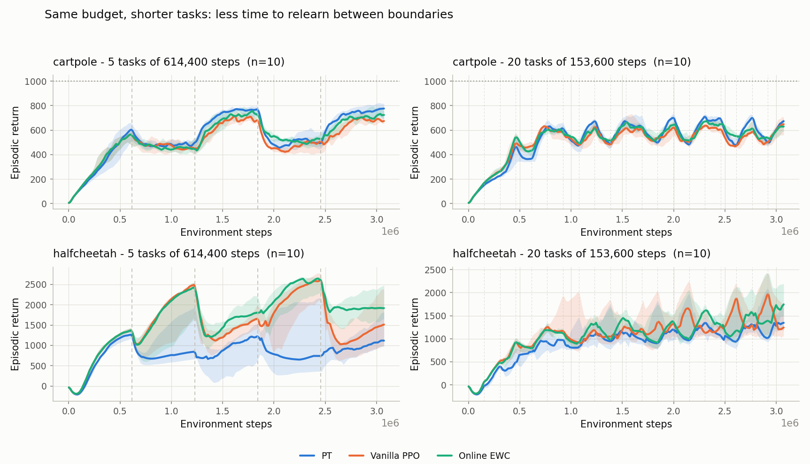

# Switching-rate results

Run 2026-08-19/20. **120 runs, all completed, none failed.**

A pre-registered prediction that **failed**, plus an unplanned replication that turned out to be
worth more than the prediction would have been.

---

## 1. The question

`pt` keeps a slow network whose job is to hold what carries across tasks. That should only pay when
the agent cannot simply forget and relearn from scratch.

In every other study each task lasts 614,400 steps — long enough that plain PPO can forget
everything, relearn, and still finish comfortably. Relearning is a perfectly good strategy there,
which is the regime *least* favourable to `pt`.

**Prediction, stated before the runs: shorten the task and `pt`'s advantage should grow.**

## 2. What was run

The same 3,072,000-step budget, split two ways:

- **5 phases** of 614,400 steps — the standard protocol, 4 boundaries.
- **20 phases** of 153,600 steps — same budget, 19 boundaries, a quarter of the time per task.

Both on both environments, 3 arms (`vanilla`, `ewc`, `pt`), 10 seeds. Standard PPO exploration.
Nothing else differs between the two — a single config key (`switch`).

All four cells were run on the same machine. Results are bit-reproducible within a machine but
diverge chaotically across machines, so splitting a comparison across two would leave "which
computer" sitting next to the variable under test.

## 3. Returns



The left column is the standard protocol, the right the shortened one; the dashed lines are the
task boundaries. Note what happens between the columns: with 20 short tasks the three arms collapse
onto each other. That is the compression effect §5 is about, visible directly.

Median across 10 seeds of each seed's mean return; final-20% in brackets.

| environment | phases | vanilla | EWC | PT |
|---|---|---:|---:|---:|
| cartpole | 5 x 614,400 | 518 (637) | 527 (671) | **551 (703)** |
| cartpole | 20 x 153,600 | 508 (553) | 524 (576) | **520 (589)** |
| HalfCheetah | 5 x 614,400 | 1477 (1337) | **1656 (1964)** | 810 (1004) |
| HalfCheetah | 20 x 153,600 | 1029 (1536) | **1064 (1331)** | 934 (1209) |

## 4. `pt` against vanilla in each cell

Exact two-sided Mann-Whitney. Whole-run, then final-20%.

| environment | phases | PT − vanilla |
|---|---|---|
| cartpole | 5 | +33 (p=0.052) · +66 (p=0.0052) |
| cartpole | 20 | +12 (p=0.280) · +36 (p=0.052) |
| HalfCheetah | 5 | −667 (p=0.019) · −333 (p=0.315) |
| HalfCheetah | 20 | −94 (p=0.280) · −327 (p=0.853) |

## 5. The prediction failed

The test is how much `pt`'s gap changed when the phase was shortened. Positive means the gap moved
in `pt`'s favour. 20,000 random permutations.

| environment | metric | gap at 5 phases | gap at 20 phases | change | p |
|---|---|---:|---:|---:|---:|
| cartpole | whole-run | +33 | +12 | −21 | 0.419 |
| cartpole | final 20% | +66 | +36 | −30 | 0.591 |
| HalfCheetah | whole-run | −667 | −94 | +573 | 0.085 |
| HalfCheetah | final 20% | −333 | −327 | +6 | 0.985 |

**`pt`'s advantage did not grow. On cartpole it shrank.** One of four measurements is marginally in
the predicted direction, one is flat, two run the wrong way. This is not support for the mechanism.

**Why it most likely failed.** Shortening the phase made every arm worse and squeezed the
differences together. Cartpole's final-phase fell from 637/671/703 to 553/576/589; HalfCheetah's
vanilla fell 1477 → 1029. With 153,600 steps per task nobody learns much, so all three arms converge
toward mediocrity and every gap — `pt`'s advantage on cartpole and its deficit on HalfCheetah alike —
shrinks toward zero. That is a loss of signal, not evidence about retention.

The reasoning behind the prediction was that less time to *relearn* should favour a method that
retains. What actually happened is that less time to *learn* hurt everyone.

## 6. The unplanned result

The 5-phase cells use the same protocol as the studies in `HALFCHEETAH_RESULTS.md` and
`CARTPOLE_RESULTS.md`, so they are an independent replication — different hardware (an AMD EPYC
box), freshly drawn seeds. Every headline holds:

| comparison | original | this study |
|---|---|---|
| cartpole, PT − vanilla (final) | +118 (p=0.0001) | +66 (p=0.0052) |
| HalfCheetah, PT − vanilla (whole) | −575 (p=0.0039) | −667 (p=0.019) |
| HalfCheetah, EWC − vanilla (final) | +370 (p=0.063) | +627 (p=0.089) |

Same direction, same significance class, on different hardware with independent seeds. The central
claims are not an artefact of one machine, one seed set, or one version of the code.

## 7. Limitations

1. Two phase lengths only. A trend cannot be resolved from two points.
2. The 20-phase cells disable the transfer matrix (it is indexed by phase count and raises past 5),
   so forward and backward transfer are unavailable there.
3. The failure is informative about the *prediction*, not about `pt` — it rules out "retention pays
   when relearning time is short" as the explanation for the cartpole advantage, and says nothing
   about what the explanation is.

## 8. Regenerating

```bash
cd "e:/update-single task + videos"
python -m src_continuous_control.scripts.report_switch2x2
```

Data: `results/switch{5,20}_{cartpole,halfcheetah}/`, 30 runs each.
