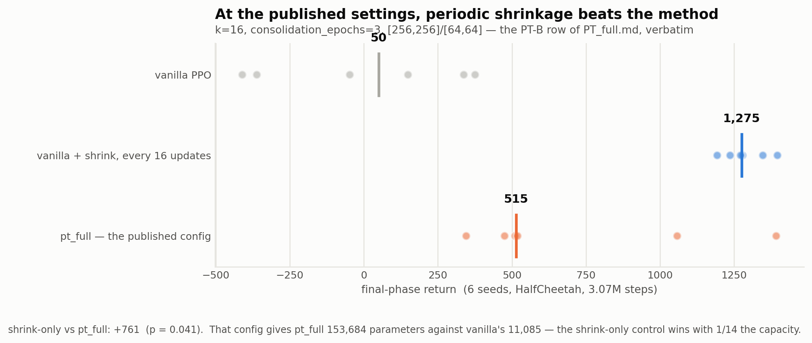

# Figure guide — what every plot shows, in plain words

A walkthrough of all 14 figures in `plots/figures_pt_full/`. For each one: what you are looking
at, what it says, and what to be careful about. A reading aid rather than a thesis document — the citable record is `FULL_PT.md`.

Regenerate everything with:

```bash
python -m src_continuous_control.plots.make_pt_full_figures
```

Every number is recomputed from the raw per-seed result files, so nothing here is transcribed by
hand and no figure can drift out of step with the text.

**The three agents that appear everywhere:**

- **vanilla PPO** — the plain baseline.
- **pt_full (live permanent)** — the full method, working normally.
- **pt_full (frozen permanent)** — the same agent with the permanent network frozen so it never
  learns. This is the control that isolates the mechanism: if the permanent–transient idea is
  what helps, live should beat frozen.
- **PPO + shrinkage** — plain PPO with only one step copied out of the method: periodically
  multiply the policy's output layer by 0.5.

---

## 1. The headline

### `reduction_halfcheetah`


**What you're looking at.** Four rows, one per agent. Every dot is one training run (6 seeds); the
thick vertical bar is the median. Further right is better.

**What it says.** `pt_full` scores 760 and PPO-plus-shrinkage scores 711 — statistically the same
(p = 0.485). Both crush plain PPO's 50. So the method works, but everything it achieves is
achieved by the shrinkage alone.

**The second finding, visible in the same picture.** Look at how *spread out* the dots are. Vanilla
and the live-permanent arm are scattered across hundreds of points; the two shrinking arms are
tight clusters. Shrinkage makes the agent **16× more consistent** across random seeds (spread 787
vs 49). It doesn't only raise the score, it makes the result reliable.

---

### `published_config_halfcheetah`



**What you're looking at.** The same comparison, but run at the exact configuration published in
`PT_full.md` — k = 16, `consolidation_epochs` = 3, [256,256] and [64,64] networks — rather than at
our settings.

**What it says.** At those settings the shrink-only control doesn't merely match the method, it
**significantly beats it**: 1275 vs 515, p = 0.041. And it does so with **1/14 the parameters**
(11,085 vs 153,684).

**Why it matters.** This is the answer to "you tested your settings, not mine." The conclusion is
stronger at the published configuration, not weaker.

---

## 2. How we found the cause

### `dose_response`


**What you're looking at.** The x-axis is how hard the policy gets shrunk — **to the right means
more shrinking**. Two lines: the full PT-PPO apparatus, and plain PPO with only the shrink added.

**What it says.** Two things at once. First, shrink harder → score higher, cleanly and
monotonically. That is what identifies the shrinkage as the active ingredient. Second, **the two
lines lie on top of each other** — the full apparatus and the bare shrink behave identically at
every setting.

**The key detail.** In both series the permanent network is zeroed and the KL term is off. None of
the PT machinery is present in either line. At the far left (no shrinking at all) the agent falls
to the vanilla baseline.

---

### `beta_sweep`


**What you're looking at.** The strength of the KL penalty (β) on the x-axis, from **zero** up to
1.0. Two lines: frozen permanent and live permanent.

**What it says.** The frozen arm is flat across four orders of magnitude and beats vanilla by the
same margin **even at β = 0**, where the penalty is switched off completely. So the KL term
explains none of the gain. Only β = 1.0 does anything, and it makes both arms worse.

**Also visible.** The live line sits below the frozen line at every β — the mechanism is a cost
across the whole range, not at one unlucky setting.

---

### `lr_perm_sweep`


**What you're looking at.** How fast the permanent network is allowed to learn, from frozen (left)
to fast (right), with the shrinkage held **exactly** fixed in every arm. Run under steady
one-directional drift — the setting most favourable to the permanent.

**What it says.** Every single point sits **below** the vanilla line. There is no learning rate at
which the permanent produces a net benefit.

**The interesting part is the shape.** It sags in the middle. A permanent that learns *slowly*
(44) is far worse than one frozen (108) or one learning fast (116). That's a stale-anchor failure:
frozen, it's a stable reference; fast, it keeps up with the drift; in between it lags, and the KL
term then drags the policy toward where the task *used to be*.

---

## 3. The mechanism, tested directly

### `mechanism_by_regime`


**What you're looking at.** One bar per regime. Each bar is the difference between the live and
frozen permanent — i.e. **the mechanism's own contribution**, with everything else identical.
Left of zero = it hurts. Grey = not statistically significant.

**What it says.** Negative in every regime that reaches significance. It helps in exactly one —
linear monotone drift (d = +1.4) — which is the lead figure 7 then closes.

**Read the units carefully.** Effects are in *standard deviations across seeds*, not percentages.
Percent-of-baseline is meaningless here: on one regime the frozen arm sits near zero, which would
make the ratio explode to −987% purely from a small denominator.

---

### `decoupling`


**What you're looking at.** Under monotone drift the permanent helps but the shrinkage hurts — so
can we keep one and drop the other? Three settings, each showing frozen (green) beside live
(orange).

**What it says.** No. Weakening the shrinkage weakens the permanent's benefit in lockstep, because
a single parameter (ρ) controls both. And forcing them apart outright — the rightmost pair —
**breaks the agent**, dropping it to −83 against vanilla's 126.

**The sanity check that makes it trustworthy.** The rightmost green bar is an agent with *neither*
a learning permanent *nor* shrinkage. It lands on vanilla (123 vs 126), exactly as it should. If
it hadn't, the setup would have been wrong.

---

## 4. Is the mechanism even running?

### `consolidation_internals`


**What you're looking at.** The method's own internal telemetry over the run. Panel (a): how much
of the transient the permanent actually absorbs on the critic — 1.0 means it absorbed exactly what
it was asked to. Panel (b): the learning-rate schedule. Panel (c): the same absorption question on
the policy.

**What it says.** The live arm absorbs 0.6–1.0 throughout; the frozen control is flat at exactly
zero. **The mechanism is genuinely running, and the control is genuinely off.** That contrast is
what the whole study rests on — without it, "the mechanism doesn't help" could just mean "the
mechanism never ran."

---

### `consolidation_loss_curves`


**What you're looking at.** Four consolidation cycles sampled across training. Each panel is the
internal regression's error as it fits, left to right within that cycle.

**What it says.** Every curve descends. Consolidation is not silently failing to fit its target.
Another way of ruling out "the implementation is broken" as an explanation.

---

## 5. Standard training curves

### `return_curves`


**What you're looking at.** Score over the whole run for the four HalfCheetah agents. The vertical
lines are the four moments the task flips direction.

**What it says.** Watch what happens at each vertical line. Vanilla recovers less and less after
every flip; the shrinking arms keep bouncing back. That's the plasticity story in one picture —
shrinkage stops the policy from locking in.

---

### `phase_means_main`


**What you're looking at.** The same runs, summarised as one bar per task phase per agent. The
+1/−1 under each group is which direction was rewarded.

**What it says.** The same trend as the curves, but easier to read off: the gap opens after the
first switch and widens.

---

### `boundary_drop`


**What you're looking at.** How far the score collapses immediately after a task flip. **Shorter
bars are better** — less disruption.

**What it says.** The project's conventional stability measure, included so this study can be
compared against the earlier ones on the same terms.

**A caution.** This metric partly tracks how high the agent was *before* the flip — an agent that
was scoring badly can't drop far. Don't read a short bar as stability on its own.

---

## 6. Two figures about our own mistakes

### `benchmark_saturation`


**What you're looking at.** How much each benchmark's score actually moves once the agent has
learned. If a benchmark barely moves, it cannot tell two methods apart.

**What it says.** The original smooth-drift environment swings only **3%** — every agent sat at
96–99% of the maximum possible score. We had measured a "significant benefit" on it. Once the
benchmark was fixed so the goal moves too (27% and 80%), that benefit **reversed sign**.

**The lesson.** Always check the dynamic range before believing a small significant difference.

---

### `sigma_collapse`


**What you're looking at.** How much randomness each agent keeps in its actions, over training.
Higher = still exploring; lower = always doing the same thing.

**What it says.** EWC stays flat at 0.140 while vanilla decays to 0.084 and PT to 0.072 — and the
final scores rank in exactly that order (2252 / 1637 / 767). EWC's penalty happens to cover the
exploration parameter, so it freezes exploration **as a side effect**.

**Why this figure exists.** It's a warning about a confound, not a result. Any comparison between
these agents has to hold exploration fixed, or it measures the exploration schedule rather than the
method. Every HalfCheetah comparison in this study does exactly that.

---

## The one-paragraph version

`pt_full` beats plain PPO. Figures 1–2 show that plain PPO plus one copied step — periodically
shrinking the policy — matches it, and beats it at the published configuration. Figures 3–5 show
where that came from: a clean dose–response in the shrink strength, with the KL term and the
permanent's learning rate both ruled out. Figures 6–7 test the permanent–transient mechanism on
its own and find it is a cost nearly everywhere, and inseparable from the shrinkage where it
helps. Figures 8–9 confirm the mechanism was genuinely running the whole time, so this is not an
implementation failure. Figures 13–14 record two places our own measurements misled us before the
controls caught them.
